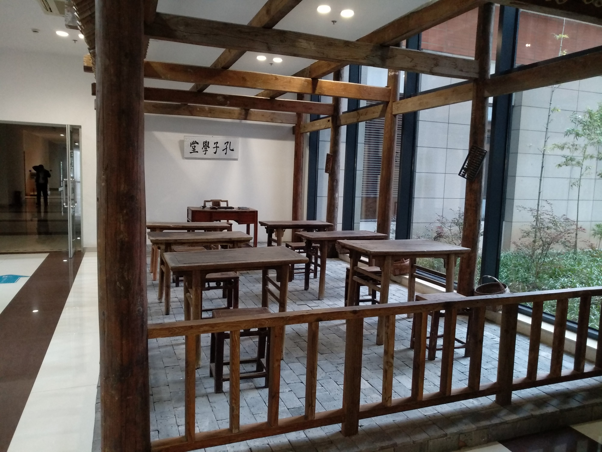
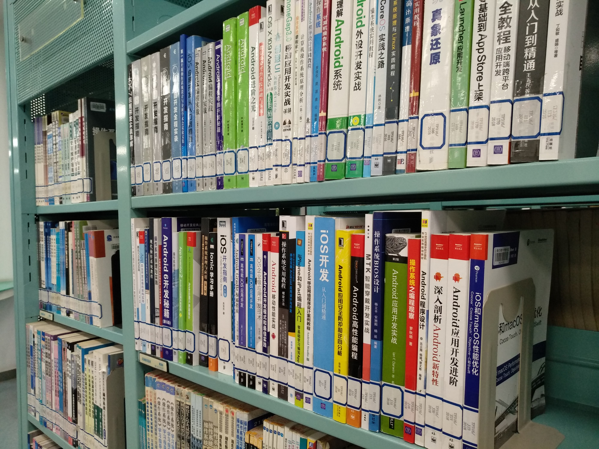
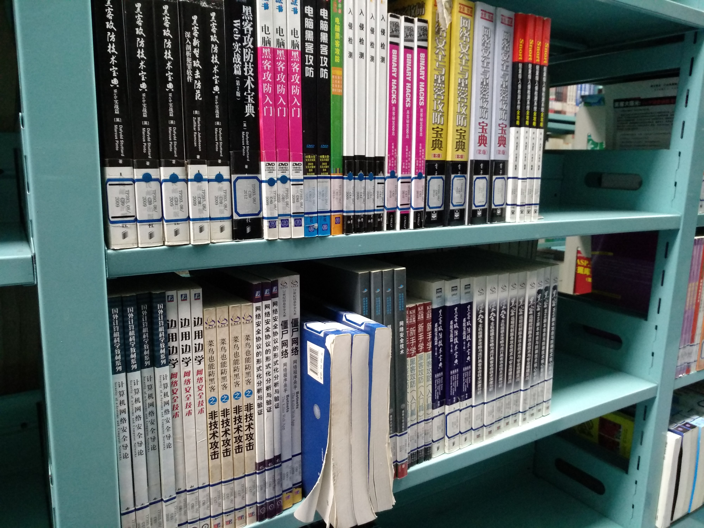
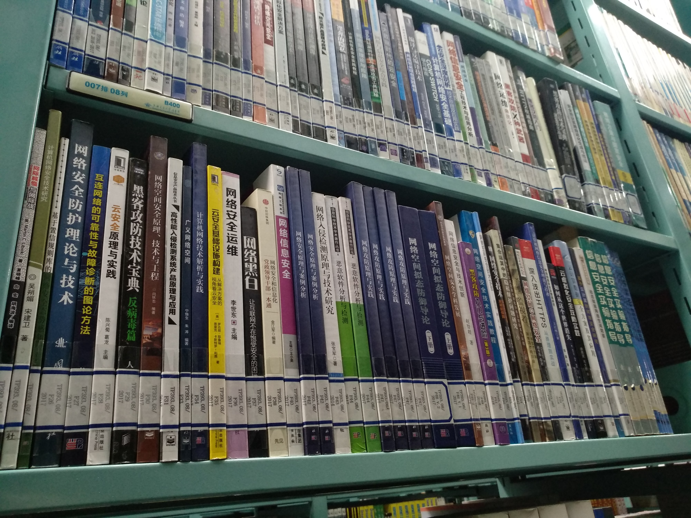

## 似水流年

流年似水，似水流年。

### 回忆

百度了一下，90年出生实岁28，一般算虚岁的话今年已经29岁了。离我大学时许下的梦想——三十岁退休的时限，如果三十岁内也算的话，最快只有一年了……也就是三十岁那一年……也就是明年。

想要做到明年退休的话，目前看来可能性只能寄托于彩票了。偏偏我又没有买彩票的习惯。偏偏非学会了“爱拼才会赢”的“恶习”，想着凡事都要靠自己，靠双手去打拼。

想当年刚刚毕业，虽然做的不是自己心仪的工作，也是投入百分之二百的努力，学的比人快，做的比人好，用身体实践了“工作两年加班加出来的五年经验”，实现了跨越式发展又如何，总有通过努力也克服不了的障碍在前方等着你。到最后结果还是输。

这个社会又是只看输赢的，其他都不看。想要赢就得有全盘的考虑，我像『四只毛毛虫的故事』里第四只毛毛虫一样，做好了全盘的计划，带着十足的信心，再次上路，挑战人生这道关卡。

可是人生这道关卡，你这也太难了吧？我可以选择easy模式么？我可以查看全区地图么？我可以使用超级道具么？我可以选择原地自杀么？

现实世界跟虚拟世界一样的残酷，没钱就永远打不过RMB玩家，你奋斗一生的目标是罗马，有人出生就在罗马，你让农妇想象皇后娘娘的早餐会有多么丰盛，农妇只会伸出枯柴一般布满老茧和冻疮的手指头比划出一个“二”字，“难不成，早上就吃两个鸡蛋？”

朱门酒肉臭，路有冻死骨。莫欺少年穷，终须有日龙穿凤。当然，我的目标也不是要成为成为有钱人，有钱又能怎样，思聪不也就这样，他也改变不了社会，只是现世享受到了社会丰厚的果实。我的目标也不是要消灭贫富差距，那是国家领导人考虑的问题。更何况更多的时候他也没有真正地考虑这个问题。那更加轮不到我来考虑这个问题。对了，我应该考虑什么问题？我的目 究竟是什么？

记得小时候，大概是四五年级，有一次老师布置的作文题目是《我的梦想》，要写自己未来相当什么职位。我至今仍记得我写了洋洋洒洒好几百字，我的梦想是未来想当一个科学家！当时还是刚刚学习到为中国之崛起而读书的年纪，大部分人都是想当工人，医生，士兵和老师，为祖国建设添砖加瓦。可见我对我的未来的规划相当的明确。

然后就开始偏离轨道，除了略微争气的学习成绩之外，在思想上从来没想过科学家的事情。高中沉迷音乐无法自拔，大学专业是工商管理，也就是未来当MBA的角色，日语拿到N1准备出国，后来又从事进出口的工作，临近而立之年再转行，我这前半生的经历，不可谓不丰富了。甚至可以说是相当精彩、或者说是“丰富多彩”。

穆然回首，真忘了自己究竟是干嘛的了。

自己究竟在干嘛？究竟想干嘛？究竟能干嘛？等等，也全都一并全都忘记了。

记得大三的时候，人生也迷茫过一阵。那年跟女友分手，把自己“锁”在图书馆里刷书，大一还拿奖学金的我，翘了一整年的课，两个学期挂了六门，算是亲身实践了大学里必须做的三件事情——奖学金、恋爱、挂科。当年真的非常迷茫，整个人跟行尸走肉一样，再回首真不知道当时日子是怎么过来的，三点一线的生活，过了接近整整两年——宿舍、图书馆、自习教室，宿舍、图书馆、自习教室，宿舍、图书馆、自习教室。

那一年几乎刷遍了校本部图书馆所有计算机、经管、金融相关的图书，也不理解，只求看着就好，脑子里塞着一堆问题的时候，是没有时间想到失恋的痛苦的，没有时间来考虑未来的意义、甚至我到底应该干什么。最后其实也是有另一个女孩子帮我走出来，否则那时人应该已经呆掉了。

那年却是我彻底蜕变的一年，二十一岁的我至少明确了自己想要去做什么，擅长什么，以及如何去达成，虽然宏观和大方向上的把握上等于零，但至少是清楚靠自己的努力，没有什么不可能。

然后其实毕业后的这五六年，也就是现实抡着大棒，不断把我打回原形的这个过程，一下又一下，一遍又一遍，告诉我并不是靠你努力，就什么都可以达成的。生活不是游戏，总有一些关卡，你是过不去的。（比如 “大富翁”的关卡，我连进入的资格都没有）。有些人血战到底，铩羽而归。有些人血战到底，得到的还不是自己想要的。阴差阳错，造化弄人。无巧不成书，有些还成了电影，成为了艺术，成为了人生百态、芸芸众生。

还是得把握大方向，还是得结合大环境、大背景，个人的努力，结合环境的演变，来考虑一些问题。孟母三迁的道理，我竟然临近三十岁，才有所顿悟。三十而立，不知道能不能立起来。真立不起来，谈不上治国、平天下的话，问题也不会很大，至少应该做到修身和齐家，这真的已经是八尺男儿最基本的要求的了。再低，真不能更低了。也许到了四十而不惑的年纪，能够真正的做到“不惑”吧，现在的我，“惑”真的太多了。

对，修身、齐家。

>“古之欲明明德于天下者，先治其国；欲治其国者，先齐其家；欲齐其家者，先修其身；欲修其身者，先正其心；欲正其心者，先诚其意；欲诚其意者，先致其知，致知在格物。物格而后知至，知至而后意诚，意诚而后心正，心正而后身修，身修而后家齐，家齐而后国治，国治而后天下平。”

>——《礼记·大学》

### 展望

一事无成的我，现在唯一该做的事情，就是修身、齐家。

如何修身、如何齐家？这是一个哲学问题。

也许，现在再多看点书，还是来得及的。

浙商传奇企业家李书福，29岁那年也重回大学深造，这段经历到现在也留在他的百度百科词条里。自比伟人当然不敢，只是如果人生太迷茫，多读点书，不管是技术、经管、还是历史，总是好的，总是会帮到的。

好过自己闭门造车，最后也想不出个头绪。或者想法完全是错的，概率非常大。当局者迷、旁观者清，自己百思不得其解的心结，也许可以在书里找到答案。佛讲究参禅和顿悟，悟性乃是立地成佛的关键。想通了，则一切有情人终成眷属，是前生造定事莫错过姻缘。

书中自有颜如玉，书中自有黄金屋。男儿欲遂平生志，五经勤向窗前读。

想不通的时候，就去多读书吧。

不吃读书的苦，就吃生活的苦，总是得选一样的，读书算是一种被动的思考，接下来愿意跟大家分享这些思考，兼听则明，偏听则暗，希望可以跟大家共同进步。

2011年末的时候我大四，当时发生了一件大事，乔布斯去世了。当时我发的朋友圈是“以为人生不过如此，想不到只是刚刚开始。”算是总结即将进入社会，对未知的一切充满困惑和懵懂的我，当时的一个心境吧。如今已是2018年末，想不到心境竟然一模一样。

————2018年11月24日
    陈佳林