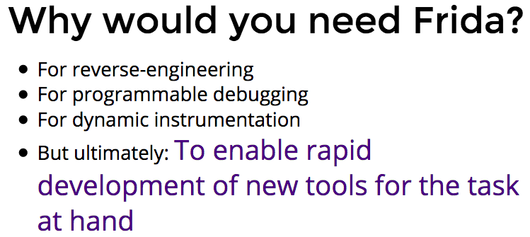
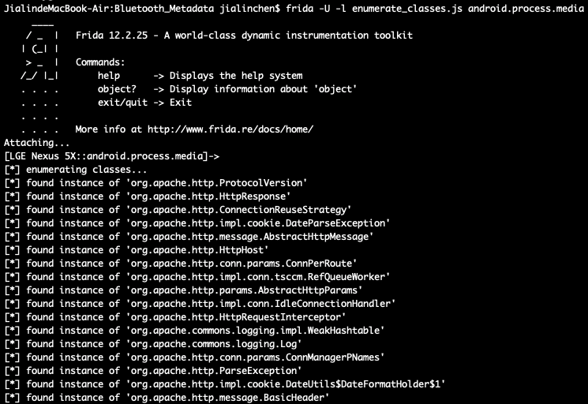
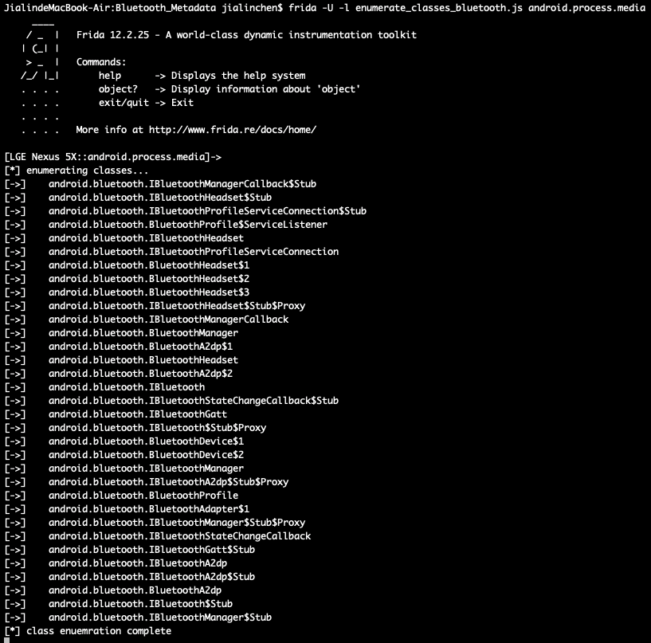
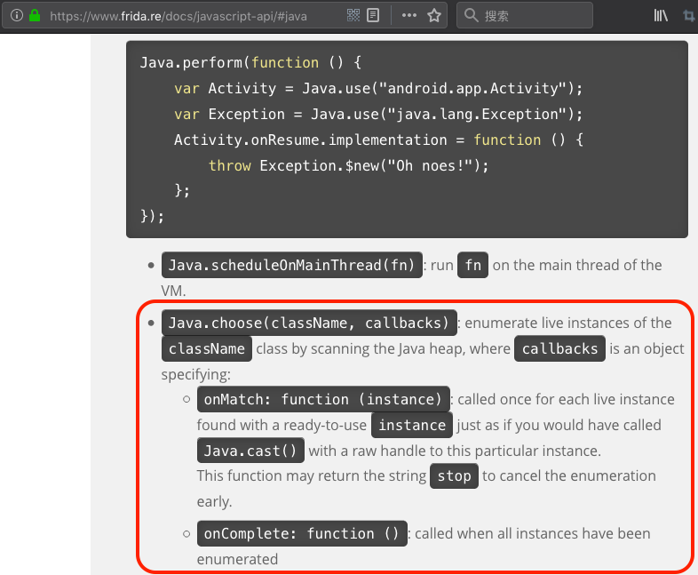
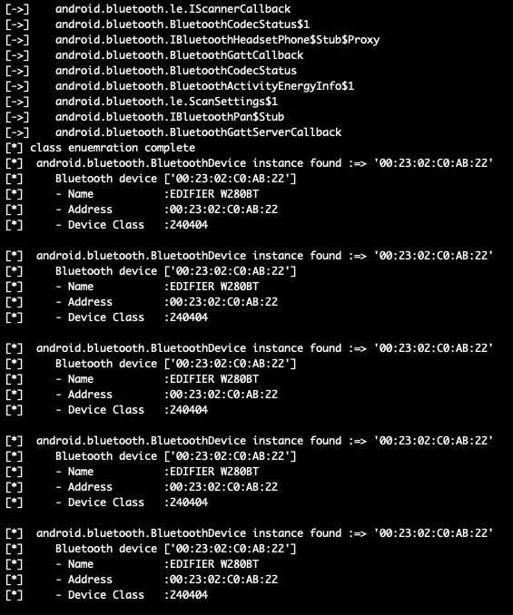

<!-- @import "[TOC]" {cmd="toc" depthFrom=1 depthTo=6 orderedList=false} -->
<!-- code_chunk_output -->

* [FRIDA脚本系列（一）入门篇：在安卓`8.1`上dump蓝牙接口和实例](#frida脚本系列一入门篇在安卓81上dump蓝牙接口和实例)
	* [0x01.FRIDA是啥？为啥这么火？](#0x01frida是啥为啥这么火)
	* [0x02.FRIDA脚本的概念](#0x02frida脚本的概念)
	* [0x03.简单脚本一：枚举所有的类](#0x03简单脚本一枚举所有的类)
	* [0x04.简单脚本二：定位目标类并打印类的实例](#0x04简单脚本二定位目标类并打印类的实例)
	* [0x05.简单脚本三：枚举所有方法并定位方法](#0x05简单脚本三枚举所有方法并定位方法)
	* [0x06.综合案例：在安卓`8.1`上dump蓝牙接口和实例：](#0x06综合案例在安卓81上dump蓝牙接口和实例)

<!-- /code_chunk_output -->


## FRIDA脚本系列（一）入门篇：在安卓`8.1`上dump蓝牙接口和实例

### 0x01.FRIDA是啥？为啥这么火？

`frida`目前非常火爆，该框架从`Java`层hook到`Native`层hook无所不能，虽然持久化还是要依靠`Xposed`和`hookzz`等开发框架，但是`frida`的动态和灵活对逆向以及自动化逆向的帮助非常巨大。

`frida`是啥呢，github目录[Awesome Frida](https://github.com/dweinstein/awesome-frida)这样介绍`frida`的：

>Frida is Greasemonkey for native apps, or, put in more technical terms, it’s a dynamic code instrumentation toolkit. It lets you inject snippets of JavaScript into native apps that run on Windows, Mac, Linux, iOS and Android. Frida is an open source software.

`frida`是平台原生`app`的`Greasemonkey`，说的专业一点，就是一种动态插桩工具，可以插入一些代码到原生`app`的内存空间去，（动态地监视和修改其行为），这些原生平台可以是`Win`、`Mac`、`Linux`、`Android`或者`iOS`。而且`frida`还是开源的。

`Greasemonkey`可能大家不明白，它其实就是`firefox`的一套插件体系，使用它编写的脚本可以直接改变`firefox`对网页的编排方式，实现想要的任何功能。而且这套插件还是外挂的，非常灵活机动。

`frida`也是一样的道理。那它为什么这么火爆呢？

动静态修改内存实现作弊一直是刚需，比如金山游侠，本质上`frida`做的跟它是一件事情。原则上是可以用`frida`把金山游侠，包括`CheatEngine`等“外挂”做出来的。

当然，现在已经不是直接修改内存就可以高枕无忧的年代了。大家也不要这样做，做外挂可是违法行为。

在逆向的工作上也是一样的道理，使用`frida`可以“看到”平时看不到的东西。出于编译型语言的特性，机器码在CPU和内存上执行的过程中，其内部数据的交互和跳转，对用户来讲是看不见的。当然如果手上有源码，甚至哪怕有带调试符号的可执行文件包，也可以使用`gbd`、`lldb`等调试器连上去看。

那如果没有呢？如果是纯黑盒呢？又要对`app`进行逆向和动态调试、甚至自动化分析以及规模化收集信息的话，我们需要的是细粒度的流程控制和代码级的可定制体系，以及不断对调试进行动态纠正和可编程调试的框架，这就是`frida`。

`frida`使用的是`python`、`JavaScript`等“胶水语言”也是它火爆的一个原因，可以迅速将逆向过程自动化，以及整合到现有的架构和体系中去，为你们发布“威胁情报”、“数据平台”甚至“AI风控”等产品打好基础。



官宣屁屁踢甚至将其`敏捷开发`和`迅速适配到现有架构`的能力作为其核心卖点。

### 0x02.FRIDA脚本的概念

`FRIDA脚本`就是利用`FRIDA`动态插桩框架，使用`FRIDA`导出的`API`和方法，对内存空间里的对象方法进行监视、修改或者替换的一段代码。`FRIDA`的`API`是使用`JavaScript`实现的，所以我们可以充分利用`JS`的匿名函数的优势、以及大量的`hook`和回调函数的API。

我们来举个最直观的例子：`hello-world.js`

```js

setTimeout(function(){
  Java.perform(function(){
      console.log("hello world!");
    });
});
```

这基本上就是一个`FRIDA`版本的"Hello World!"，我们把一个匿名函数作为参数传给了`setTimeout()`函数，然而函数体中的`Java.perform()`这个函数本身又接受了一个匿名函数作为参数，该匿名函数中最终会调用`console.log()`函数来打印一个“Hello world！”字符串。我们需要调用`setTimeout()`方法因为该方法将我们的函数注册到`JavaScript`运行时中去，然后需要调用`Java.perform()`方法将函数注册到`Frida`的`Java`运行时中去，用来执行函数中的操作，当然这里只是打了一条`log`。

然后我们在手机上将`frida-server`运行起来，在电脑上进行操作：

`$ frida -U -l hello-world.js android.process.media`


然后可以看到`console.log()`执行成功，字符串打印了出来。

### 0x03.简单脚本一：枚举所有的类

我们现在来给这个`HelloWorld.js`稍微加一点功能，比如说枚举所有已经加载的类，这就用到了`Java`对象的`enumerateLoadedClasses`方法。代码如下：

```js
setTimeout(function (){
  Java.perform(function (){
    console.log("\n[*] enumerating classes...");
    Java.enumerateLoadedClasses({
      onMatch: function(_className){
        console.log("[*] found instance of '"+_className+"'");
      },
      onComplete: function(){
        console.log("[*] class enuemration complete");
      }
    });
  });
});
```

首先还是确保手机上的`frida-server`正在运行中，然后在电脑上操作：

```
$ frida -U -l enumerate_classes.js android.process.media
```




### 0x04.简单脚本二：定位目标类并打印类的实例

现在我们已经找到目标进程中所有已经加载的类，比如说现在我们的目标是要查看其蓝牙相关的类，我们可以把代码修改成这样：

```js
Java.enumerateLoadedClasses({
    onMatch: function(instance){
      if (instance.split(".")[1] == "bluetooth"){
        console.log("[->]\t"+instance);
      }
    },
    onComplete: function() {
      console.log("[*] class enuemration complete");
    }
  });
```

我们来看下效果：



可以找到上述这么多蓝牙相关的类。当然也可以使用字符串包含的方法，使用`JavaScript`字符串的`indexOf()`、`search()`或者`match()`方法，这个留给读者自己完成。

定位到我们想要研究的类之后，就可以打印类的实例了，查看[`FRIDA的API手册`](https://www.frida.re/docs/javascript-api/#java)可以得知，此时应该使用`Java.choose()`函数，来选定某一个实例。



我们增加下列几行选定`android.bluetooth.BluetoothDevice`类的实例的代码。

```js
Java.choose("android.bluetooth.BluetoothDevice",{
  onMatch: function (instance){
    console.log("[*] "+" android.bluetooth.BluetoothDevice instance found"+" :=> '"+instance+"'");
    bluetoothDeviceInfo(instance);
  },
  onComplete: function() { console.log("[*] -----");}
});
```

在手机打开蓝牙，并且连接上我的漫步者蓝牙耳机，开始播放内容之后：


在电脑上运行脚本：

```
$ frida -U -l enumerate_classes_bluetooth_choose.js com.android.bluetooth
```

可以看到正确检测到了我的蓝牙设备：



### 0x05.简单脚本三：枚举所有方法并定位方法

上文已经将类以及实例枚举出来，接下来我们来枚举所有方法，主要使用了`Java.use()`函数。


`Java.use()`与`Java.choose()`最大的区别，就是在于前者会新建一个对象，后者会选择内存中已有的实例。

对代码的增加如下：

```js

function enumMethods(targetClass)
{
	var hook = Java.use(targetClass);
	var ownMethods = hook.class.getDeclaredMethods();
	hook.$dispose;

	return ownMethods;
}

...
...

		var a = enumMethods("android.bluetooth.BluetoothDevice")
		a.forEach(function(s) {
			console.log(s);
		});

```

保持上一小节环境的情况下，在电脑上进行操作：

```js
$ frida -U -l enumerate_classes_bluetooth_choose_allmethod.js com.android.bluetooth
```

最终效果如下，类的所有方法均被打印了出来。


接下来如何“滥用”这些方法，拦截、修改参数、修改结果、等等，皆可悉听尊便，具体流程请参考

### 0x06.综合案例：在安卓`8.1`上dump蓝牙接口和实例：

一个比较好的综合案例，就是作为上文案例的`dump`蓝牙信息的“加强版”——['BlueCrawl'](https://github.com/IOActive/BlueCrawl)。

```js
VERSION="1.0.0"
setTimeout(function(){
	Java.perform(function(){

		Java.enumerateLoadedClasses({
				onMatch: function(instance){
					if (instance.split(".")[1] == "bluetooth"){
						console.log("[->]\t"+lightBlueCursor()+instance+closeCursor());
					}
				},
				onComplete: function() {}
			});

		Java.choose("android.bluetooth.BluetoothGattServer",{
				onMatch: function (instance){
					...
				onComplete: function() { console.log("[*] -----");}
			});

		Java.choose("android.bluetooth.BluetoothGattService",{
				onMatch: function (instance){
					...
				onComplete: function() { console.log("[*] -----");}
			});

		 Java.choose("android.bluetooth.BluetoothSocket",{
				onMatch: function (instance){
					...
				onComplete: function() { console.log("[*] -----");}
			});

		  Java.choose("android.bluetooth.BluetoothServerSocket",{
				onMatch: function (instance){
					...
				onComplete: function() { console.log("[*] -----");}
			});

		  Java.choose("android.bluetooth.BluetoothDevice",{
				onMatch: function (instance){
					...
				onComplete: function() { console.log("[*] -----");}
			});
	});
},0);
```

该脚本首先枚举了很多蓝牙相关的类，然后`choose`了很多类，包括蓝牙接口信息以及蓝牙服务接口对象等，还加载了内存中已经分配好的蓝牙设备对象，也就是上文我们已经演示的信息。我们可以用这个脚本来“查看”`App`加载了哪些蓝牙的接口，`App`是否正在查找蓝牙设备、或者是否窃取蓝牙设备信息等。

在电脑上运行命令：

```
$ frida -U -l bluecrawl-1.0.0.js com.android.bluetooth
```


可以看到该脚本在安卓8.1上运行良好，我们的接口和设备均被打印了出来。

我们今天的脚本入门就到这里，谢谢大家。
