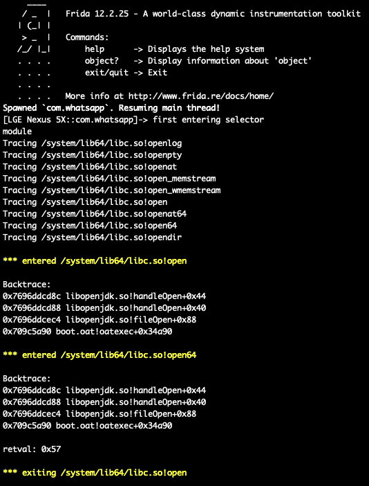
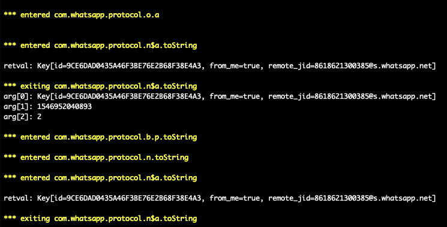
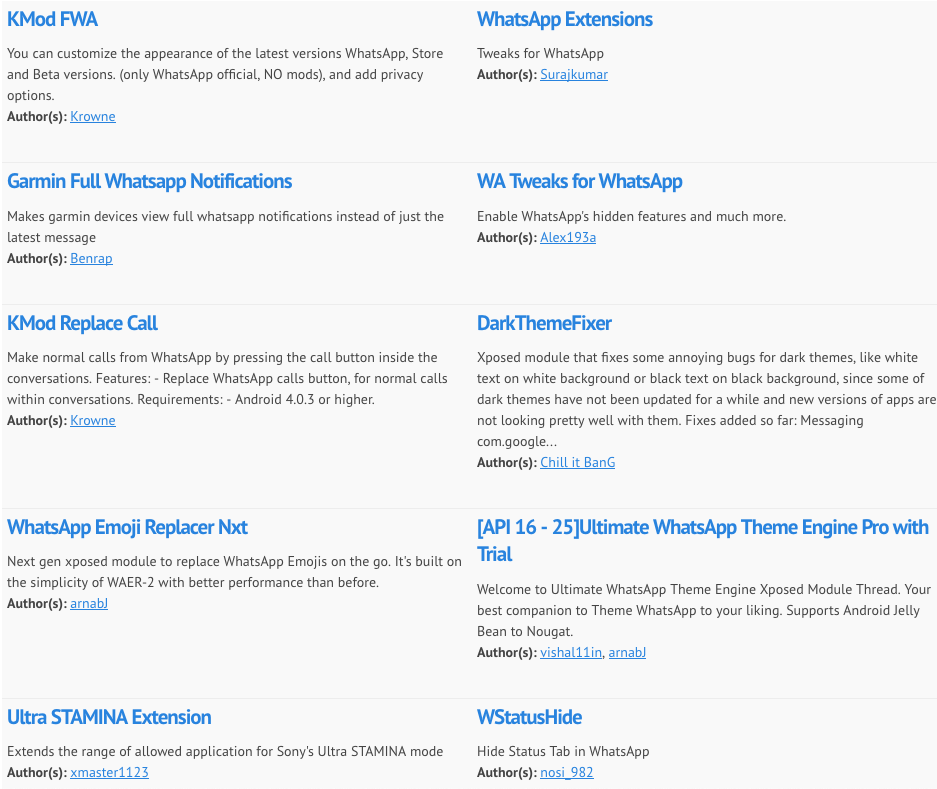

## FRIDA脚本系列（二）成长篇：动静态结合逆向WhatsApp

在[FRIDA脚本系列（一）入门篇：在安卓8.1上dump蓝牙接口和实例](https://www.anquanke.com/post/id/168152)中，我们学到了枚举模块中所有的类、子类及其方法，以及找到其所有重载，最终还通过蓝牙接口来小小的实战了一下。这一篇我们倒着来，从`hook`所有重载开始，写一个可以动态观察所有模块、类、方法等接口数据的工具出来。

### 0x01.hook方法的所有重载

在[一篇文章带你领悟Frida的精髓（基于安卓8.1）](https://github.com/hookmaster/frida-all-in-one/blob/master/03.%E5%9F%BA%E6%9C%AC%E6%A1%88%E4%BE%8B%E4%B8%8A%E6%89%8B/%E4%B8%80%E7%AF%87%E6%96%87%E7%AB%A0%E5%B8%A6%E4%BD%A0%E9%A2%86%E6%82%9FFrida%E7%9A%84%E7%B2%BE%E9%AB%93(%E5%9F%BA%E4%BA%8E%E5%AE%89%E5%8D%938.1)/READMD.md)一文中，我们已经学会了对放的重载进行处理的方法，我们先回顾一下代码：

```js
my_class.fun.overload("int" , "int").implementation = function(x,y){
my_class.fun.overload("java.lang.String").implementation = function(x){
```

也就是说我们需要构造一个重载的数组，并把每一个重载都打印出来。我们直接上代码：


```js

//目标类
var hook = Java.use(targetClass);
//重载次数
var overloadCount = hook[targetMethod].overloads.length;
//打印日志：追踪的方法有多少个重载
console.log("Tracing " + targetClassMethod + " [" + overloadCount + " overload(s)]");
//每个重载都进入一次
for (var i = 0; i < overloadCount; i++) {
//hook每一个重载
	hook[targetMethod].overloads[i].implementation = function() {
		console.warn("\n*** entered " + targetClassMethod);

		//可以打印每个重载的调用栈，对调试有巨大的帮助，当然，信息也很多，尽量不要打印，除非分析陷入僵局
		Java.perform(function() {
		     var bt = Java.use("android.util.Log").getStackTraceString(Java.use("java.lang.Exception").$new());
		        console.log("\nBacktrace:\n" + bt);
		});   

		// 打印参数
		if (arguments.length) console.log();
		for (var j = 0; j < arguments.length; j++) {
			console.log("arg[" + j + "]: " + arguments[j]);
		}

		//打印返回值
		var retval = this[targetMethod].apply(this, arguments); // rare crash (Frida bug?)
		console.log("\nretval: " + retval);
		console.warn("\n*** exiting " + targetClassMethod);
		return retval;
	}
}
```

这样我们对于方法的所有重载就处理好了，接下来是枚举所有方法。

### 0x02.hook类的所有方法

还是直接上代码：

```js
function traceClass(targetClass)
{
  //Java.use是新建一个对象哈，大家还记得么？
	var hook = Java.use(targetClass);
  //利用反射的方式，拿到当前类的所有方法
	var methods = hook.class.getDeclaredMethods();
  //建完对象之后记得将对象释放掉哈
	hook.$dispose;
  //将方法名保存到数组中
	var parsedMethods = [];
	methods.forEach(function(method) {
		parsedMethods.push(method.toString().replace(targetClass + ".", "TOKEN").match(/\sTOKEN(.*)\(/)[1]);
	});
  //去掉一些重复的值
	var targets = uniqBy(parsedMethods, JSON.stringify);
  //对数组中所有的方法进行hook，traceMethod也就是第一小节的内容
	targets.forEach(function(targetMethod) {
		traceMethod(targetClass + "." + targetMethod);
	});
}
```

### 0x03.hook类的所有子类

还是上核心部分的代码：

```js
//枚举所有已经加载的类
Java.enumerateLoadedClasses({
	onMatch: function(aClass) {
		//迭代和判断
		if (aClass.match(pattern)) {
			//做一些更多的判断，适配更多的pattern
			var className = aClass.match(/[L]?(.*);?/)[1].replace(/\//g, ".");
			//进入到traceClass里去
			traceClass(className);
		}
	},
	onComplete: function() {}
});
```

### 0x04.hook本地库的导出函数

```js
// 追踪本地库函数
function traceModule(impl, name)
{
	console.log("Tracing " + name);
	//frida的Interceptor
	Interceptor.attach(impl, {
		onEnter: function(args) {

		console.warn("\n*** entered " + name);
		//打印调用栈
		console.log("\nBacktrace:\n" + Thread.backtrace(this.context, Backtracer.ACCURATE)
						.map(DebugSymbol.fromAddress).join("\n"));
		},
		onLeave: function(retval) {
		//打印返回值
		console.log("\nretval: " + retval);
		console.warn("\n*** exiting " + name);

		}
	});
}
```

### 0x05.动静态结合逆向WhatsApp

终于到了实战的时候，把以上代码拼接起来，形成一个脚本，其实这个脚本[awesome-frida
](https://github.com/dweinstein/awesome-frida)里面也有介绍，代码在[这里](https://github.com/0xdea/frida-scripts/blob/master/raptor_frida_android_trace.js)，就是有点小bug，经[葫芦娃](https://github.com/hookmaster/frida-all-in-one)修改好之后，终于可以用了。

我们来试下它的几个主要的功能，首先是本地库的导出函数。

```js

setTimeout(function() {
	Java.perform(function() {
		trace("exports:*!open*");
		//trace("exports:*!write*");
		//trace("exports:*!malloc*");
		//trace("exports:*!free*");
	});
}, 0);
```

我们`hook`的是`open()`函数，跑起来看下效果：

```
$ frida -U -f com.whatsapp -l raptor_frida_android_trace_fixed.js --no-pause
```



如图所示`*!open*`根据正则匹配到了`openlog`、`open64`等导出函数，并hook了所有这些函数，打印出了其参数以及返回值。

接下来想要看哪个部分，只要扔到[`jadx`](https://github.com/skylot/jadx)里，静态“分析”一番，自己随便翻翻，或者根据字符串搜一搜。


比如说我们想要看上图中的`com.whatsapp.app.protocol`包里的内容，就可以设置`trace("com.whatsapp.app.protocol")`。




可以看到包内的函数、方法、包括重载、参数以及返回值全都打印了出来。这就是`frida`脚本的魅力。

当然，脚本终归只是一个工具，你对`Java`、安卓App的理解，和你的创意才是至关重要的。

接下来可以搭配[Xposed module](https://repo.xposed.info/module-overview)看看别人都给`whatsapp`做了哪些模块，`hook`的哪些函数，实现了哪些功能，学习自己写一写。



当然，再强调一句，做外挂是违法行为，千万不要制作和分发任何App的外挂，否则等待你的只会是法律的制裁。
