<!-- @import "[TOC]" {cmd="toc" depthFrom=1 depthTo=6 orderedList=false} -->

<!-- code_chunk_output -->

- [`XPOSED`魔改一：获取特征](#xposed魔改一获取特征)
  - [写在前面](#写在前面)
  - [准备环境：选择`XPOSED`版本`v89`](#准备环境选择xposed版本v89)
  - [准备环境：选择谷歌原版镜像`7.1.2`](#准备环境选择谷歌原版镜像712)
  - [准备环境：使用`SuperSU`进行`root`](#准备环境使用supersu进行root)
  - [准备环境：安装`Xposed`框架并激活插件](#准备环境安装xposed框架并激活插件)
  - [收集特征：底包详细信息](#收集特征底包详细信息)
  - [收集特征：日志输出信息](#收集特征日志输出信息)
  - [收集特征：插件开发配置信息](#收集特征插件开发配置信息)
  - [收集特征：`XposedChecker`源码](#收集特征xposedchecker源码)
  - [收集特征：逆向分析大厂方案](#收集特征逆向分析大厂方案)

<!-- /code_chunk_output -->


## `XPOSED`魔改一：获取特征

### 写在前面

受这篇文章——[《定制Xposed框架》](https://bbs.pediy.com/thread-255836.htm)启发，决定自己也尝试一下。

尝试的过程中发现，文章写得太“简约”了，基本上毫无细节，后人想下手或复现非常困难，对`Xposed`各模块之间的关系也没有介绍，有点“干”，不易于理解，于是有了此文。

本文细节非常多，相当于手把手，篇幅过长所以分拆成三篇：

1. `XPOSED`魔改一：获取特征
2. `XPOSED`魔改二：编译源码
3. `XPOSED`魔改三：更改特征

话不多说，进入正题，既然想要抹掉`XPOSED`框架的特征，那么首先得知道`XPOSED`框架有哪些特征，才能有的放矢、对症下药。

### 准备环境：选择`XPOSED`版本`v89`


从`Xposed`[官方发布频道](https://forum.xda-developers.com/showthread.php?t=3034811)得知，`sdk27`版本（也就是安卓8.1）的`Xposed`还是`beta`的状态：

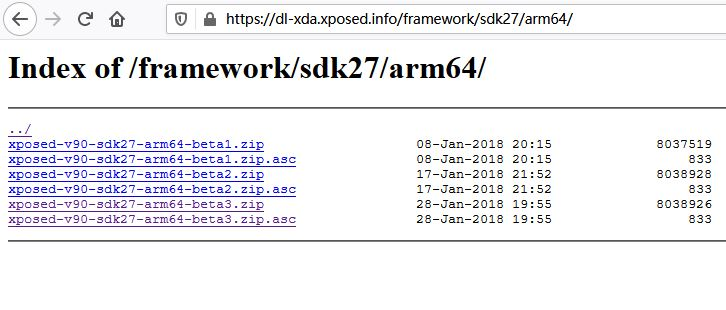

最新的正式版是`sdk25`（也就是安卓7.1），已经是`2017`年的了：

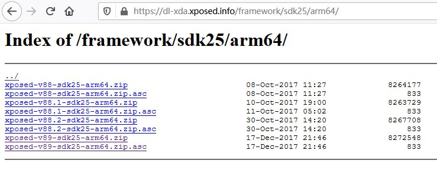

当然最重要的还是[`Github`主页](https://github.com/rovo89/Xposed)上开源的版本只到`v89`，也就是安卓`7.1`；而不是安卓`8`的`v90`系列。

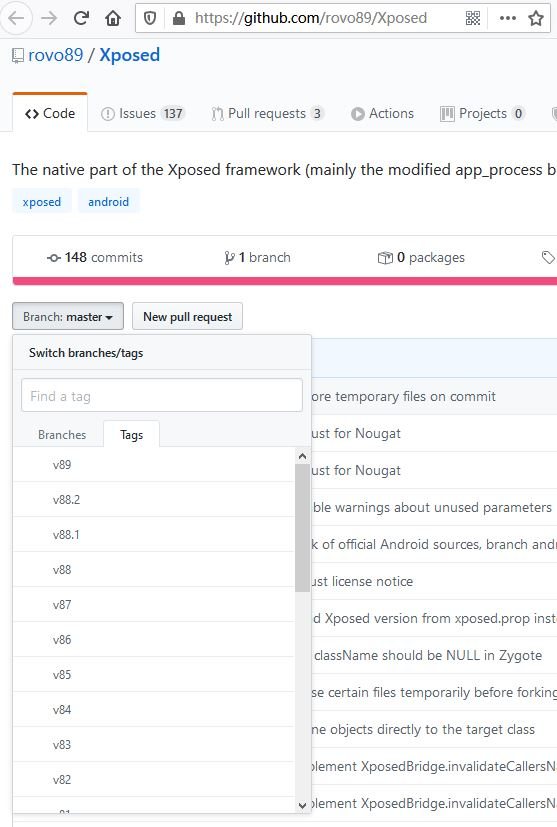

### 准备环境：选择谷歌原版镜像`7.1.2`

`Xposed`今后应该也不会更新了，我们以`android-7.1.2_r8`版本来进行编译。

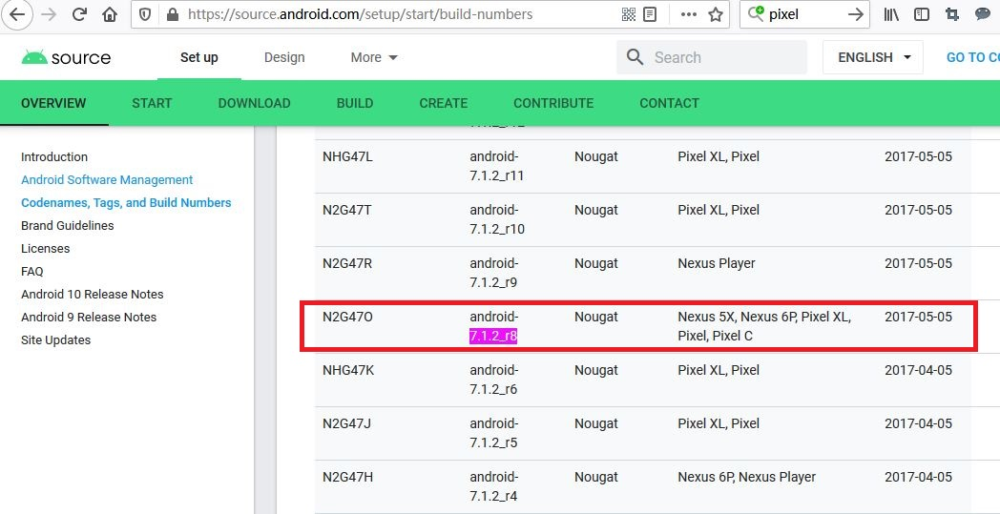

首先只需要收集特征，我们先下载其线程的谷歌镜像进行刷机即可：

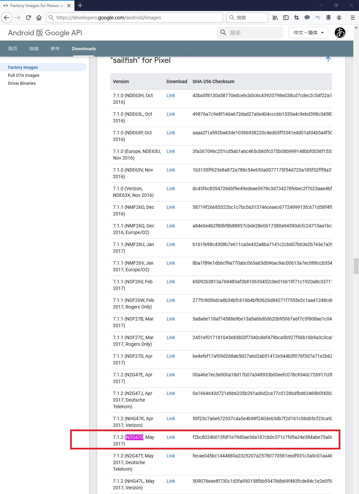

在`Link`上右键复制链接地址，可以直接黏贴到国内环境的浏览器里下载的，也可以直接`wget`：

```
# wget https://dl.google.com/dl/android/aosp/sailfish-n2g47o-factory-f2bc8024.zip
--2020-03-29 10:18:25--  https://dl.google.com/dl/android/aosp/sailfish-n2g47o-factory-f2bc8024.zip
Resolving dl.google.com (dl.google.com)... 203.208.43.101, 203.208.43.102, 203.208.43.104, ...
Connecting to dl.google.com (dl.google.com)|203.208.43.101|:443... connected.
HTTP request sent, awaiting response... 200 OK
Length: 1914505658 (1.8G) [application/zip]
Saving to: ‘sailfish-n2g47o-factory-f2bc8024.zip’

sailfish-n2g47o-factory-f2bc 100%[============================================>]   1.78G  10.5MB/s    in 3m 25s  

2020-03-29 10:21:51 (8.92 MB/s) - ‘sailfish-n2g47o-factory-f2bc8024.zip’ saved [1914505658/1914505658]

```

下载完成后进行解压：

```
# unzip sailfish-n2g47o-factory-f2bc8024.zip 
Archive:  sailfish-n2g47o-factory-f2bc8024.zip
   creating: sailfish-n2g47o/
  inflating: sailfish-n2g47o/radio-sailfish-8996-012901-1702171013.img  
  inflating: sailfish-n2g47o/bootloader-sailfish-8996-012001-1703151359.img                                       
  inflating: sailfish-n2g47o/flash-all.bat                                                                        
  inflating: sailfish-n2g47o/flash-all.sh                                                                         
 extracting: sailfish-n2g47o/image-sailfish-n2g47o.zip                                                            
  inflating: sailfish-n2g47o/flash-base.sh                     
```

如果电脑里没有安装`fastboot`，可以先下载一下：


```
# wget wget https://dl.google.com/android/repository/platform-tools-latest-linux.zip
--2020-03-29 10:24:28--  http://wget/
Resolving wget (wget)... failed: Name or service not known.
wget: unable to resolve host address ‘wget’
--2020-03-29 10:24:29--  https://dl.google.com/android/repository/platform-tools-latest-linux.zip
Resolving dl.google.com (dl.google.com)... 203.208.50.167, 203.208.50.164, 203.208.50.174, ...
Connecting to dl.google.com (dl.google.com)|203.208.50.167|:443... connected.
HTTP request sent, awaiting response... 302 Found
Location: https://dl.google.com/android/repository/platform-tools_r29.0.6-linux.zip [following]
--2020-03-29 10:24:29--  https://dl.google.com/android/repository/platform-tools_r29.0.6-linux.zip
Reusing existing connection to dl.google.com:443.
HTTP request sent, awaiting response... 200 OK
Length: 8254604 (7.9M) [application/zip]
Saving to: ‘platform-tools-latest-linux.zip.1’

platform-tools-latest-linux. 100%[============================================>]   7.87M  9.76MB/s    in 0.8s    

2020-03-29 10:24:30 (9.76 MB/s) - ‘platform-tools-latest-linux.zip.1’ saved [8254604/8254604]

FINISHED --2020-03-29 10:24:30--
Total wall clock time: 2.3s
Downloaded: 1 files, 7.9M in 0.8s (9.76 MB/s)
```

解压并将`fastboot`命令加入当前终端的路径中去：

```
# unzip platform-tools-latest-linux.zip
inflating: platform-tools/systrace/catapult/systrace/systrace/__init__.py  
inflating: platform-tools/systrace/catapult/systrace/systrace/monitor_unittest.py  
inflating: platform-tools/systrace/catapult/systrace/systrace/LICENSE  
inflating: platform-tools/systrace/catapult/systrace/systrace/tracing_controller.py  
inflating: platform-tools/systrace/catapult/systrace/systrace/update_systrace_trace_viewer.py  
inflating: platform-tools/systrace/catapult/systrace/systrace/prefix.html  
creating: platform-tools/systrace/catapult/systrace/systrace/tracing_agents/
inflating: platform-tools/systrace/catapult/systrace/systrace/tracing_agents/walt_agent_unittest.py  
inflating: platform-tools/systrace/catapult/systrace/systrace/tracing_agents/__init__.py  
...
...
# pwd    （获取当前路径）
# export PATH=$PATH:/当前路径/platform-tools/
```

测试一下当前终端中有`fastboot`命令了么？如果有，会打印出一堆帮助信息。

```
# fastboot -h
usage: fastboot [OPTION...] COMMAND...

flashing:
 update ZIP                 Flash all partitions from an update.zip package.
 flashall                   Flash all partitions from $ANDROID_PRODUCT_OUT.
                            On A/B devices, flashed slot is set as active.
                            Secondary images may be flashed to inactive slot.
 flash PARTITION [FILENAME] Flash given partition, using the image from
                            $ANDROID_PRODUCT_OUT if no filename is given.

basics:
 devices [-l]               List devices in bootloader (-l: with device paths).
 getvar NAME                Display given bootloader variable.
 reboot [bootloader]        Reboot device.

locking/unlocking:
 flashing lock|unlock       Lock/unlock partitions for flashing
 flashing lock_critical|unlock_critical
                            Lock/unlock 'critical' bootloader partitions.
 flashing get_unlock_ability
                            Check whether unlocking is allowed (1) or not(0).

```

将手机进入`bootloader`模式，这里以`pixel`一代`sailfish`为例，刚刚下载的镜像也是专为`sailfish`这个型号准备的。首先完全关闭手机（可以等关机息屏后再等待一分钟），然后按住音量向下键，再按开机键开机，手机会进入如图状态，就是`bootloader`模式：

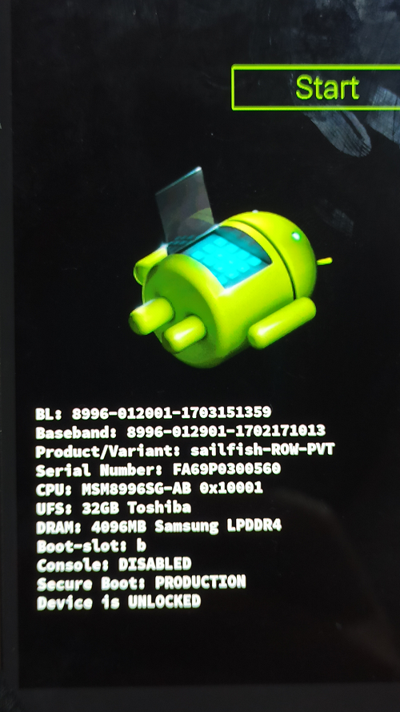

`usb`线连接到电脑后，可以使用`fastboot`命令检测到：

> 如果系统是在`VMware`里，那么要确保`usb`口连接到`VMware`里的`Linux`系统。

```
# fastboot devices
FA69P0300560    fastboot
```

最终就是进入刚刚解压出来的`sailfish`镜像文件夹，运行其中的`flash-all.sh`命令即可。

```
# cd sailfish-n2g47o/
# ./flash-all.sh 
Sending 'bootloader_b' (32380 KB)                  OKAY [  3.792s]
Writing 'bootloader_b'                             (bootloader) Valid bootloader version.
(bootloader) Flashing active slot "_b" 
(bootloader) Flashing active slot "_b" 
OKAY [ 12.260s]
Finished. Total time: 16.250s
Rebooting into bootloader                          OKAY [  0.048s]
Finished. Total time: 0.149s
< waiting for any device >
Sending 'radio_b' (57240 KB)                       OKAY [  6.854s]
Writing 'radio_b'                                  OKAY [  0.951s]
Finished. Total time: 7.991s
Rebooting into bootloader                          OKAY [  0.045s]
Finished. Total time: 0.096s
--------------------------------------------
Bootloader Version...: 8996-012001-1703151359
Baseband Version.....: 8996-012901-1702171013
Serial Number........: FA69P0306926
--------------------------------------------
extracting android-info.txt (0 MB) to RAM...
Checking 'product'                                 OKAY [  0.048s]
Checking 'version-bootloader'                      OKAY [  0.050s]
Checking 'version-baseband'                        OKAY [  0.050s]
Setting current slot to 'b'                        OKAY [  0.405s]
extracting boot.img (24 MB) to disk... took 0.353s
archive does not contain 'boot.sig'
Sending 'boot_b' (24653 KB)                        OKAY [  3.192s]
Writing 'boot_b'                                   OKAY [  0.605s]
archive does not contain 'system.sig'
Sending sparse 'system_b' 1/4 (521196 KB)          OKAY [ 64.041s]
Writing 'system_b'                                 OKAY [  7.893s]
Sending sparse 'system_b' 2/4 (524080 KB)          OKAY [ 66.481s]
Writing 'system_b'                                 OKAY [ 15.006s]
Sending sparse 'system_b' 3/4 (496387 KB)          OKAY [ 60.688s]
Writing 'system_b'                                 OKAY [  7.644s]
Sending sparse 'system_b' 4/4 (32756 KB)           OKAY [  4.007s]
Writing 'system_b'                                 OKAY [  0.996s]
archive does not contain 'system_ext.img'
extracting system_other.img (1641 MB) to disk... took 30.917s
archive does not contain 'system.sig'
Sending sparse 'system_a' 1/4 (520579 KB)          OKAY [ 64.744s]
Writing 'system_a'                                 OKAY [  5.791s]
Sending sparse 'system_a' 2/4 (521193 KB)          OKAY [ 63.390s]
Writing 'system_a'                                 OKAY [  6.042s]
Sending sparse 'system_a' 3/4 (510220 KB)          OKAY [ 61.388s]
Writing 'system_a'                                 OKAY [  5.191s]
Sending sparse 'system_a' 4/4 (128745 KB)          OKAY [ 15.756s]
Writing 'system_a'                                 OKAY [  1.953s]
extracting vendor.img (236 MB) to disk... took 4.279s
archive does not contain 'vendor.sig'
Sending 'vendor_b' (242102 KB)                     OKAY [ 29.721s]
Writing 'vendor_b'                                 OKAY [  7.801s]
archive does not contain 'vendor_other.img'
Erasing 'userdata'                                 OKAY [  6.061s]
mke2fs 1.45.4 (23-Sep-2019)
Creating filesystem with 6509568 4k blocks and 1630208 inodes
Filesystem UUID: 4b251af0-28e0-479e-b726-813ed8a0ed0c
Superblock backups stored on blocks: 
        32768, 98304, 163840, 229376, 294912, 819200, 884736, 1605632, 2654208, 
        4096000

Allocating group tables: done                            
Writing inode tables: done                            
Creating journal (32768 blocks): done
Writing superblocks and filesystem accounting information: done   

Sending 'userdata' (4272 KB)                       OKAY [  0.572s]
Writing 'userdata'                                 OKAY [  0.111s]
Rebooting                                          OKAY [  0.050s]
Finished. Total time: 567.899s

```

安装成功就会出现`finished`字样，并且手机重启，进入系统。

### 准备环境：使用`SuperSU`进行`root`

貌似`Magisk`环境与`XPOSED`是有冲突的，不然不会有[[Magisk] Systemless Xposed v89.3/v90.2-beta3 (SDK 21-27)](https://forum.xda-developers.com/xposed/unofficial-systemless-xposed-t3388268)这种产物了，所以幸亏我们选择的是`7.1.2`，用老牌的`SuperSU`还是支持的。

`SuperSU`官网提供的下载已经无法下载了，所以在其他网盘里找到个能用的[SR3-SuperSU-v2.82-SR3-20170813133244.zip](picC/SR3-SuperSU-v2.82-SR3-20170813133244.zip)，用`TWRP`刷进这个`SuperSU`就行了。

`TWRP`则使用这个版本：[twrp-3.2.1-0-sailfish.img](picC/twrp-3.2.1-0-sailfish.img)，先都下载了。

1. 首先手机进入`bootloader`状态，这个上文已经讲过；
2. 使用`fastboot`命令加载`TWRP`，

```
# fastboot boot twrp-3.2.1-0-sailfish.img 
Sending 'boot.img' (30948 KB)                      OKAY [  3.981s]
Booting                                            OKAY [  1.005s]
Finished. Total time: 5.160s
```
3. 待`TWRP`完全开机之后，将`SR3-SuperSU-v2.82-SR3-20170813133244.zip`推送到`/sdcard/`目录下：

```
# adb push SR3-SuperSU-v2.82-SR3-20170813133244.zip /sdcard/
* daemon not running; starting now at tcp:5037
* daemon started successfully
SR3-SuperSU-v2.82-SR3-20170813133244.zip: 1 file pushed, 0 skipped. 21.8 MB/s (6918737 bytes in 0.303s)
```

4. 选择`Install`，浏览到`/sdcard/`目录下，点选`SR3-SuperSU-v2.82-SR3-20170813133244.zip`文件，将最下方滑块从最左拖到最右，即开始刷入`SuperSU`。刷入成功后如图所示。

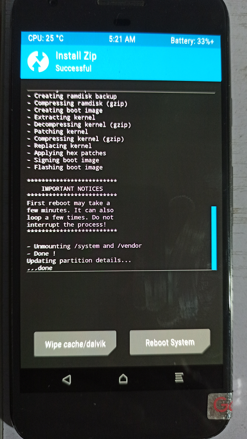

选择`Reboot System`→ `Do Not Install`即可。

### 准备环境：安装`Xposed`框架并激活插件

[下载](https://forum.xda-developers.com/showthread.php?t=3034811)安装最新版[xposed.installer_3.1.5](picC/de.robv.android.xposed.installer_3.1.5-43_minAPI15(nodpi)_apkmirror.com.apk)，下载完安装和打开，然后安装`Xposed`的底包，具体流程见下图。

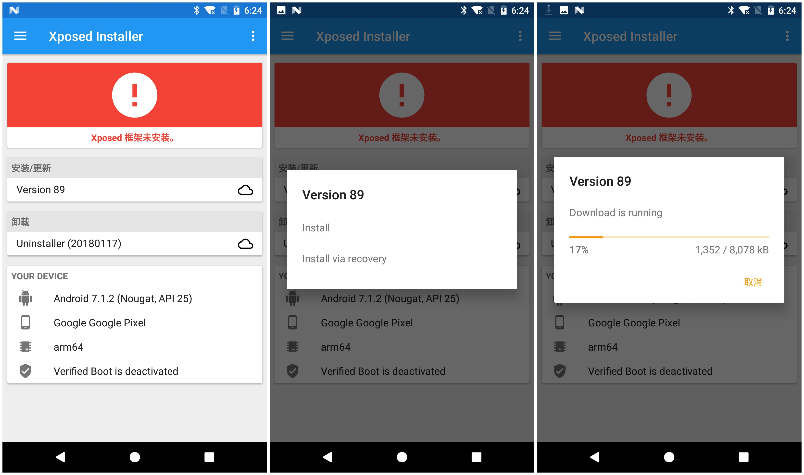

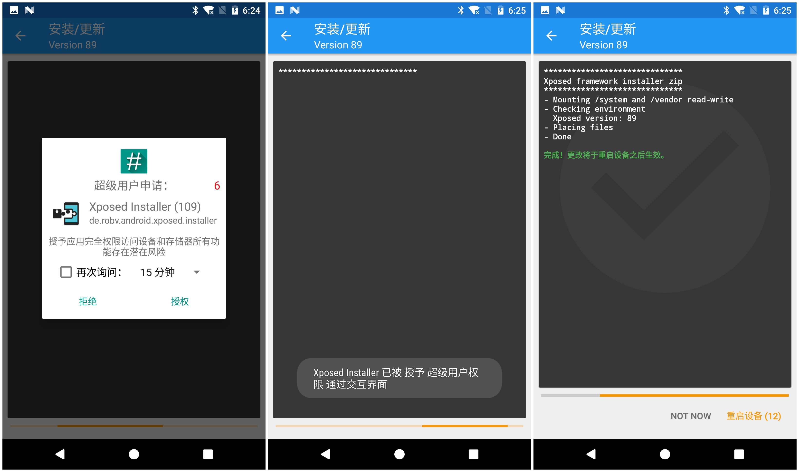

安装、重启完成后，须出现“`Xposed`框架89版已激活”字样，绿色勾勾（而不是红色或黄色）。在`Xposed Installer`的“下载”模块里找到`GraviryBox[N]`安装和激活，然后让状态栏文字变成如图绿色康康（原来为白色）。

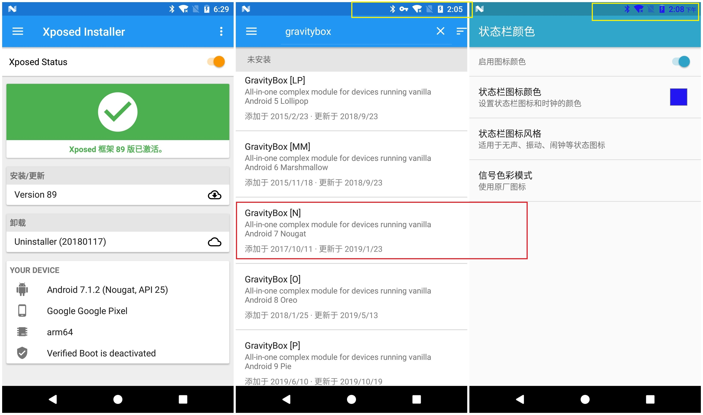

到这里框架和插件都安装成功并正常使用了。

### 收集特征：底包详细信息

从手机里把底包抽出来，也就是`xposed-v89-sdk25-arm64.zip`，应该就是服务器上的`https://dl-xda.xposed.info/framework/sdk25/arm64/xposed-v89-sdk25-arm64.zip`，解压康康发现里面东西很多。

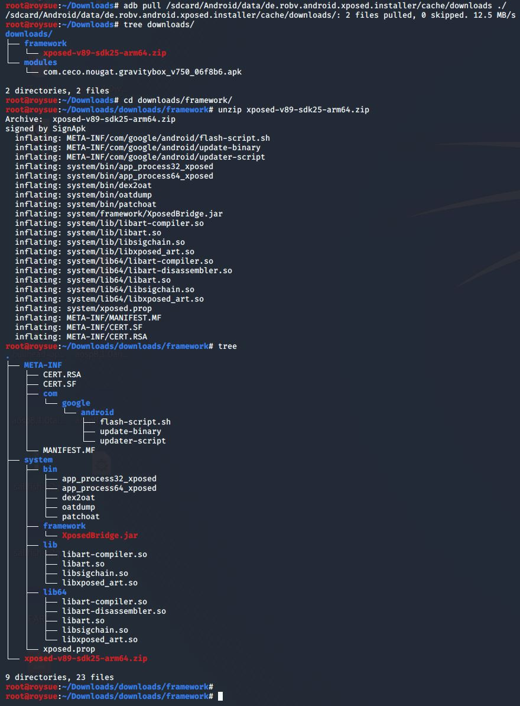

这个里面最关键的就是安装包文件做了什么，这里只取最关键的康康，其余拷贝证书之类的，心里有数就好：

```
# cat META-INF/com/google/android/flash-script.sh
```

```sh
##########################################################################################
#
# Xposed framework installer zip.
#
# This script installs the Xposed framework files to the system partition.  该脚本将Xposed框架安装到系统分区
# The Xposed Installer app is needed as well to manage the installed modules. XposedInstaller用来管理模块
#
##########################################################################################

...
...

##########################################################################################

echo "******************************"
echo "Xposed framework installer zip" 框架安装
echo "******************************"

if [ ! -f "system/xposed.prop" ]; then
  echo "! Failed: Extracted file system/xposed.prop not found!"
  exit 1
fi

# 挂载system和vendor分区可读可写
echo "- Mounting /system and /vendor read-write"
mount /system >/dev/null 2>&1
mount /vendor >/dev/null 2>&1
mount -o remount,rw /system
mount -o remount,rw /vendor >/dev/null 2>&1
if [ ! -f '/system/build.prop' ]; then
  echo "! Failed: /system could not be mounted!"
  exit 1
fi

# 检查环境并设置变量
echo "- Checking environment"
API=$(grep_prop ro.build.version.sdk)
APINAME=$(android_version $API)
ABI=$(grep_prop ro.product.cpu.abi | cut -c-3)
ABI2=$(grep_prop ro.product.cpu.abi2 | cut -c-3)
ABILONG=$(grep_prop ro.product.cpu.abi)
XVERSION=$(grep_prop version system/xposed.prop)
XARCH=$(grep_prop arch system/xposed.prop)
XMINSDK=$(grep_prop minsdk system/xposed.prop)
XMAXSDK=$(grep_prop maxsdk system/xposed.prop)

XEXPECTEDSDK=$(android_version $XMINSDK)
if [ "$XMINSDK" != "$XMAXSDK" ]; then
  XEXPECTEDSDK=$XEXPECTEDSDK' - '$(android_version $XMAXSDK)
fi

ARCH=arm
IS64BIT=
if [ "$ABI" = "x86" ]; then ARCH=x86; fi;
if [ "$ABI2" = "x86" ]; then ARCH=x86; fi;
if [ "$API" -ge "21" ]; then
  if [ "$ABILONG" = "arm64-v8a" ]; then ARCH=arm64; IS64BIT=1; fi;
  if [ "$ABILONG" = "x86_64" ]; then ARCH=x64; IS64BIT=1; fi;
fi


# 这一行其实输出更加详细的信息，只是被作者注销掉了
# echo "DBG [$API] [$ABI] [$ABI2] [$ABILONG] [$ARCH] [$XARCH] [$XMINSDK] [$XMAXSDK] [$XVERSION]"

# 只输出了简化版信息，图片中有。
echo "  Xposed version: $XVERSION"

# 如果各种信息不匹配，则输出错误信息
XVALID=
if [ "$ARCH" = "$XARCH" ]; then
  if [ "$API" -ge "$XMINSDK" ]; then
    if [ "$API" -le "$XMAXSDK" ]; then
      XVALID=1
    else
      echo "! Wrong Android version: $APINAME"
      echo "! This file is for: $XEXPECTEDSDK"
    fi
  else
    echo "! Wrong Android version: $APINAME"
    echo "! This file is for: $XEXPECTEDSDK"
  fi
else
  echo "! Wrong platform: $ARCH"
  echo "! This file is for: $XARCH"
fi

if [ -z $XVALID ]; then
  echo "! Please download the correct package"
  echo "! for your platform/ROM!"
  exit 1
fi

# 上面环境监测都通过时，就开始把不同的文件放到相应的位置上去，区分32位和64位。

echo "- Placing files"
install_nobackup /system/xposed.prop                      0    0 0644
install_nobackup /system/framework/XposedBridge.jar       0    0 0644

install_and_link  /system/bin/app_process32               0 2000 0755 u:object_r:zygote_exec:s0
install_overwrite /system/bin/dex2oat                     0 2000 0755 u:object_r:dex2oat_exec:s0
install_overwrite /system/bin/oatdump                     0 2000 0755
install_overwrite /system/bin/patchoat                    0 2000 0755 u:object_r:dex2oat_exec:s0
install_overwrite /system/lib/libart.so                   0    0 0644
install_overwrite /system/lib/libart-compiler.so          0    0 0644
install_overwrite /system/lib/libart-disassembler.so      0    0 0644
install_overwrite /system/lib/libsigchain.so              0    0 0644
install_nobackup  /system/lib/libxposed_art.so            0    0 0644
if [ $IS64BIT ]; then
  install_and_link  /system/bin/app_process64             0 2000 0755 u:object_r:zygote_exec:s0
  install_overwrite /system/lib64/libart.so               0    0 0644
  install_overwrite /system/lib64/libart-compiler.so      0    0 0644
  install_overwrite /system/lib64/libart-disassembler.so  0    0 0644
  install_overwrite /system/lib64/libsigchain.so          0    0 0644
  install_nobackup  /system/lib64/libxposed_art.so        0    0 0644
fi

if [ "$API" -ge "22" ]; then
  find /system /vendor -type f -name '*.odex.gz' 2>/dev/null | while read f; do mv "$f" "$f.xposed"; done
fi

echo "- Done"
exit 0
```

也就是说该脚本的实质，把确保安装包没有下错，跟系统环境是匹配的，以及把不同的文件放到相应的位置上去。这里我们有了基本的概念，至少我们最终编译出来的可以刷机的包，得包含下列文件，他们最终会被放在系统的`system/bin/`、`system/framework/`、`system/lib64/`位置上。

简单地搜下字符串，可以看到几乎所有的二进制文件中都含有`xposed`的字符串，我们最终的目标最起码要拿掉`xposed`的字符串特征。

```
# grep -ril "xposed" *
META-INF/CERT.SF
META-INF/MANIFEST.MF
META-INF/com/google/android/update-binary
META-INF/com/google/android/flash-script.sh
system/lib64/libxposed_art.so
system/lib64/libart-compiler.so
system/lib64/libart.so
system/lib/libxposed_art.so
system/lib/libart-compiler.so
system/lib/libart.so
system/bin/oatdump
system/bin/dex2oat
system/bin/app_process32_xposed
system/bin/app_process64_xposed
xposed-v89-sdk25-arm64.zip
```

这些文件的用途及与源码的比对我们下一章再详细介绍。


### 收集特征：日志输出信息

`Xposed`插件在运行的时候会输出日志，如下图：

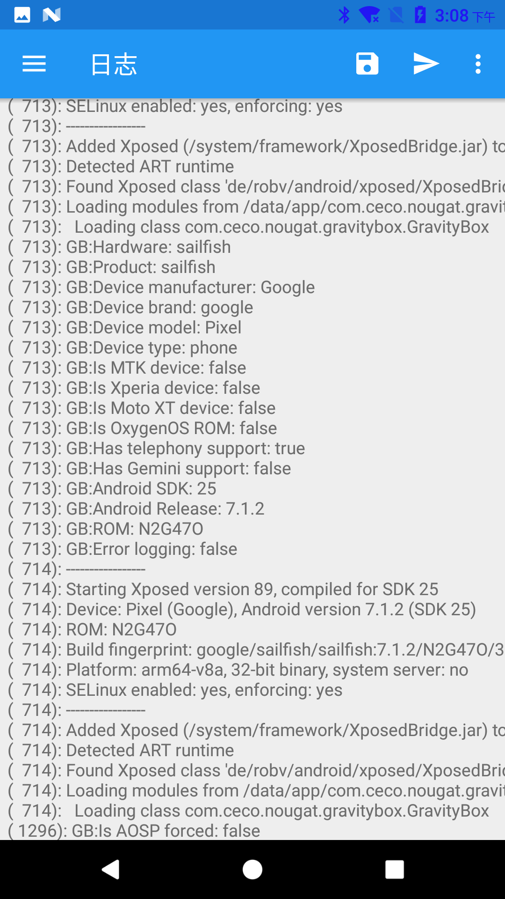

可以提取出来看个完整的：

```
# cat xposed_error_20200331_150832.log 
03-31 14:06:50.383 I/Xposed  (  713): -----------------
03-31 14:06:50.383 I/Xposed  (  713): Starting Xposed version 89, compiled for SDK 25
03-31 14:06:50.384 I/Xposed  (  713): Device: Pixel (Google), Android version 7.1.2 (SDK 25)
03-31 14:06:50.384 I/Xposed  (  713): ROM: N2G47O
03-31 14:06:50.384 I/Xposed  (  713): Build fingerprint: google/sailfish/sailfish:7.1.2/N2G47O/3852959:user/release-keys
03-31 14:06:50.384 I/Xposed  (  713): Platform: arm64-v8a, 64-bit binary, system server: yes
03-31 14:06:50.384 I/Xposed  (  713): SELinux enabled: yes, enforcing: yes
03-31 14:06:51.426 I/Xposed  (  713): -----------------
03-31 14:06:51.426 I/Xposed  (  713): Added Xposed (/system/framework/XposedBridge.jar) to CLASSPATH
03-31 14:06:52.425 I/Xposed  (  713): Detected ART runtime
03-31 14:06:52.433 I/Xposed  (  713): Found Xposed class 'de/robv/android/xposed/XposedBridge', now initializing
03-31 14:06:52.774 I/Xposed  (  713): Loading modules from /data/app/com.ceco.nougat.gravitybox-1/base.apk
03-31 14:06:52.806 I/Xposed  (  713):   Loading class com.ceco.nougat.gravitybox.GravityBox
03-31 14:06:52.819 I/Xposed  (  713): GB:Hardware: sailfish
03-31 14:06:52.819 I/Xposed  (  713): GB:Product: sailfish
03-31 14:06:52.819 I/Xposed  (  713): GB:Device manufacturer: Google
03-31 14:06:52.819 I/Xposed  (  713): GB:Device brand: google
03-31 14:06:52.819 I/Xposed  (  713): GB:Device model: Pixel
03-31 14:06:52.821 I/Xposed  (  713): GB:Device type: phone
03-31 14:06:52.821 I/Xposed  (  713): GB:Is MTK device: false
03-31 14:06:52.821 I/Xposed  (  713): GB:Is Xperia device: false
03-31 14:06:52.821 I/Xposed  (  713): GB:Is Moto XT device: false
03-31 14:06:52.821 I/Xposed  (  713): GB:Is OxygenOS ROM: false
03-31 14:06:52.822 I/Xposed  (  713): GB:Has telephony support: true
03-31 14:06:52.822 I/Xposed  (  713): GB:Has Gemini support: false
03-31 14:06:52.822 I/Xposed  (  713): GB:Android SDK: 25
03-31 14:06:52.822 I/Xposed  (  713): GB:Android Release: 7.1.2
03-31 14:06:52.822 I/Xposed  (  713): GB:ROM: N2G47O
03-31 14:06:52.822 I/Xposed  (  713): GB:Error logging: false
03-31 14:07:05.189 I/Xposed  ( 1296): GB:Is AOSP forced: false
```

可以观察到主要涉及的文件也就是`/system/framework/XposedBridge.jar`，也就是前文中放到`/system/framework/`的`XposedBridge.jar`文件，可见`XposedBridge.jar`文件在`Xposed`插件的运行中起到了关键的作用。

### 收集特征：插件开发配置信息

根据[官方`tutorial`](https://github.com/rovo89/XposedBridge/wiki/Development-tutorial)，典型的插件开发流程分为：

- 加入`Xposed Framework API`
- 修改`AndroidManifest.xml`
- 编写`hook`代码
- 将类注册到`assets/xposed_init`文件中去

比如编写下述`java`的`hook`代码，最终效果就是改变系统时钟颜色：

```java
package de.robv.android.xposed.mods.tutorial;

import static de.robv.android.xposed.XposedHelpers.findAndHookMethod;
import android.graphics.Color;
import android.widget.TextView;
import de.robv.android.xposed.IXposedHookLoadPackage;
import de.robv.android.xposed.XC_MethodHook;
import de.robv.android.xposed.callbacks.XC_LoadPackage.LoadPackageParam;

public class Tutorial implements IXposedHookLoadPackage {
	public void handleLoadPackage(final LoadPackageParam lpparam) throws Throwable {
		if (!lpparam.packageName.equals("com.android.systemui"))
			return;

		findAndHookMethod("com.android.systemui.statusbar.policy.Clock", lpparam.classLoader, "updateClock", new XC_MethodHook() {
			@Override
			protected void afterHookedMethod(MethodHookParam param) throws Throwable {
				TextView tv = (TextView) param.thisObject;
				String text = tv.getText().toString();
				tv.setText(text + " :)");
				tv.setTextColor(Color.RED);
			}
		});
	}
}
```

可以看到引入的包都位于`de.robv.android.xposed`包中，当然这也是引入`Xposed Framework API`时被包含进项目的：

```gradle
repositories {
    jcenter();
}

dependencies {
    provided 'de.robv.android.xposed:api:82'
}
```

官网最新的版本还是`api-82.jar`、`api-source-82.jar`。


下载来看下里面的内容，一个是`.class`字节码，一个是`.java`源代码而已。

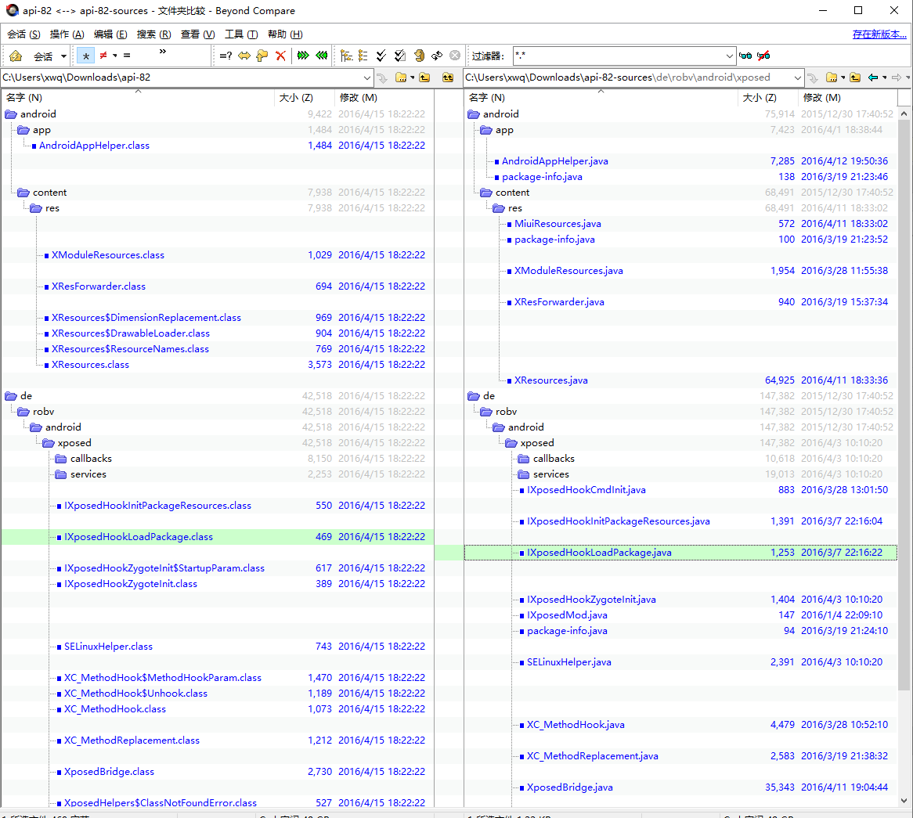

随便打开个文件来康康，`IXposedHookLoadPackage.java`：

```java
package de.robv.android.xposed;

import android.app.Application;

import de.robv.android.xposed.callbacks.XC_LoadPackage;
import de.robv.android.xposed.callbacks.XC_LoadPackage.LoadPackageParam;

/**
 * Get notified when an app ("Android package") is loaded.
 * This is especially useful to hook some app-specific methods.
 *
 * <p>This interface should be implemented by the module's main class. Xposed will take care of
 * registering it as a callback automatically.
 */
public interface IXposedHookLoadPackage extends IXposedMod {
	/**
	 * This method is called when an app is loaded. It's called very early, even before
	 * {@link Application#onCreate} is called.
	 * Modules can set up their app-specific hooks here.
	 *
	 * @param lpparam Information about the app.
	 * @throws Throwable Everything the callback throws is caught and logged.
	 */
	void handleLoadPackage(LoadPackageParam lpparam) throws Throwable;

	/** @hide */
	final class Wrapper extends XC_LoadPackage {
		private final IXposedHookLoadPackage instance;
		public Wrapper(IXposedHookLoadPackage instance) {
			this.instance = instance;
		}
		@Override
		public void handleLoadPackage(LoadPackageParam lpparam) throws Throwable {
			instance.handleLoadPackage(lpparam);
		}
	}
}

```

里面的各种`xposed`特征字符串到处都是。

也就是说，如果我们更改了`xposed`的字符串特征，也要制作这样的一份`api-82.jar`、`api-source-82.jar`，供开发者编写代码时进行调用。

并且开发者在编码时，使用的系列`API`中，至少不存在`xposed`字样。

到这里正常的`Xposed`插件开发及使用流程中可以搜集到的特征就都有了，接下来看一个专业检测`Xposed`的`App`，看看它主要检测哪些方面。

### 收集特征：`XposedChecker`源码

作者已经将源码开源：[XposedChecker](https://github.com/w568w/XposedChecker)，安装包位于`app`目录中，名字叫`Xposed Checker 4.apk`，先装上去跑一下，申请`root`权限时点击“同意”，结果如下图所示，可信度竟然5/9，我的`GravityBox`插件还在跑着，状态栏还变着色：

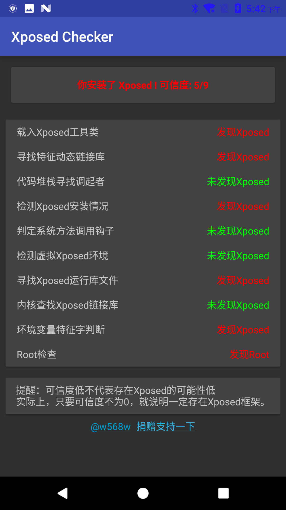

这个结果肯定是不准确的，那四个绿色的项目中，只有“检测虚拟Xposed环境”是对的，毕竟我们不是`VirtualXposed`，而是真实的`Xposed`。其他三项出现了失误，可以看看它的源码怎么写的，主要的检测逻辑位于`app\src\main\java\ml\w568w\checkxposed\ui\MainActivity.java`文件中，定义了以下功能：

```java
private static final String[] CHECK_ITEM = {
  "载入Xposed工具类",
  "寻找特征动态链接库",
  "代码堆栈寻找调起者",
  "检测Xposed安装情况",
  "判定系统方法调用钩子",
  "检测虚拟Xposed环境",
  "寻找Xposed运行库文件",
  "内核查找Xposed链接库",
  "环境变量特征字判断",
};

```

- 载入Xposed工具类

```java
private boolean testClassLoader() {
        try {
            ClassLoader.getSystemClassLoader()
				.loadClass("de.robv.android.xposed.XposedHelpers");

            return true;
        }
		catch (ClassNotFoundException e) {
            e.printStackTrace();
        }
        return false;
    }
```

- 寻找特征动态链接库

```java
private int check2() {
    return checkContains("XposedBridge") ? 1 : 0;
}
public static boolean checkContains(String paramString) {
    try {
        HashSet<String> localObject = new HashSet<>();
        // 读取maps文件信息
        BufferedReader localBufferedReader =
    new BufferedReader(new FileReader("/proc/" + Process.myPid() + "/maps"));
        while (true) {
            String str = localBufferedReader.readLine();
            if (str == null) {
                break;
            }
            localObject.add(str.substring(str.lastIndexOf(" ") + 1));
        }
        //应用程序的链接库不可能是空，除非是高于7.0。。。
        if (localObject.isEmpty() && Build.VERSION.SDK_INT <= Build.VERSION_CODES.M) {
            return true;
        }
        localBufferedReader.close();
        for (String aLocalObject : localObject) {
            if (aLocalObject.contains(paramString)) {
                return true;
            }
        }
    }
catch (Throwable ignored) {
    }
    return false;
}
```


- 代码堆栈寻找调起者

```java
private int check3() {
        try {
            throw new Exception();
        }
		catch (Exception e) {
            StackTraceElement[] arrayOfStackTraceElement = e.getStackTrace();
            for (StackTraceElement s : arrayOfStackTraceElement) {
                if ("de.robv.android.xposed.XposedBridge".equals(s.getClassName())) {
                    return 1;
                }
            }
            return 0;
        }
    }
```

- 检测`XposedInstaller`安装情况

```java
    private int check4() {
        try {
            List<PackageInfo> list = getPackageManager().getInstalledPackages(0);
            for (PackageInfo info : list) {
                if ("de.robv.android.xposed.installer".equals(info.packageName)) {
                    return 1;
                }
                if ("io.va.exposed".equals(info.packageName)) {
                    return 1;
                }
            }
        }
		catch (Throwable ignored) {

        }
        return 0;
    }
```

- 判定系统方法调用钩子

```java
    private int check5() {
        try {
            Method method = Throwable.class.getDeclaredMethod("getStackTrace");
            return Modifier.isNative(method.getModifiers()) ? 1 : 0;
        }
		catch (NoSuchMethodException e) {
            e.printStackTrace();
        }
        return 0;
    }
```

- 检测虚拟Xposed环境

```java
private int check6() {
    return System.getProperty("vxp") != null ? 1 : 0;
}
```


- 寻找Xposed运行库文件


```java
private int check7() {
        CommandResult commandResult = Shell.run("ls /system/lib");
        return commandResult.isSuccessful() ? commandResult.getStdout().contains("xposed") ? 1 : 0 : 0;
    }
```

- 内核查找Xposed链接库

```c
char isXposedMaps(char * pid){
	FILE * maps;
	char path[80];
	char * content;
	strcpy (path,"/proc/");
	strcat (path,pid);
	strcat (path,"/maps");
	if((maps=fopen(path,"r"))==NULL){
		return 0;
	}else{
		int len=filelength(maps);
		content=(char *)malloc(len);
		fread(content,len,1,maps);
		content[len-1]='\0';
		return strstr(content,"XposedBridge")!=NULL;
	}
}
```

- 环境变量特征字判断

```java
private int check9() {
    return System.getenv("CLASSPATH").contains("XposedBridge") ? 1 : 0;
}
```

### 收集特征：逆向分析大厂方案

- [Android逆向之旅---破解某支付软件防Xposed等框架Hook功能检测机制](https://mp.weixin.qq.com/s/Je1kRksxHTTYb4l9x3bTmQ)

- [阿里系产品Xposed Hook检测机制原理分析](https://www.52pojie.cn/thread-621570-1-1.html)

- [美团出品-Android Hook技术防范漫谈](https://tech.meituan.com/android_anti_hooking.html)

- [看雪出品-企业壳反调试及hook检测分析](https://mp.weixin.qq.com/s/StnqWtZMFCu09snIEGi1RQ)

- [支付宝小专栏-无需 Root 也能使用 Xposed](https://mp.weixin.qq.com/s/ZFJdne95K_cA223ey-LRLA)

- [抖音短视频检测 Xposed 分析（一）](https://www.52pojie.cn/thread-684757-1-1.html)

- [抖音短视频检测 Xposed 分析（二）](https://www.52pojie.cn/thread-691584-1-1.html)

- [检测Android虚拟机的方法和代码实现](https://mp.weixin.qq.com/s/tamMeh2xsi6L37jjizW_rA)

以上每一篇都看过来之后，发现文章还是比较过时的，现在大部分风控都是写在`so`中，检测项目可能多达成百上千项，并且`Ollvm`甚至自家`vmp`来混淆下，不会让你轻易地找到并`patch`的；只是他们收集了环境特征后只是加密上传，并不会把`app`退掉让你发现而已。

针对这种加固/风控的行为特征，可能比较好的方案就是修改`aosp`系统源码，打更多的埋点，收集`so`的检测项目，形成一个`checklist`；或者`unicorn`来模拟执行，只是现在对抗`unicorn`的技术也越来越多，`unicorn`的终极形态，就是一个完整的安卓系统；所以不如直接改系统。

当然我们不用分析那么远，只需要简单修改`XPOSED`的字符串，过简单的根据字符串特征的`XPOSED`检测是没有问题的。

在下一篇中我们将介绍`XPOSED`框架之间的关系，以及如何编译使用原版`XPOSED`框架，最后一篇中再来简单更改特征。


