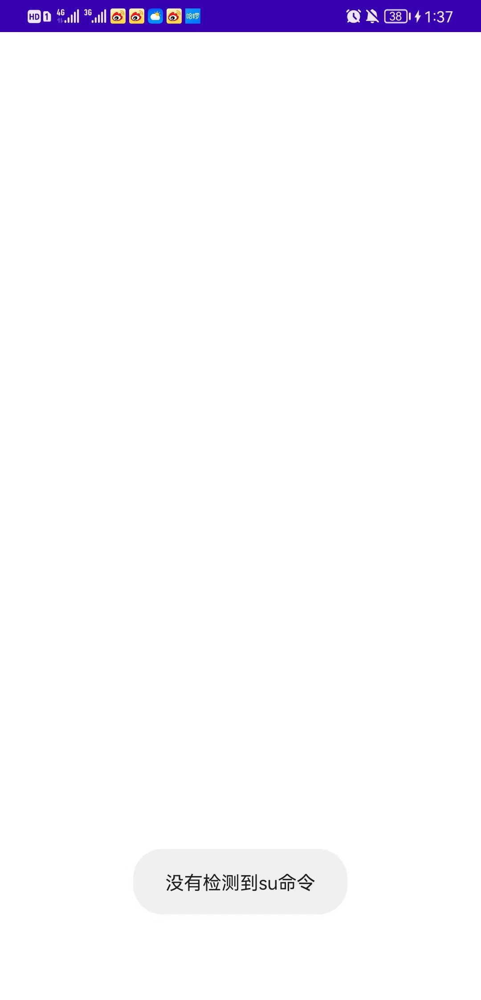
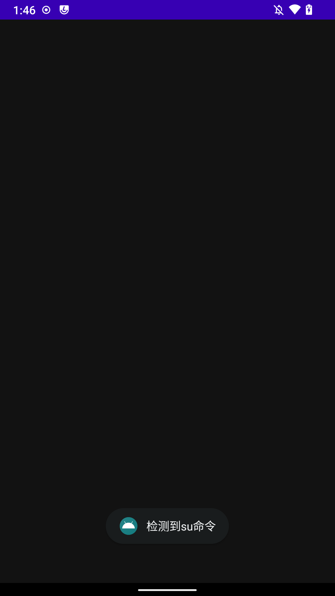
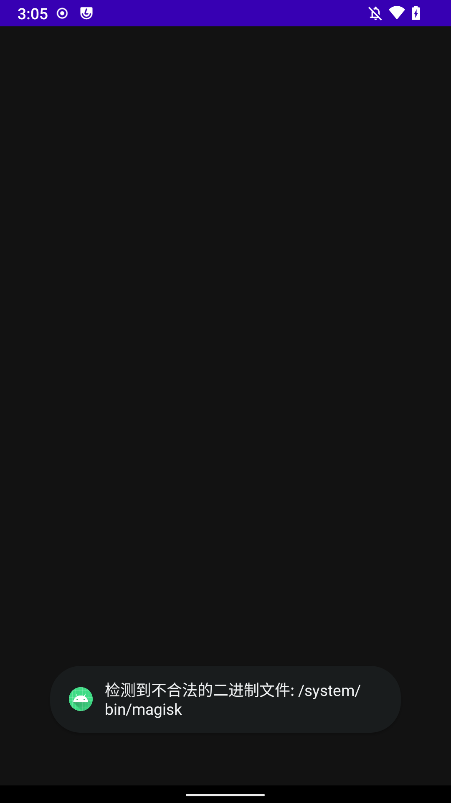
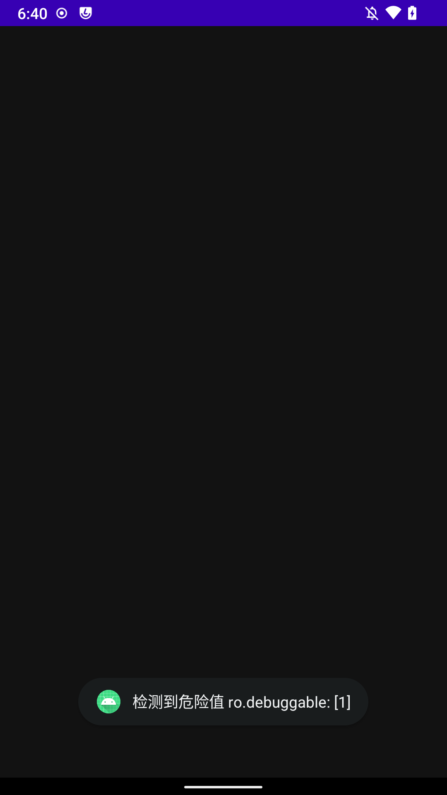
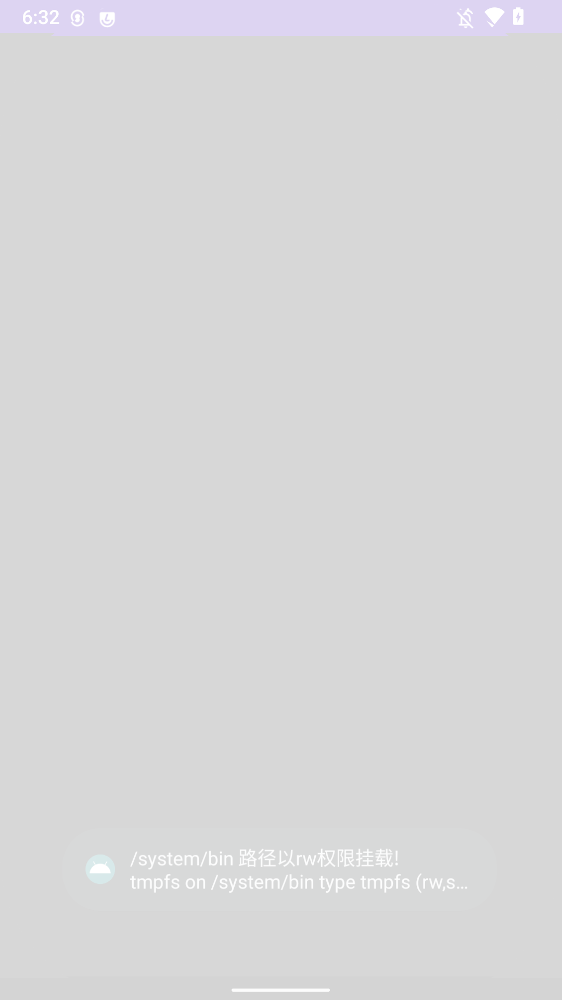
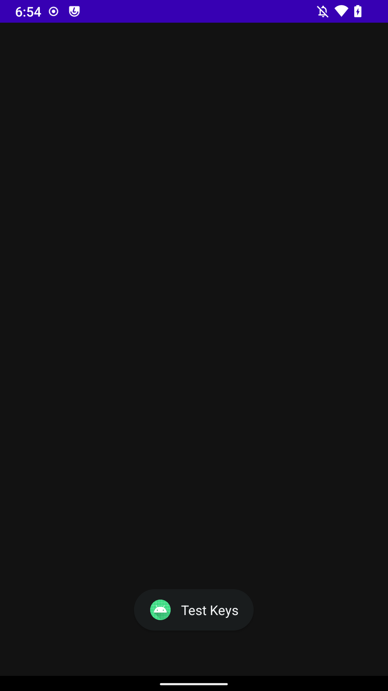
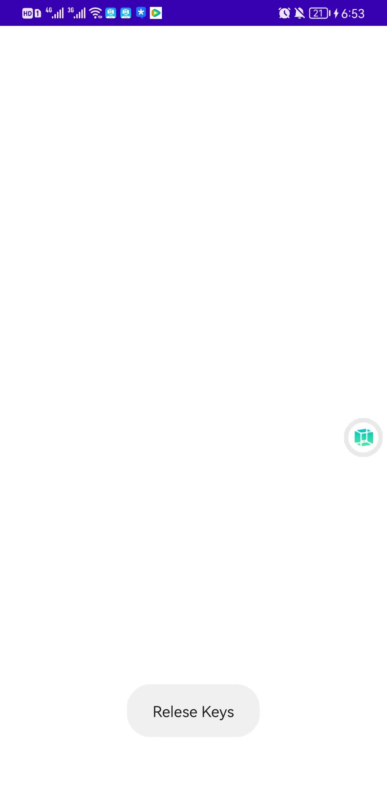

<!-- @import "[TOC]" {cmd="toc" depthFrom=1 depthTo=6 orderedList=false} -->

<!-- code_chunk_output -->

- [Intro](#intro)
- [《常见Java层反调试技术之root检测方式总结》](#常见java层反调试技术之root检测方式总结)
  - [执行'which su'命令检测su](#执行which-su命令检测su)
  - [检测在常用目录下是否存在非法的二进制文件](#检测在常用目录下是否存在非法的二进制文件)
  - [判断SELinux是否开启，](#判断selinux是否开启)
  - [检测ro.debuggable和ro.secure值](#检测rodebuggable和rosecure值)
  - [检查特定路径是否有写权限](#检查特定路径是否有写权限)
  - [检测test-keys](#检测test-keys)
  - [检测非法应用](#检测非法应用)

<!-- /code_chunk_output -->

# Intro

该系列为学员优秀作品系列，附件apk、代码等位于我的项目中，大家可以自取：

[https://github.com/r0ysue/AndroidSecurityStudy](https://github.com/r0ysue/AndroidSecurityStudy)

# 《常见Java层反调试技术之root检测方式总结》

Android 系统的设计初衷为了保护用户设备的安全和稳定性，并控制对系统的访问权限。因此，Android 系统会对root这种非授权的操作进行限制，在渗透测试 Android 应用程序时候，大多数技术都需要 root 权限才能安装各种工具，从而危及应用程序的安全性，以下是笔者对几种Root检测方式的总结，抛砖引玉


## 执行'which su'命令检测su 
su命令可用于切换至其他用户，安卓手机出于安全考虑，系统内部一般是没有su可执行文件，所以基于检查系统内部是否存在su文件的方式可以判断该系统有没有被Root

以下命令测试的是被Root过的手机，可以看到存在su
```bash
bullhead:/ $ which su
which su
/system/bin/su
```

而另一部华为手机没有被Root，没有检测到su
```bash
D:\Users\wyz\Desktop\Fastboot>adb shell
HWEVR:/ $ which su
which su
1|HWEVR:/ $
```

用java实现检测是否存在su命令
```java
 package com.example.checksu;

import android.os.Bundle;
import androidx.appcompat.app.AppCompatActivity;
import java.io.BufferedReader;
import java.io.InputStreamReader;
import android.widget.Toast;
 public class MainActivity extends AppCompatActivity {

    @Override
    protected void onCreate(Bundle savedInstanceState) {
        super.onCreate(savedInstanceState);

        if(checkSuExists())
        {
            Toast.makeText(getApplicationContext(), "检测到su命令",
                    Toast.LENGTH_SHORT).show();
        }
        else
        {
            Toast.makeText(getApplicationContext(),"没有检测到su命令",
                    Toast.LENGTH_SHORT).show();
        }
    }

     public boolean checkSuExists() {
         Process process = null;
         try {
             process = Runtime.getRuntime().exec(new String[] { "which", "su" });
             BufferedReader in = new BufferedReader(new InputStreamReader(process.getInputStream()));
             return in.readLine() != null;
         } catch (Throwable t) {
             return false;
         } finally {
             if (process != null) process.destroy();
         }
     }
}
```

没有root过的华为手机的检测结果


root过的N5x的检测结果


## 检测在常用目录下是否存在非法的二进制文件

笔者root过的N5x在一些环境变量路径里存在su和magisk
```bash
bullhead:/system/bin $ which magick
which magick
1|bullhead:/system/bin $ which magisk
which magisk
/system/bin/magisk
bullhead:/system/bin $ which su
which su
/system/bin/su
```

```bash
1|bullhead:/system/bin $ echo $PATH | grep /system/bin
echo $PATH | grep /system/bin
/product/bin:/apex/com.android.runtime/bin:/apex/com.android.art/bin:/system_ext/bin:/system/bin:/system/xbin:/odm/bin:/vendor/bin:/vendor/xbin
```


由此可以用遍历系统PATH的手段检测一些非法二进制文件，java实现如下
```java
package com.example.checkpath;

import android.os.Bundle;
import android.widget.Toast;
import androidx.appcompat.app.AppCompatActivity;
import java.io.File;
import java.util.ArrayList;
import java.util.Arrays;


public class MainActivity extends AppCompatActivity {

    @Override
    protected void onCreate(Bundle savedInstanceState) {
        super.onCreate(savedInstanceState);
        checkForBinary("magisk");
        checkForBinary("su");
        checkForBinary("busybox");
    }

    private static final String[] suPaths = {
            "/data/local/",
            "/data/local/bin/",
            "/data/local/xbin/",
            "/sbin/",
            "/su/bin/",
            "/system/bin/",
            "/system/bin/.ext/",
            "/system/bin/failsafe/",
            "/system/sd/xbin/",
            "/system/usr/we-need-root/",
            "/system/xbin/",
            "/cache/",
            "/data/",
            "/dev/"
    };

    public void checkForBinary(String filename) {

        String[] pathsArray = this.getPaths();

        boolean flag = false;

        for (String path : pathsArray) {
            String completePath = path + filename;
            File f = new File(path, filename);
            boolean fileExists = f.exists();
            if (fileExists) {
                Toast.makeText(getApplicationContext(), "检测到非法的二进制文件: "+path+filename, Toast.LENGTH_LONG).show();
            }
        }
    }

    private String[] getPaths() {
        ArrayList<String> paths = new ArrayList<>(Arrays.asList(suPaths));

        String sysPaths = System.getenv("PATH");

        // If we can't get the path variable just return the static paths
        if (sysPaths == null || "".equals(sysPaths)) {
            return paths.toArray(new String[0]);
        }

        for (String path : sysPaths.split(":")) {

            if (!path.endsWith("/")) {
                path = path + '/';
            }

            if (!paths.contains(path)) {
                paths.add(path);
            }
        }

        return paths.toArray(new String[0]);
    }
}
```

N5x运行结果



## 判断SELinux是否开启，

>**但此方法或已过时**，需要结合其他多种方法来判断手机是否root


用java反射获取ro.build.selinux值来判断
```java
package com.example.checkselinuxenabled;

import android.os.Bundle;
import android.widget.Toast;
import androidx.appcompat.app.AppCompatActivity;
import java.lang.reflect.Method;

public class MainActivity extends AppCompatActivity {

    @Override
    protected void onCreate(Bundle savedInstanceState) {
        super.onCreate(savedInstanceState);
        if(isSelinuxFlagInEnabled())
        {
            Toast.makeText(getApplicationContext(), "SELinux开启",
                    Toast.LENGTH_SHORT).show();
        }
        else
        {
            Toast.makeText(getApplicationContext(), "SELinux没有开启",
                    Toast.LENGTH_SHORT).show();
        }
    }

    private boolean isSelinuxFlagInEnabled() {
        try {
            Class<?> c = Class.forName("android.os.SystemProperties");
            Method get = c.getMethod("get", String.class);
            String selinux = (String) get.invoke(c, "ro.build.selinux");
            return "1".equals(selinux);
        } catch (Exception ignored) {

        }
        return false;
    }
}
```

## 检测ro.debuggable和ro.secure值

"ro.debuggable" 是 Android 操作系统中的一个属性，它指示设备是否已启用 Android Debug Bridge（ADB）功能。当该属性设置为 "1" 时，设备将启用 ADB 功能，允许开发人员使用各种工具和命令在设备上进行调试和测试。在生产环境中，该属性通常应该被设置为 "0" 以增加设备的安全性。如果该属性设置为 "1"，则任何人都可以使用 ADB 命令访问设备，从而可能会导致设备受到攻击或其他安全问题

"ro.secure" 是一个 Android 操作系统中的系统属性（System Property），它控制着该设备是否开启了安全性强化措施。如果该属性的值为 "1"，则表示该设备已开启安全性强化措施。如果该属性的值为 "0"，则表示该设备未开启安全性强化措施。

不过笔者root过的N5x的ro.secure值为1，不能盲目的相信ro.secure
```bash
bullhead:/ $ getprop ro.debuggable
getprop ro.debuggable
1
bullhead:/ $ getprop ro.secure
getprop ro.secure
1
```
所以，检测的逻辑是检查ro.debuggable属性是否为true，为true的话APP所运行环境很可能是Root环境
使用java代码实现
```java
package com.example.checkdebuggableandsecure;

import android.os.Bundle;
import android.widget.Toast;
import androidx.appcompat.app.AppCompatActivity;

import java.io.IOException;
import java.io.InputStream;
import java.util.HashMap;
import java.util.Map;
import java.util.NoSuchElementException;
import java.util.Scanner;

public class MainActivity extends AppCompatActivity {

    @Override
    protected void onCreate(Bundle savedInstanceState) {
        super.onCreate(savedInstanceState);
        checkForDangerousProps();
    }

    private void checkForDangerousProps() {

        final Map<String, String> dangerousProps = new HashMap<>();
        dangerousProps.put("ro.debuggable", "1");

        boolean result = false;

        String[] lines = propsReader();

        if (lines == null){
            // Could not read, assume false;
            return;
        }

        for (String line : lines) {
            for (String key : dangerousProps.keySet()) {
                if (line.contains(key)) {
                    String badValue = dangerousProps.get(key);
                    badValue = "[" + badValue + "]";
                    if (line.contains(badValue)) {
                        Toast.makeText(getApplicationContext(), "检测到危险值 "+key+": "+badValue,
                                Toast.LENGTH_LONG).show();
                    }
                }
            }
        }
    }

    private String[] propsReader() {
        try {
            InputStream inputstream = Runtime.getRuntime().exec("getprop").getInputStream();
            if (inputstream == null) return null;
            String propVal = new Scanner(inputstream).useDelimiter("\\A").next();
            return propVal.split("\n");
        } catch (IOException | NoSuchElementException e) {
            return null;
        }
    }
}
```

N5x执行以上代码的结果



## 检查特定路径是否有写权限
在 Linux 和 Android 的系统中，root 用户有着最高的权限，可以在系统中执行一些非常低级的操作，例如更改系统设置、系统文件、程序文件等。而其他常规用户则只能够在自己拥有的权限下进行操作，通过检查具体路径的读写权限，可以判断设备是否被root

下列Java代码将使用mount命令检查这些路径的读写权限，如果可读写，说明设备可能被root了   
```         
            /system
            /system/bin
            /system/sbin
            /system/xbin
            /vendor/bin
            /sbin
            /etc
            /sys
            /proc
            /dev
```

```java
package com.example.checkrw;

import android.os.Bundle;
import android.widget.Toast;
import androidx.appcompat.app.AppCompatActivity;
import java.io.IOException;
import java.io.InputStream;
import java.util.NoSuchElementException;
import java.util.Scanner;

public class MainActivity extends AppCompatActivity {
    @Override
    protected void onCreate(Bundle savedInstanceState) {
        super.onCreate(savedInstanceState);
        this.checkForRWPaths();
    }


    private String[] pathsThatShouldNotBeWritable = {
            "/system",
            "/system/bin",
            "/system/sbin",
            "/system/xbin",
            "/vendor/bin",
            "/sbin",
            "/etc",
            "/sys",
            "/proc",
            "/dev"
    };

    private String[] mountReader() {
        try {
            InputStream inputstream = Runtime.getRuntime().exec("mount").getInputStream();
            if (inputstream == null) return null;
            String propVal = new Scanner(inputstream).useDelimiter("\\A").next();
            return propVal.split("\n");
        } catch (IOException | NoSuchElementException e) {
            Toast.makeText(getApplicationContext(), e.getMessage(),
                    Toast.LENGTH_LONG).show();
            return null;
        }
    }

    public void checkForRWPaths() {

        //Run the command "mount" to retrieve all mounted directories
        String[] lines = mountReader();

        if (lines == null){
            return;
        }

        int sdkVersion = android.os.Build.VERSION.SDK_INT;

        for (String line : lines) {

            // Split lines into parts
            String[] args = line.split(" ");

            if ((sdkVersion <= android.os.Build.VERSION_CODES.M && args.length < 4)
                    || (sdkVersion > android.os.Build.VERSION_CODES.M && args.length < 6)) {
                // If we don't have enough options per line, skip this and log an error
                Toast.makeText(getApplicationContext(), "Error formatting mount line: "+line+line,
                        Toast.LENGTH_LONG).show();
                continue;
            }

            String mountPoint;
            String mountOptions;

            /**
             * To check if the device is running Android version higher than Marshmallow or not
             */
            if (sdkVersion > android.os.Build.VERSION_CODES.M) {
                mountPoint = args[2];
                mountOptions = args[5];
            } else {
                mountPoint = args[1];
                mountOptions = args[3];
            }

            for(String pathToCheck: this.pathsThatShouldNotBeWritable) {
                if (mountPoint.equalsIgnoreCase(pathToCheck)) {

                    /**
                     * If the device is running an Android version above Marshmallow,
                     * need to remove parentheses from options parameter;
                     */
                    if (android.os.Build.VERSION.SDK_INT > android.os.Build.VERSION_CODES.M) {
                        mountOptions = mountOptions.replace("(", "");
                        mountOptions = mountOptions.replace(")", "");

                    }

                    // Split options out and compare against "rw" to avoid false positives
                    for (String option : mountOptions.split(",")){

                        if (option.equalsIgnoreCase("rw")){
                            Toast.makeText(getApplicationContext(), pathToCheck+" 路径以rw权限挂载! "+line,
                                    Toast.LENGTH_LONG).show();
                        }
                    }
                }
            }
        }
    }


}
```

N5x执行以上代码的结果



## 检测test-keys

通过检测其系统属性中的"ro.build.tags"参数的值，如果其值为"test-keys"，则说明该手机系统是使用测试版的数字签名密钥构建的，而这种密钥是开发人员常用的，容易被黑客攻击，因此有被root的风险。而正式发布的Android系统则使用的是"release-keys"，这种密钥是由厂家发布的数字签名，更难被攻击，因此是相对安全的。因此，如果检测到一个Android设备的系统属性中的"ro.build.tags"为"test-keys"，则可以判定该设备可能被root

root过的N5x，打印出的ro.build.tags值为test-keys
```bash
bullhead:/ $ getprop ro.build.tags
getprop ro.build.tags
test-keys
```

没有root过的华为手机，打印出的ro.build.tags值为release-keys
```bash
HWEVR:/ $ getprop ro.build.tags
getprop ro.build.tags
release-keys
```

用java代码实现
```java
package com.example.checkbuildtags;

import android.os.Bundle;
import android.widget.Toast;
import androidx.appcompat.app.AppCompatActivity;

public class MainActivity extends AppCompatActivity {

    @Override
    protected void onCreate(Bundle savedInstanceState) {
        super.onCreate(savedInstanceState);
        if(detectTestKeys())
            Toast.makeText(getApplicationContext(), "Test Keys",
                    Toast.LENGTH_SHORT).show();
        else
            Toast.makeText(getApplicationContext(), "Relese Keys",
                    Toast.LENGTH_SHORT).show();
    }

    public boolean detectTestKeys() {
        String buildTags = android.os.Build.TAGS;
        return buildTags != null && buildTags.contains("test-keys");
    }

}
```

root过的N5x执行结果


没有root过的华为手机执行结果



## 检测非法应用
通过获取系统安装的应用列表，从中过滤出非法应用

以下命令过滤出了非法应用magisk
```bash
PS D:\Users\wyz\Desktop\Fastboot> ./adb shell pm list packages | findstr magisk
package:com.topjohnwu.magisk
```

用java代码实现类似逻辑，读者可在knownRootAppsPackages中加入自己的过滤列表，不过这段代码过滤不到magisk，建议读者使用Runtime.getRuntime().exec来执行和上段类似的shell命令进行过滤magisk
```java
package com.example.checkapp;

import android.content.pm.PackageManager;
import android.os.Bundle;
import android.widget.Toast;
import androidx.appcompat.app.AppCompatActivity;

import java.util.ArrayList;
import java.util.Arrays;
import java.util.List;

public class MainActivity extends AppCompatActivity {

    @Override
    protected void onCreate(Bundle savedInstanceState) {
        super.onCreate(savedInstanceState);
        detectPotentiallyDangerousApps();
    }

    static final String[] knownRootAppsPackages = {
            //add....
    };

    public void detectPotentiallyDangerousApps() {

        // Create a list of package names to iterate over from constants any others provided
        ArrayList<String> packages = new ArrayList<>();
        packages.addAll(Arrays.asList(this.knownRootAppsPackages));
        isAnyPackageFromListInstalled(packages);
    }

    private void isAnyPackageFromListInstalled(List<String> packages){
        PackageManager pm = getApplicationContext().getPackageManager();

        for (String packageName : packages) {
            try {
                // Root app detected
                pm.getPackageInfo(packageName, 0);
                Toast.makeText(getApplicationContext(), "检测到非法应用: "+packageName,
                        Toast.LENGTH_LONG).show();
            } catch (PackageManager.NameNotFoundException e) {
                Toast.makeText(getApplicationContext(), "没有检测到非法应用: "+packageName,
                        Toast.LENGTH_LONG).show();
            }
        }
    }
}
```

以上是笔者对各种root检测方式的一个粗略总结，应该把多种检测方式叠加，以确保检测成功率符合预期，不过这些都是初级的检测方式，不排除有大量的漏网之鱼