[toc]

# 《ObjC语法、iOS应用开发、及Objection自动化hook入门》

# Intro

本篇文章是《挑战不用macOS逆向iOS APP》系列的第二课iOS逆向基础知识主要为了了解在iOS APP逆向过程中一些常见知识，具体内容如下:

- ObjC基础语法与消息传递
- iOS开发简单了解
- iOS签名相关了解
  - 为什么企业签名可以卖钱?
  - 可以白嫖签名吗？不花钱那种？
  - 网上下载的IPA能长期无痛使用吗？
  - 第三方软件商店能用吗？感受如何？
  - AltStore第三方软件商店体验实操
- Objection自动化逆向与hook
- Objection破解简单CrackMe

该系列为学员优秀作品系列，附件apk、代码等位于我的项目中，大家可以自取：

[https://github.com/r0ysue/AndroidSecurityStudy](https://github.com/r0ysue/AndroidSecurityStudy)

# 1.Objective-C 基础语法 与消息传递

我们通过最简单的“Hello World！”源码来学习ObjC的基础语法知识。

## (1)类的声明与实现

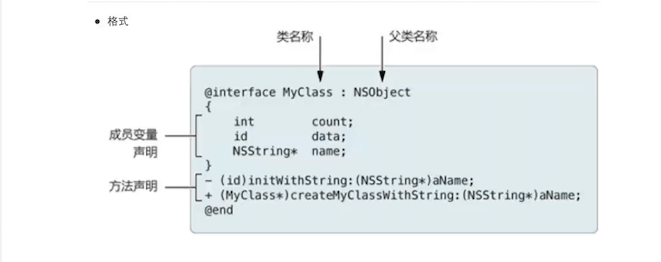

```ObjectiveC
声明：所有的类都继承自NSObject类
@interface test : NSObject {

}
@end

实现：
#import "test.h"
@implementation test

@end
```

## (2)类方法和实例方法的声明与实现

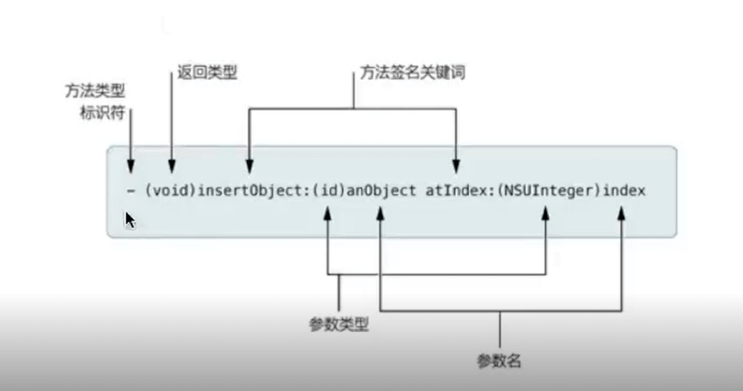

### ①类方法

```ObjectiveC
声明：
+(void) class_method;

实现：
+(void) class_method;
{
    NSLog(@"This is class_method");
}
```

### ②实例方法

```ObjectiveC
声明：
-(void) instance_method;

实现：
-(void) instance_method;
{
    NSLog(@"This is instance_method");
    test *test1 = [test new];
}
```

## (3)变量与属性

Objective- C类中的变量默认是private权限的，对象无法直接访问，否则会报错，属性则是使用@property声明，声明的属性可以选择是否自动生成getter() 和setter()方法

```ObjectiveC
声明：
{
    int num1;
    @public
    int num2;
}
@property(assign) int num1;//(assign)	括号内是用来写属性特性
@property(assign) int num2;

实现：
@synthesize num1;
@synthesize num2;
```

## (4)消息传递

C++里类别与方法的关系严格清楚，一个方法必定属于一个类别，而且在编译时（compile time）就已经紧密绑定，不可能调用一个不存在类别里的方法。但在Objective-C，类别与消息的关系比较松散，调用方法视为对对象发送消息，所有方法都被视为对消息的回应。所有消息处理直到运行时（runtime）才会动态决定，并交由类别自行决定如何处理收到的消息。

```ObjectiveC
[test class_method];
test *test1 = [test new];
[test1 instance_method];
```

完整类代码

```ObjectiveC
类声明：
@interface test : NSObject{
    int num1;
    @public
    int num2;
}
@property(assign) int num1;
@property(assign) int num2;
+(void) class_method;
-(void) instance_method;

@end

类实现：
#import "test.h"
@implementation test
@synthesize num1;
@synthesize num2;
+(void) class_method;
{
    NSLog(@"This is class_method");
}
-(void) instance_method;
{
    NSLog(@"This is instance_method");
    test *test1 = [test new];
    
}
@end

类实例化及方法调用：
#import <Foundation/Foundation.h>
#import "test.h"
int main(int argc, const char * argv[]) {
    @autoreleasepool {
        // insert code here...
        NSLog(@"Hello, World!");
        [test class_method];
    
        test *test1 = [test new];
        [test1 instance_method];
        
    }
    return 0;
}
```

# 2.iOS开发简述

## (1)ios架构

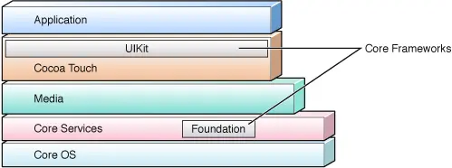

- Application Layer（应用层）、
- Cocoa Touch Layer（触摸层）、
- Media Layer （媒体层）、
- Core Services Layer（核心服务层）、
- Core OS Layer （核心系统操作层）、
- The Kernel and Device Drivers layer（内核和驱动层）

## (2)系统架构各层功能模块视图：

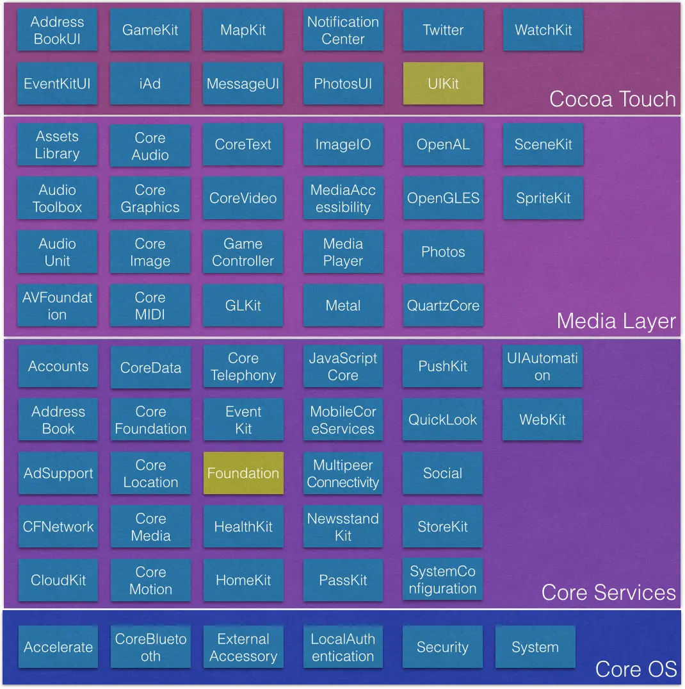

## (3)使用Xcode建立简单MVC程序

- Xcode中的MVC简述

  - 模型是应用程序的数据。
  - 视图是用户看见的界面，包含在Interface Builder 中构建的各种UI组件。
  - 控制器是将模型和视图元素连接在一起的逻辑单元，处理用户输入和UI交互。

- Interface Builder 简述：

  Interface Builder是一个控件工具箱，开发者只需要从工具箱中简单地向窗口或菜单中拖曳控件即可完成界面的设计。然后，用连线将 控件可以提供的“动作”(Action)、 控件对象分别和应用程序代码中对象“方法”(Method)、对象“接 口”( Outlet)连接起来，就完成了整个创建工作 。 

### ①打开xcode新建项目，这里xcode版本为14

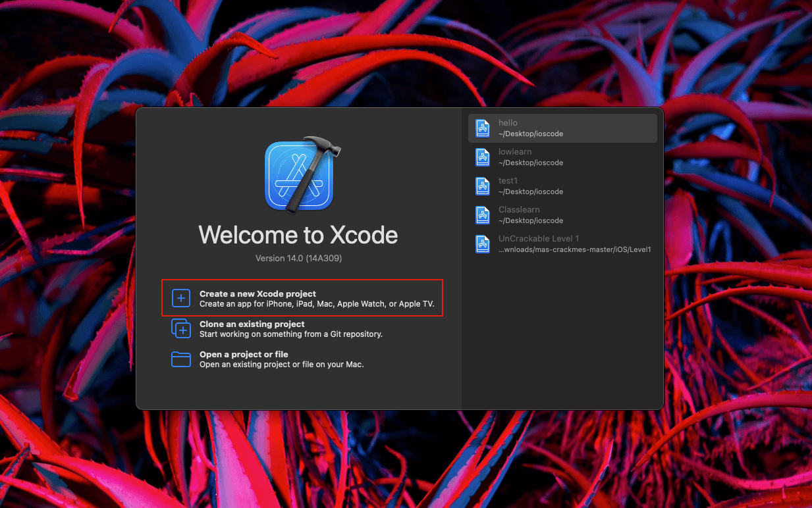

### ②选择iOS APP 模版

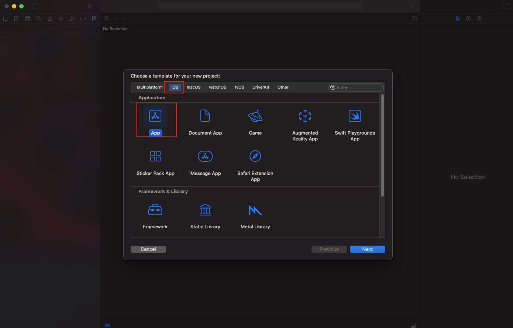

### ③填入项目相关信息

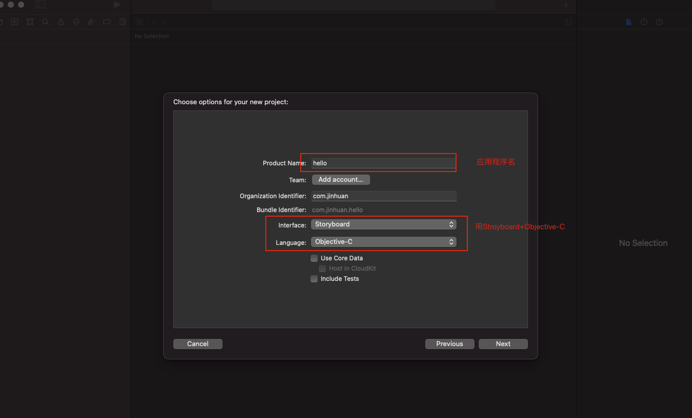

### ④保存后生成项目可以看到自动生成的项目模版文件

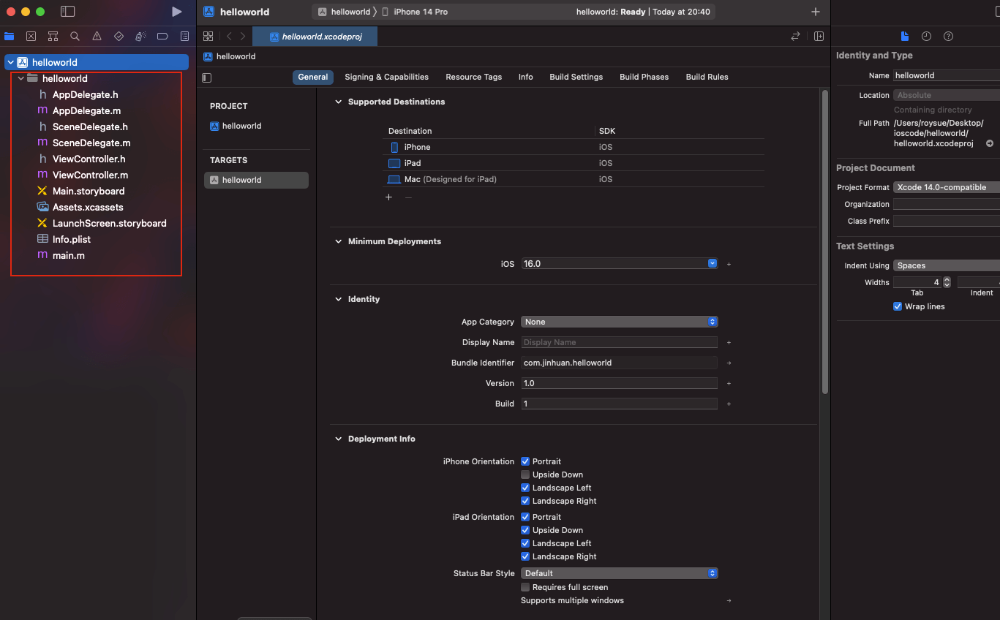

- AppDelegate: AppDelegate 文件是应用程序的委托，负责响应系统和应用程序事件，处理应用程序生命周期及对应用程序级别的配置与操作。
- SceneDelegate: SceneDelegate文件是iOS13及以上版本新增的文件，负责管理应用程序中的场景，每个场景都代表着应用程序中的一个窗口和对应视图层次。
- ViewController: MVC模式中的Controller部分用于管理应用程序的界面和处理用户的交互操作，对应ViewController类继承自UIViewController类是UIKit框架的一部分，是构建iOS应用程序的核心组件和类。
- storyboard:故事板文件其中LaunchScreen是应用程序启动画面，我们不用管他，Main是我们的主要故事板，包含所有UI元素及视图控制器。 
- Assets.xcassets:资源文件夹。
- Info.plist:应用程序配置文件。

### ⑤设计界面

打开Main.storyboard故事板，箭头指向为主视图文件中前两个对象分别是用户输入区域(文本框)和输出(标签)， 而第 3个对象(按钮)触发代码 中的操作，以便将标签的内容设置为文本框的内容

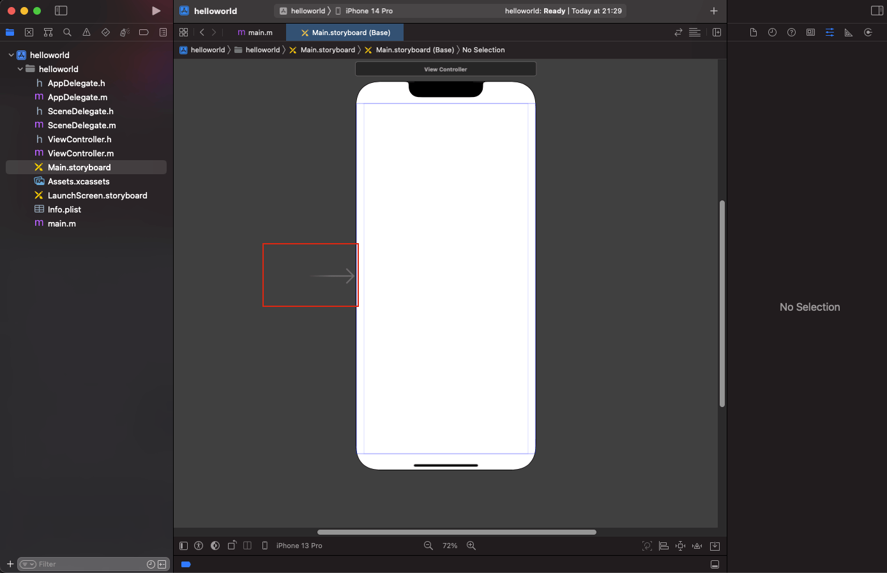

### ⑥使用控件

使用Interface Builder编辑器(快捷键Shift+command+L)直接拉取控件到页面上,这里我们拉取一个文本框(UITextField),一个标签(UILabel),一个按钮(UIButton)共三个组件对象,其中前两个对象分别是用户输入区域(文本框)和输出(标签)， 而第 3个对象(按钮)触发代码 中的操作，以便将标签的内容设置为文本框的内容。设置完组件后设置view对应class为ViewController


### ⑦创建并连接输出口和操作

IBAction与IBOutlet简介:

- IBAction:从返回值角度看，作用相当于void，只有返回值声明为IBAction的方法，才能跟storyboard中控件连线
- IBOutlet:只有声明为IBOutlet的属性，才能跟storyboard中的控件进行连线

在ViewController类中声明两个IBOutlet属性对应UILabel和UITextField两个输入输出对象，声明一个返回值为IBAction类型的方法对应按钮点击事件，同时在ViewController文件中实现，可以看到，当对象和方法声明后就出现三个圆圈等待与storyboard绑定

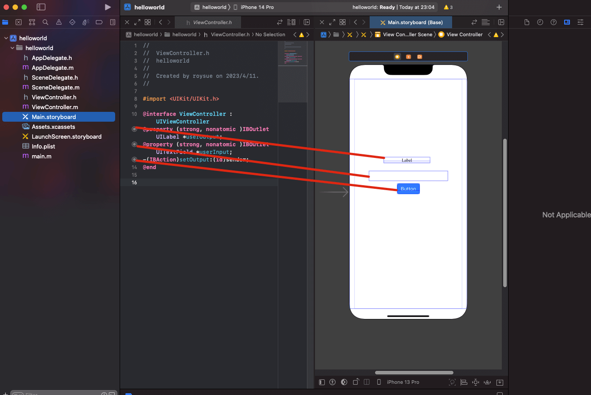

```ObjectiveC
#import <UIKit/UIKit.h>

@interface ViewController : UIViewController
@property (strong, nonatomic )IBOutlet UILabel *userOutput;
@property (strong, nonatomic )IBOutlet UITextField *userInput;
-(IBAction)setOutput:(id)sender;
@end

#import "ViewController.h"
@implementation ViewController
@synthesize userOutput;
@synthesize userInput;
- (void)viewDidLoad {
    [super viewDidLoad];
    // Do any additional setup after loading the view.
    self.userOutput.text=self.userInput.text;
}

@end
```

### ⑧绑定

直接拖拉进行空间与属性和方法的绑定


### ⑨设置启动视图

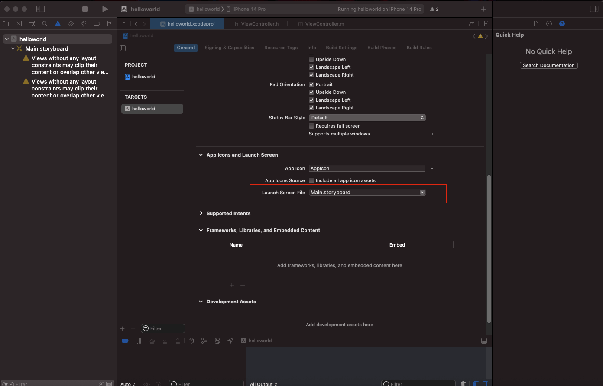

启动项目发现成功运行

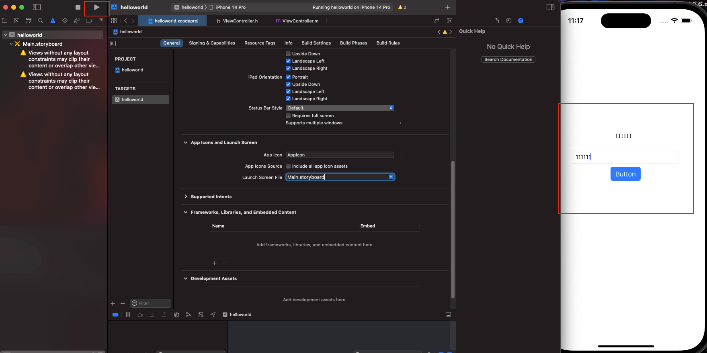

### ⑩项目启动流程简单分析：

main.m ->找到AppDelegate文件

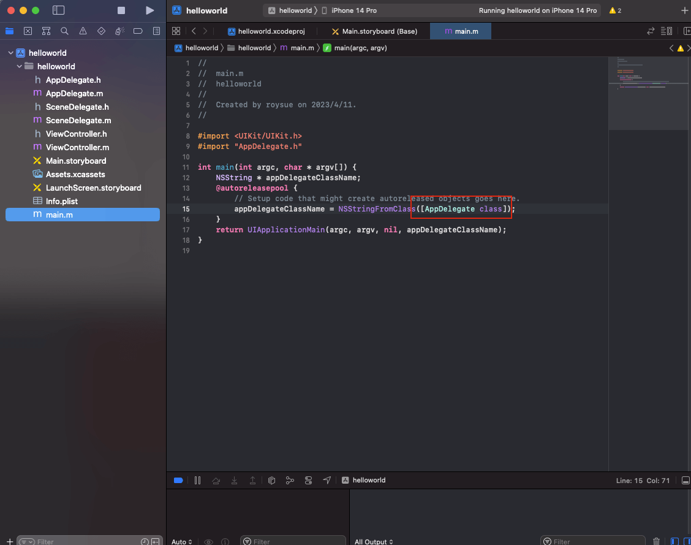

AppDelegate类根据打包根据配置文件找到启动故事板

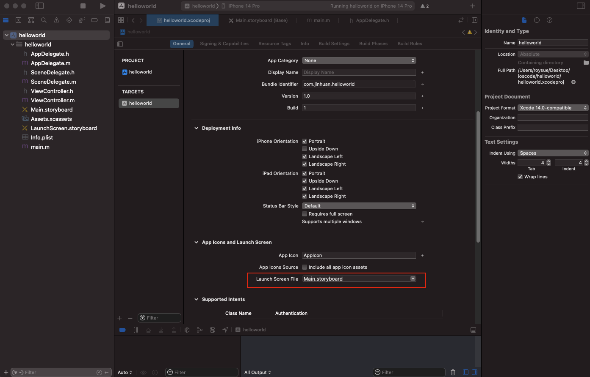

在故事板找到箭头指向的视图控制器->加载视图控制器内的视图view展示

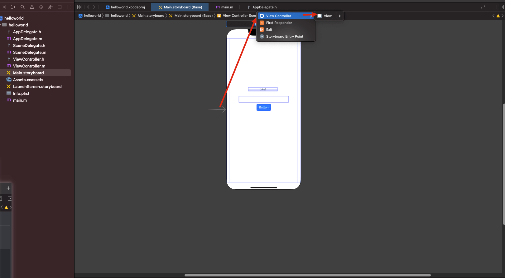

## (4)demo打包签名生成IPA

Xcode中打包签名需要生成一个开发者证书，开发者证书需要开发正账号生成，以下为开发者账号的从无到有申请过程：

①打开[官网](appleid.apple.com)注册Apple ID

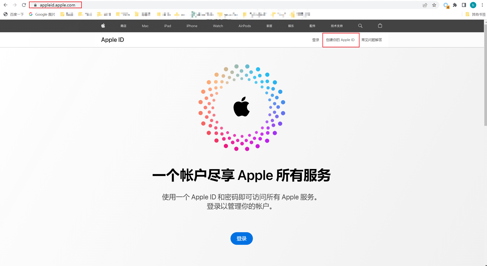

②填写相关信息

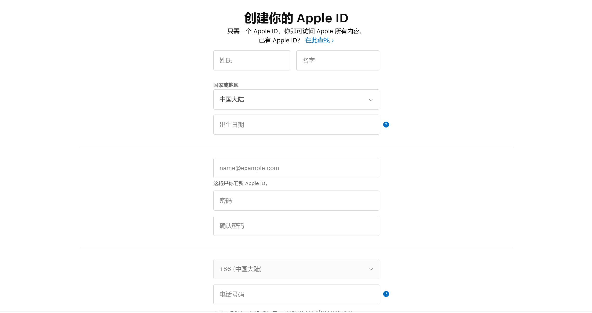

③输入验证码

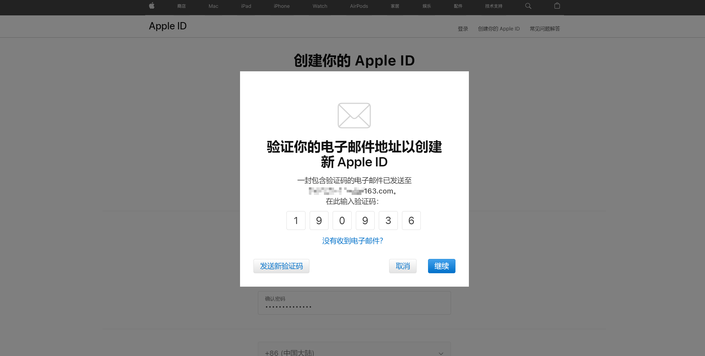

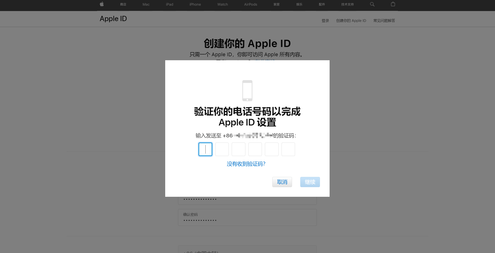

④同意条款

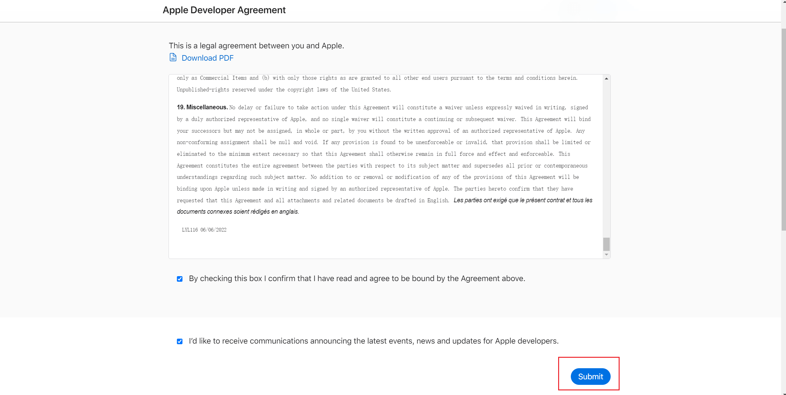

⑤Apple ID 注册成功

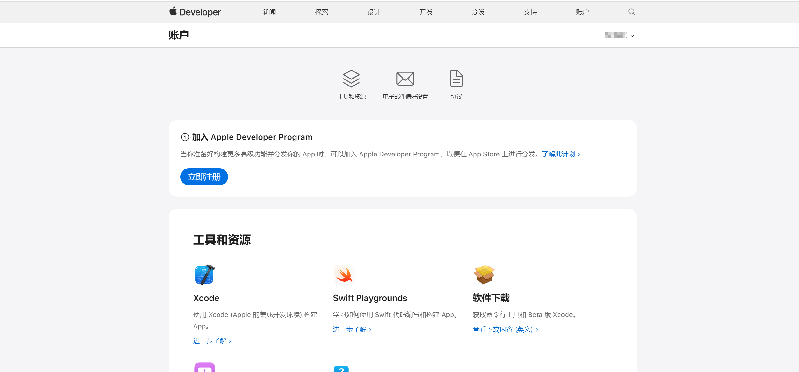

到这里Apple ID 注册成功了但是我们还需要将其申请为开发者，这里申请开发者对于iOS版本有要求，而且不同机型需求还不一样，第一次使用iphone6iOS版本太低需要14以上，第二次使用iphone SE 要求版本在15以上。

⑥申请开发者账号

a.登录apple id 打开双重验证

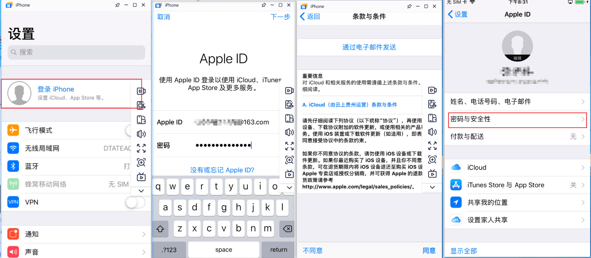

b.在App store 下载Apple Developer进行注册

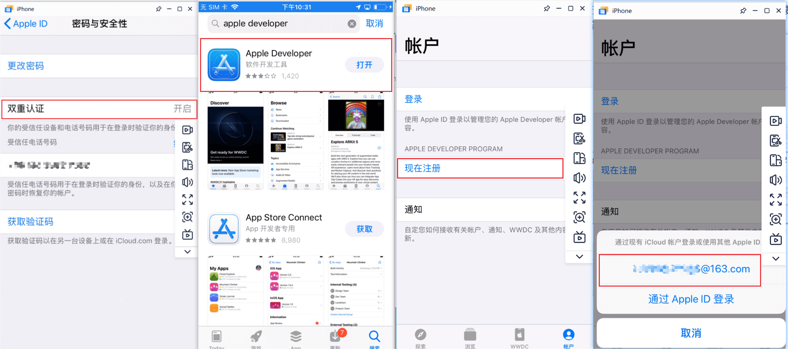

c.激活触控ID或打开密码


d.换了几次设备才可以填写信息进行申请


这里申请的话看网上说是要等一个月才可以审核通过。

⑦打包生成IPA(这里因为开发者账号没有审核通过无法生成证书，也没办法添加设备，所以先欠着后续补)

### (5)IPA文件结构分析

查看文件格式可以发现其实ipa也是zip格式的压缩包

```
file bilibili.ipa
```

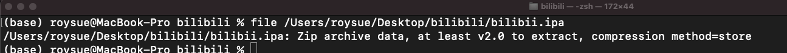

对其进行解压发现以下目录，其中payload就是存放主要代码的目录，里边的app后缀文件夹就是我们主要代码目录，而且如果想要对一个ipa进行重打包的话就可以将其app文件夹抠出来进行压缩，然后进行签名

```
unzip bilibili.ipa
```

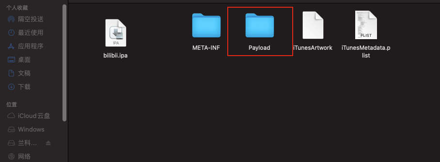

```
ls allit 查看app文件夹内文件
```

查看app文件夹内文件可以发现许多资源文件，框架文件及.plist后缀的配置文件.pem后缀的证书文件等

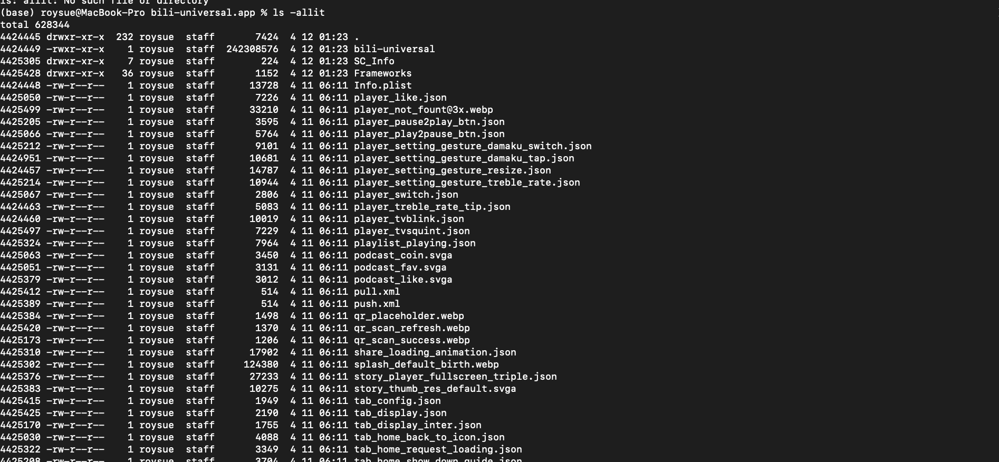

这里我们主要把其中的二进制执行文件找出来，mac中可执行文件格式为Mac-O 类似于windows中的PE，linux中的elf，Android中的dex是整个程序的运行代码内容编译生成的二进制文件.

```
file * |grep -i mach
```

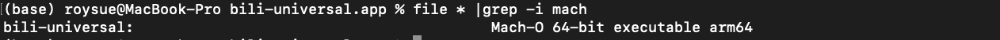

同时二进制文件肯定也是最大的，因此我们也可以通过文件大小寻找可执行文件

查看这个文件有多大

```
du -h bilibili-universal    
```

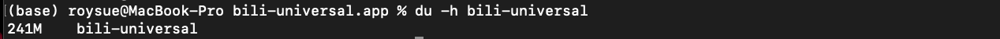

查看当前目录下最大的是个目录或文件

```
du -a |sort -n -r |head -n 10   
```

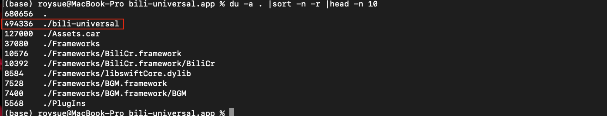

找到代码文件后我们可以通过mac自带的otool命令查看文件信息，通过其crypt id参数判断其是否加壳值为1为加壳

```
otool -l bili-universal|grep -i crypt
```

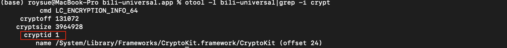

# 3.iOS签名相关了解

## (1).iOS签名原理

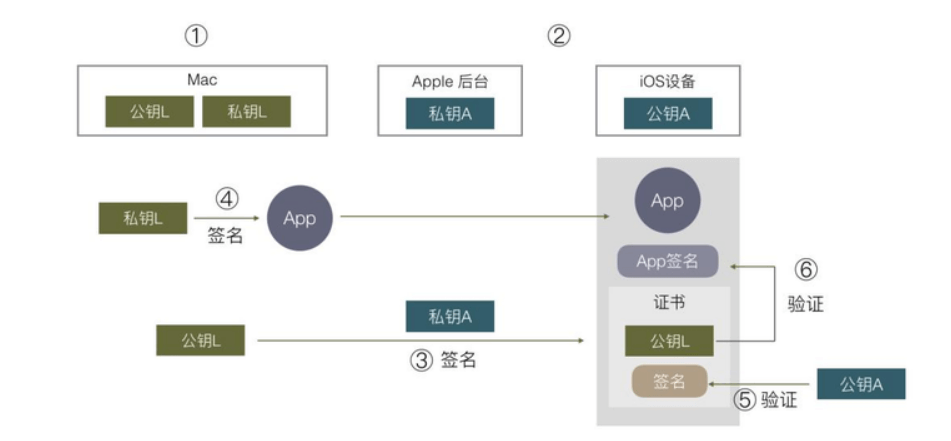

1、在你的 Mac 开发机器生成一对公私钥，这里称为公钥L，私钥L。L:Local
2、苹果自己有固定的一对公私钥，跟上面 AppStore 例子一样，私钥在苹果后台，公钥在每个 iOS 设备上。这里称为公钥A，私钥A。A:Apple
3、把公钥 L 传到苹果后台，用苹果后台里的私钥 A 去签名公钥 L。得到一份数据包含了公钥 L 以及其签名，把这份数据称为证书。
4、在开发时，编译完一个 APP 后，用本地的私钥 L 对这个 APP 进行签名，同时把第三步得到的证书一起打包进 APP 里，安装到手机上。
5、在安装时，iOS 系统取得证书，通过系统内置的公钥 A，去验证证书的数字签名是否正确。
6、验证证书后确保了公钥 L 是苹果认证过的，再用公钥 L 去验证 APP 的签名，这里就间接验证了这个 APP 安装行为是否经过苹果官方允许。（这里只验证安装行为，不验证APP 是否被改动，因为开发阶段 APP 内容总是不断变化的，苹果不需要管。）

## (2).不同账号区别

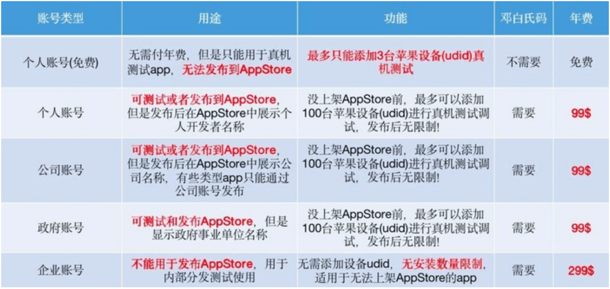

①这张图我们可以清晰的看到不同账号的用途及权限，根据这里不同账号生成的不同证书在打包时能够选择不同的打包方式，这里由于申请的开发者账号没有审核完成，后续补充证书生成及项目打包方式选择。

②查看应用签名 这里使用命令查看时要注意不是直接查看ipa文件而是其解压后payload目录下的app后缀文件夹

```
codesign -vv -d example.app
```

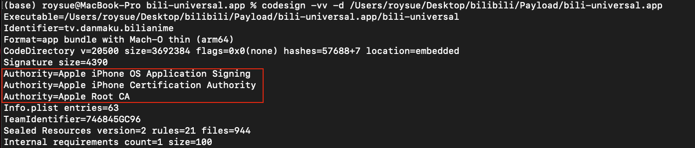

## (3).签名相关问题解释

- 为什么企业签名可以卖钱?

企业签名是有限的，是为了方便企业在没有通过App Store 审核的情况下在企业内部分发应用，属于企业的资源，而且申请时也是需要钱的，因此可以卖钱。

- 可以白嫖签名吗？不花钱那种？

可以可以一直使用个人账号免费的，但有效期只有七天，而且设备数量及应用包数量等都有限制。

- 网上下载的IPA能长期无痛使用吗？

可以，我么可以通过工具AltStore 进行个人签每七天签一次延长时间。

- 第三方软件商店能用吗？感受如何？

可以正常使用，而且其实爱思应用商店的应用有些就是正版应用

- 这里补充一点，越狱后手机安装了AppSync Unified插件其实就绕过了app应用安装签名检查了

## (4)AltStore工具实操

①下载[iTunes](https://www.apple.com/itunes/download/win64),[iCloud](https://updates.cdn-apple.com/2020/windows/001-39935-20200911-1A70AA56-F448-11EA-8CC0-99D41950005E/iCloudSetup.exe),[Altstore](https://cdn.altstore.io/file/altstore/altinstaller.zip)并安装

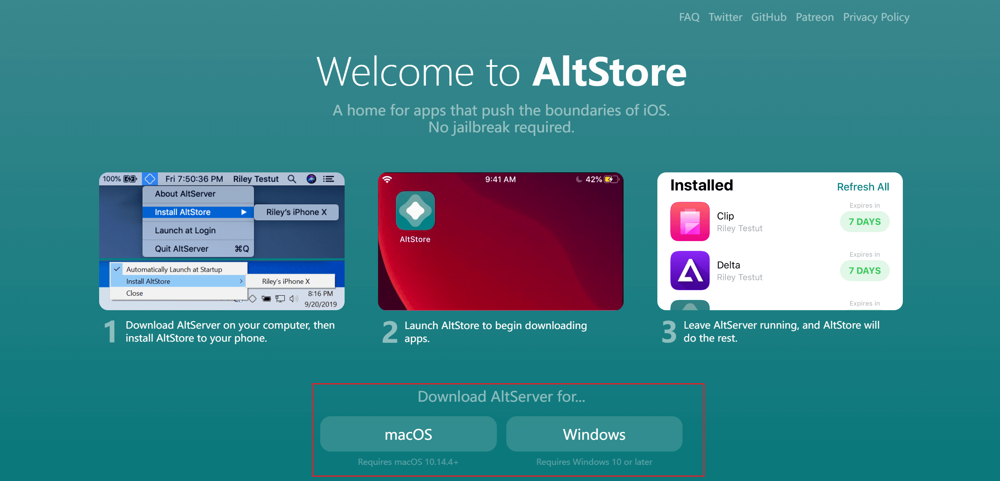

②打开iTunes点击设备，如果没出现就登陆apple Id

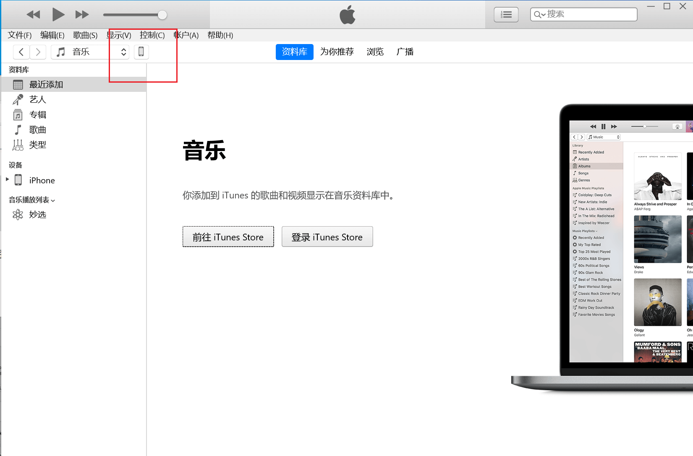

③打开wifi同步同时保证手机及电脑在同一网段，安装AltStore

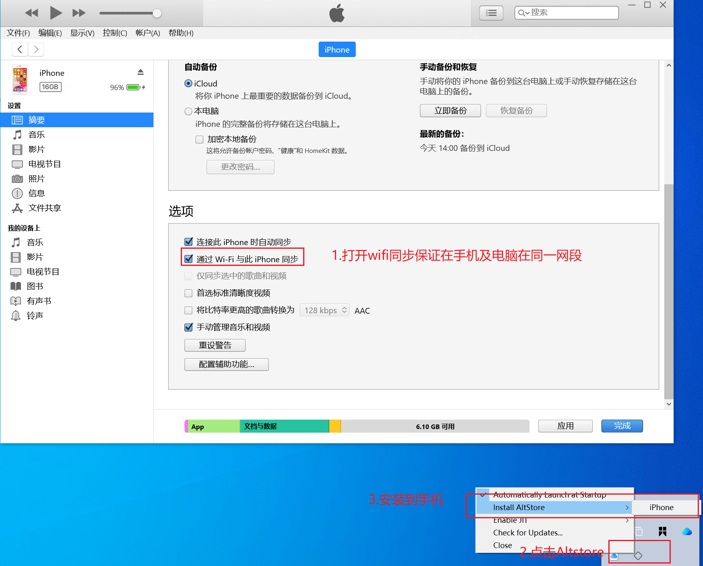

④输入你要设置的签名ID,这里我的apple id 其实还没有申请开发者账号不过也没事就是后边无法签名，而且这里要注意如果你的apple id 是手机号的话记得在前面加86

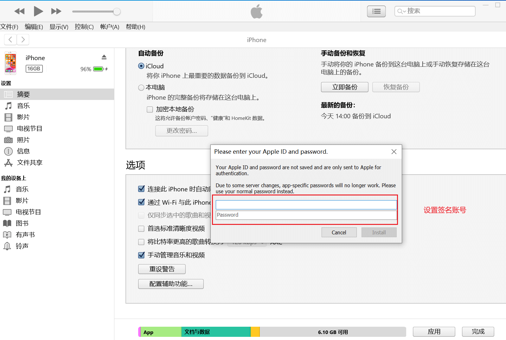

⑤信任你的Apple ID

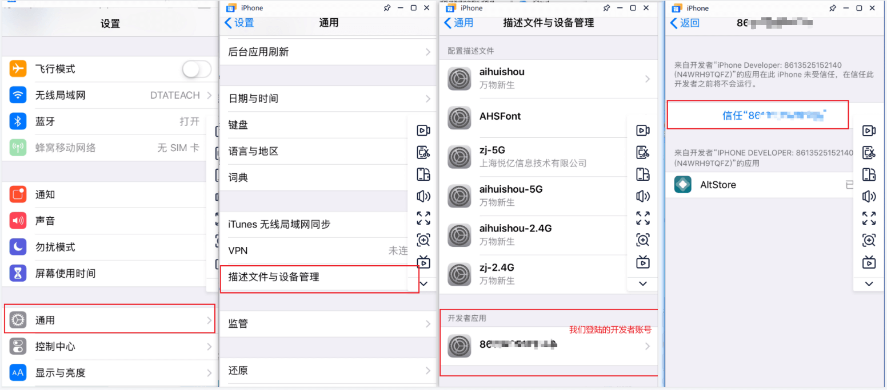

⑥使用AltStore安装ipa并对其签名

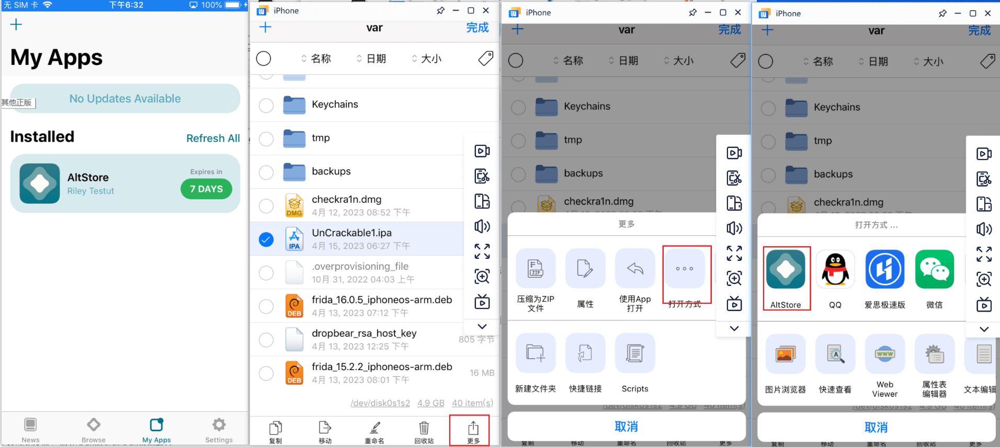

# 4.Objection自动化逆向与hook简述

①查看包路径，缓存路径，文件路径，lib路径

```
env
```

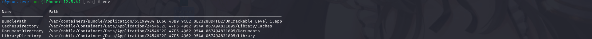

```
evaluate 自己写一段js代码加载进来
```

②查看当前注入的包的路径

```
pwd 当前注入的包的路径
```

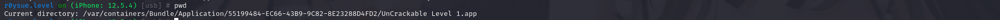

③列出内存中模块

我们只关心自己的app（containners）中的模块 其他是系统或组件模块，而且这里也可以直接看到我们应用的基址

```
memory list modules 
```


④列出导出表

 这里可以找到 do_it地址 拿这个地址去减去基址(包模块地址)得到函数相对地址 ida64 UnCrackable1.ipa 用ida看一下发现do_it函数是基址+相对地址

```
memory list exports [包名] 
```

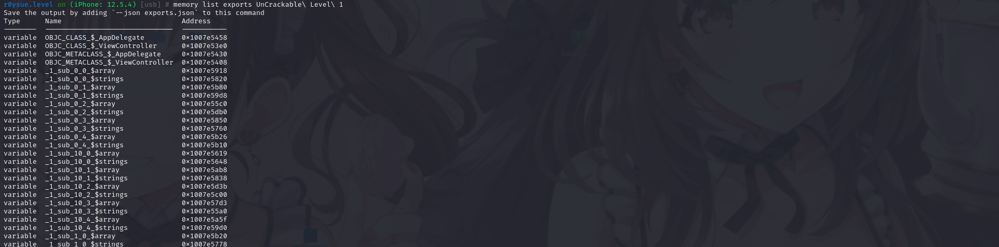

⑤获取当前应用存储的cookies

```
ios cookies get --json
```

⑥在堆上找一个类的实例化内存对象把内存地址打印出来

```
iOS heap search instances UILabel
```

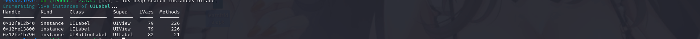

⑦打印域中变量值 这里可以得到 结果

```
ios heap execute 地址 text --return-string 打印域中变量值 这里可以得到 结果
```

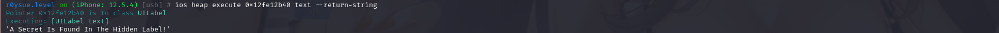

```
ios heap evaluate --inline 自己写OC代码
```

⑧查看二进制文件信息，查看是否加密判断是否加壳

```
ios info binary  
```

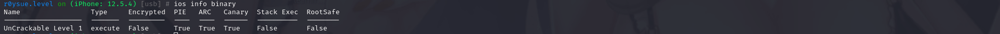

⑨dump存储的密码

```
ios keychain 
```

⑩hook 一些加解密算法的库

```
ios monitor crypto 
```

⑪查看是否有凭据存储

```
ios nsurlcredentialstorage
```

⑫查看用户的一些信息

```
ios nsuserdefaults 用户的一些信息
```

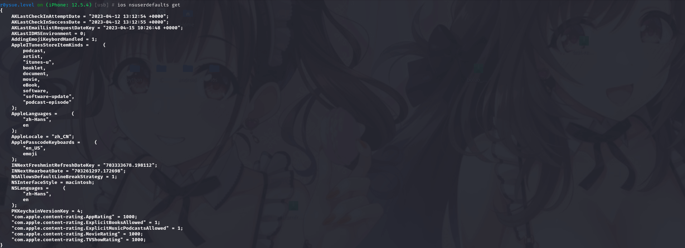

hook证书绑定相关方法

```
ios sslpinning 
```

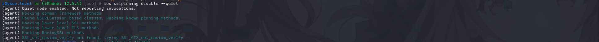

```
ios ui screenshot 123.png 做个截图
```

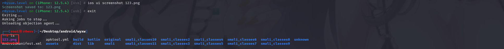

⑬hook相关：

列出所有类

```
ios hook list classes 
```

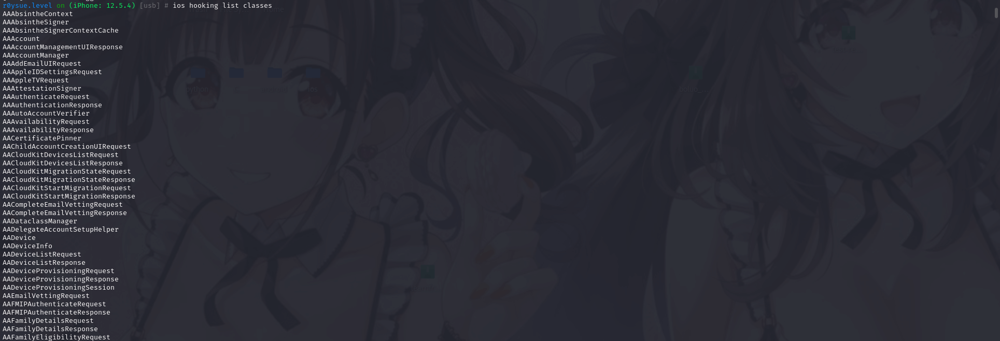

列出相关类的所有方法

```
ios hooking list class_methods ViewController
```

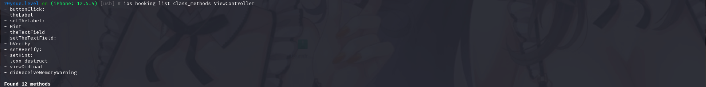

hook这个类的所有方法 hook后去点击查看调用

```
ios hooking watch class ViewController 
```

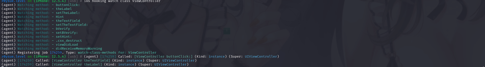

 hook 这个buttonclick方法 这里要注意OC中的方法签名要记得加":"完整方法签名是：-[ViewController buttonClick:]

```
ios hooking watch method "-[ViewController buttonClick:]" --dump-args --dump-backtrace --dump-return
```

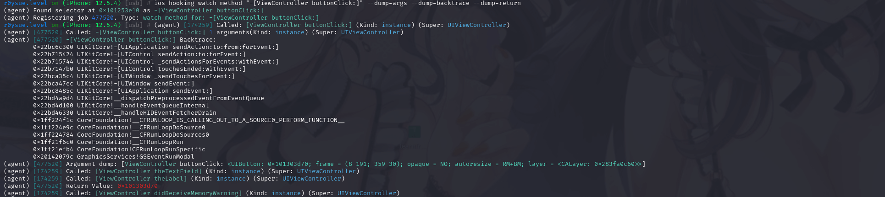

# 5.Objection破解简单CrackMe

(1)首先对CrackMe进行分析

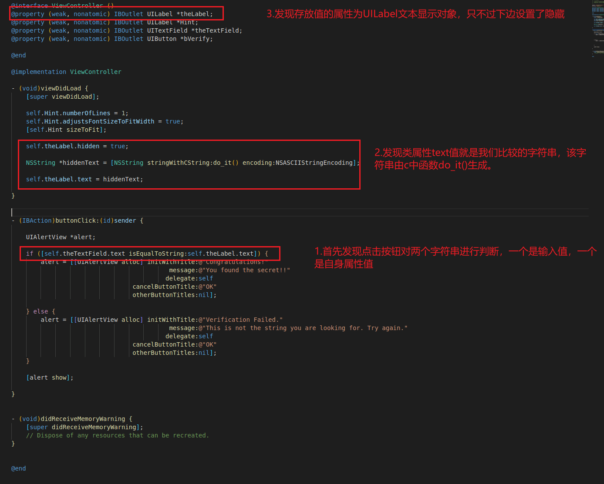

①找到点击事件响应方法buttonClick发现其对输入字符串及本地字符串比对

②发现本地字符串存放在类属性中，值由do_it()函数生成

③查看属性类型是UILabel,也就是说是隐藏起来的文本显示控件类对象

(2)进行破解

首先注入该CrackMe进程

```
frida-ps -U 
objection -g PID explore
```

①直接dump当前ui界面所有对象，可以看到设置为隐藏的UILabel对象及其text值

```
ios ui dump dump
```

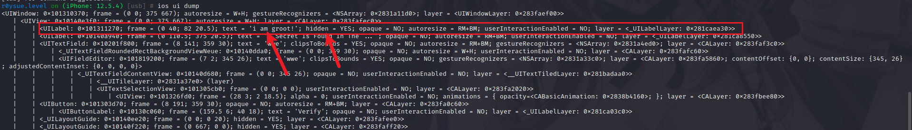

②直接找到所有UILabel类对象，对其进行打印，打印其域内属性及对象

```
ios heap search instances UILabel 
```

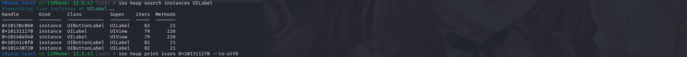

```
ios heap print ivars 0x101311270 --to-utf8 
```

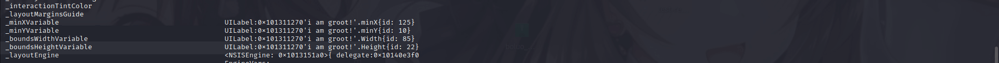


《挑战不用macOS逆向iOS APP》系列的第二课基础知识讲解内容到这就结束了，这里的内容可能并不全面，后续会根据需要进行补充，同时也会继续更新iOS App逆向学习内容，有需要的可以联系r0ysue师傅报名课程，共同学习进步。
