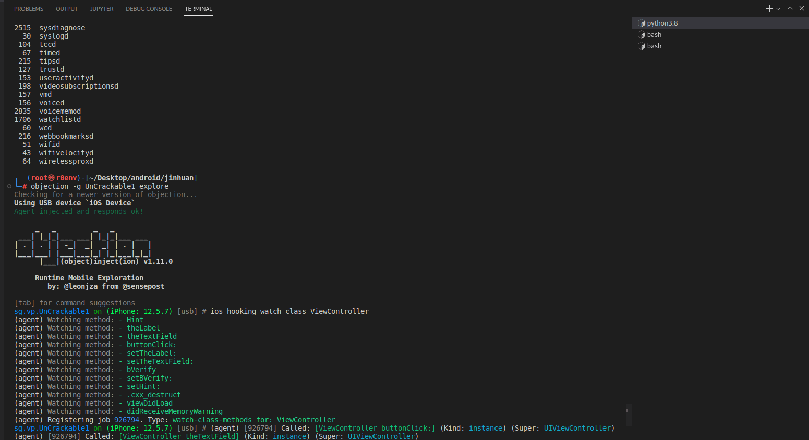
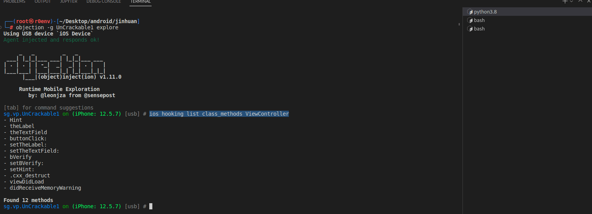
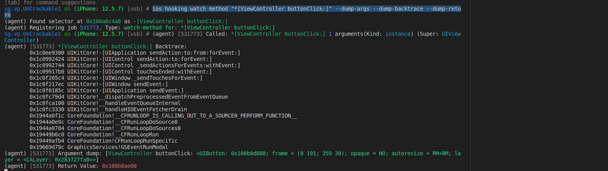
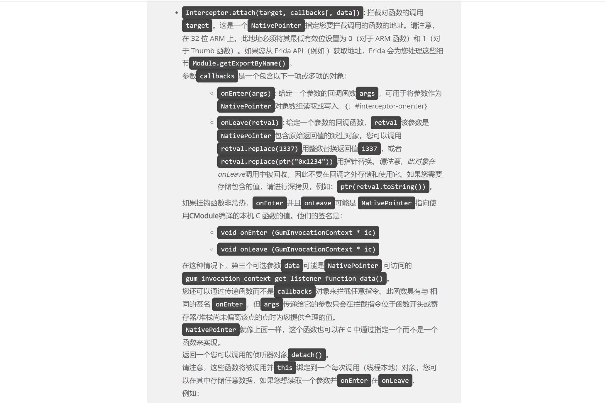
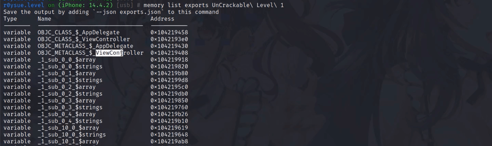
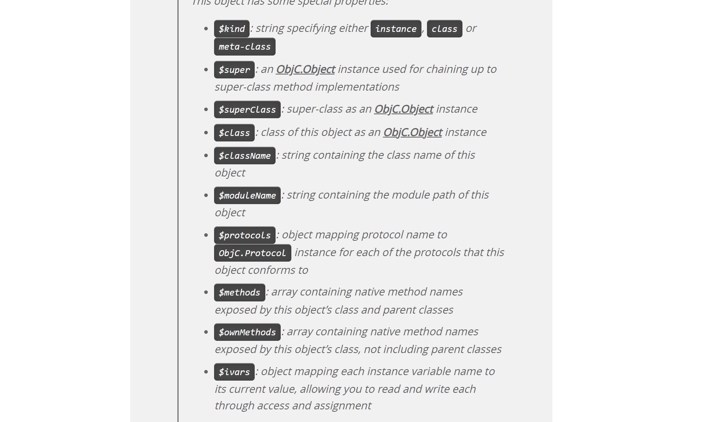
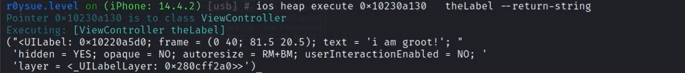
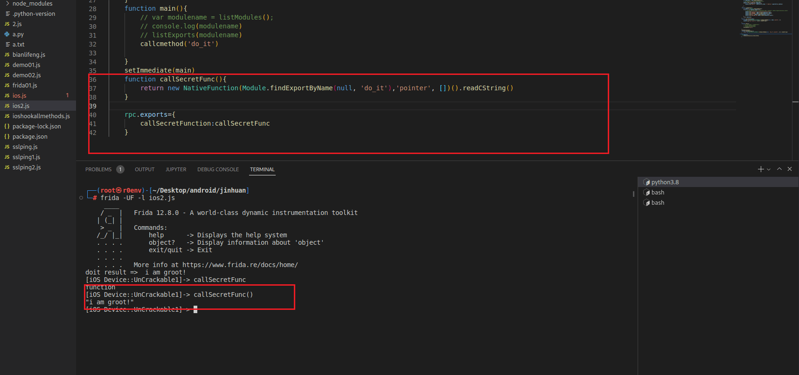

<!-- @import "[TOC]" {cmd="toc" depthFrom=1 depthTo=6 orderedList=false} -->

<!-- code_chunk_output -->

- [前言](#前言)
- [1.ios hooking search 源码解析](#1ios-hooking-search-源码解析)
- [2.ApiResolver 搜刮内存中所有符号](#2apiresolver-搜刮内存中所有符号)
- [3.枚举搜索所有类/所有方法/所有重载](#3枚举搜索所有类所有方法所有重载)
- [4.hook所有类/所有方法/所有重载](#4hook所有类所有方法所有重载)
- [5.输出(修改)解析参数/调用栈/返回值](#5输出修改解析参数调用栈返回值)
  - [①修改返回值实现目的](#1修改返回值实现目的)
  - [②修改参数实现目的](#2修改参数实现目的)
  - [③查看调用栈](#3查看调用栈)
  - [④替换函数](#4替换函数)
- [6.枚举内存中所有模块/符号/地址](#6枚举内存中所有模块符号地址)
- [7.无脑自动化hook 应用包下所有函数](#7无脑自动化hook-应用包下所有函数)
- [8.Objection 内存漫游搜刮所有对象](#8objection-内存漫游搜刮所有对象)
- [9.ObjC.choose枚举所有类输出属性](#9objcchoose枚举所有类输出属性)
- [10.主动调用对象方法获取算法执行结果](#10主动调用对象方法获取算法执行结果)
- [11配置RPC黑盒调用算法远程批量脱机](#11配置rpc黑盒调用算法远程批量脱机)

<!-- /code_chunk_output -->

# 前言

终于学到了Frida的部分，在本篇中我们将从objection这款自动化hook框架的源码出发，学习使用Frida内置的ApiResolver搜刮器来枚举内存中的所有符号，包括所有类/所有方法/所有重载，再对其进行hook后输出参数调用栈返回值，并且对参数与返回值进行修改，以实现修改函数逻辑的目的。

一次性hook一个函数并不是最终目的，批量自动化一次性hook成百上千个函数才是真的牛逼，本文中我们还介绍一种搜刮App的所有类并全部hook上的方法，并且使用Frida遍历内存的特性搜刮ObjC的对象，直接调用方法，获取算法的执行结果，最终配置RPC进行远程批量脱机调用，实现团队成员在即使不知道算法实现细节的情况下，依旧可以获取算法执行结果的目的。

附件APP、代码等位于我的项目中，大家可以自取：

[https://github.com/r0ysue/AndroidSecurityStudy](https://github.com/r0ysue/AndroidSecurityStudy)

# 1.ios hooking search 源码解析

这里我们直接去github[下载](https://github.com/sensepost/objection)objection的源码，查看其对ios的hook是如何写的

objection 中ios相关hook代码在agent-->src-->ios-->hooking.ts文件上，这里我们主要查看其search 及watch如何实现。

```
const objcEnumerate = (pattern: string): ApiResolverMatch[] => {
  return new ApiResolver('objc').enumerateMatches(pattern);
};

export const search = (patternOrClass: string): ApiResolverMatch[] => {

  // if we didnt get a pattern, make one assuming its meant to be a class
  if (!patternOrClass.includes('[')) 
  patternOrClass = `*[*${patternOrClass}* *]`;

  return objcEnumerate(patternOrClass);
};
```

这里首先查看search源码，可以看到我们传入的参数作为patternOrclass参数，首先检验是否为相应格式，如果不是相应格式则进行补全，之后使用ApiResolverMatch进行内存中的符号搜索，以找到要hook方法的地址，ios的hook与android中so层的hook都是直接对地址进行hook，再看watch方法

```
export const watch = (patternOrClass: string, dargs: boolean = false, dbt: boolean = false,
  dret: boolean = false, watchParents: boolean = false): void => {

  // Add the job
  // We init a new job here as the child watch* calls will be grouped in a single job.
  // mostly commandline fluff
  const job: IJob = {
    identifier: jobs.identifier(),
    invocations: [],
    type: `ios-watch for: ${patternOrClass}`,
  };
  jobs.add(job);

  const isPattern = patternOrClass.includes('[');

  // if we have a patterm we'll loop the methods, hook and push a listener to the job
  if (isPattern === true) {
    const matches = objcEnumerate(patternOrClass);
    matches.forEach((match: ApiResolverMatch) => {
      watchMethod(match.name, job, dargs, dbt, dret);
    });

    return;
  }

  watchClass(patternOrClass, job, dargs, dbt, dret, watchParents);
};
```

当使用watch参数时会将其添加进jobs列表，同时调用watchClass方法

```
const watchClass = (clazz: string, job: IJob, dargs: boolean = false, dbt: boolean = false,
  dret: boolean = false, parents: boolean = false): void => {

  const target = ObjC.classes[clazz];

  if (!target) {
    send(`${c.red(`Error!`)} Unable to find class ${c.redBright(clazz)}!`);
    return;
  }

  // with parents as true, include methods from a parent class,
  // otherwise simply hook the target class' own  methods
  (parents ? target.$methods : target.$ownMethods).forEach((method) => {
    // filter and make sure we have a type and name. Looks like some methods can
    // have '' as name... am expecting something like "- isJailBroken"
    const fullMethodName = `${method[0]}[${clazz} ${method.substring(2)}]`;
    watchMethod(fullMethodName, job, dargs, dbt, dret);
  });

};
```

可以看到watchClass方法中首先通过传入参数clazz当作参数使用api  ObjC.classes[clazz]获取该类对象，然后遍历该类方法分别调用watchMethod方法进行方法hook.

```
const watchMethod = (selector: string, job: IJob, dargs: boolean, dbt: boolean,
  dret: boolean): void => {

  const resolver = new ApiResolver("objc");
  let matchedMethod = {
    address: undefined,
    name: undefined,
  };

  // handle the resolvers error it may throw if the selector format is off.
  try {
    // select the first match
    const resolved = resolver.enumerateMatches(selector);
    if (resolved.length <= 0) {
      send(`${c.red(`Error:`)} No matches for selector ${c.redBright(`${selector}`)}. ` +
        `Double check the name, or try "ios hooking list class_methods" first.`);
      return;
    }

    // not sure if this will ever be the case... but lets log it
    // anyways
    if (resolved.length > 1) {
      send(`${c.yellow(`Warning:`)} More than one result for selector ${c.redBright(`${selector}`)}!`);
    }

    matchedMethod = resolved[0];
  } catch (error) {
    send(
      `${c.red(`Error:`)} Unable to find address for selector ${c.redBright(`${selector}`)}! ` +
      `The error was:\n` + c.red((error as Error).message),
    );
    return;
  }

  // Attach to the discovered match
  // TODO: loop correctly when globbing
  send(`Found selector at ${c.green(matchedMethod.address.toString())} as ${c.green(matchedMethod.name)}`);

  const watchInvocation: InvocationListener = Interceptor.attach(matchedMethod.address, {
    // tslint:disable-next-line:object-literal-shorthand
    onEnter: function (args) {
      // how many arguments do we have in this selector?
      const argumentCount: number = (selector.match(/:/g) || []).length;
      const receiver = new ObjC.Object(args[0]);
      send(
        c.blackBright(`[${job.identifier}] `) +
        `Called: ${c.green(`${selector}`)} ${c.blue(`${argumentCount}`)} arguments` +
        `(Kind: ${c.cyan(receiver.$kind)}) (Super: ${c.cyan(receiver.$superClass.$className)})`,
      );

      // if we should include a backtrace to here, do that.
      if (dbt) {1
        
        send(
          c.blackBright(`[${job.identifier}] `) +
          `${c.green(`${selector}`)} Backtrace:\n\t` +
          Thread.backtrace(this.context, Backtracer.ACCURATE).map(DebugSymbol.fromAddress).join("\n\t"),
        );
      }

      if (dargs && argumentCount > 0) {
        const methodSplit = ObjC.selectorAsString(args[1]).split(":").filter((val) => val);
        const r = methodSplit.map((argName, position) => {
          // As this is an ObjectiveC method, the arguments are as follows:
          // 0. 'self'
          // 1. The selector (object.name:)
          // 2. The first arg
          //
          // For this reason do we shift it by 2 positions to get an 'instance' for
          // the argument value.
          const t = new ObjC.Object(args[position + 2]);
          return `${argName}: ${c.greenBright(`${t}`)}`;
        });

        send(c.blackBright(`[${job.identifier}] `) +
          `Argument dump: [${c.green(receiver.$className)} ${r.join(" ")}]`);
      }
    },
    onLeave: (retval) => {
      // do nothing if we are not expected to dump return values
      if (!dret) { return; }
      send(c.blackBright(`[${job.identifier}] `) + `Return Value: ${c.red(retval.toString())}`);
    },
  });

  job.invocations.push(watchInvocation);
};
```

观察代码可以发现，这里使用frida 的api Interceptor.attach 进行hook同时根据传入的参数dargs，dbt判断是否打印出参数及调用栈

# 2.ApiResolver 搜刮内存中所有符号

首先去官网查看该api的介绍


可以看到该api支持module模块及objc并且返回值为包含api名称及地址的对象数组，下边我们使用该api编写hook代码

补充:这里我们可以看到ObjC的hook代码在编写时没有Java.perform()原因是Frida注入时，会自动创建一个被注入程序的运行时环境，OC的Runtime java 的jvm 但是由于jvm是一个独立的“库”  也就是libart.so，因此frida注入后会hook这个art.so使用其内置的API进行java hook，因此frida注入后创建的是自己的jvm虚拟机进程，但是我们想操作应用的类或方法时就要进入他的jvm

```
setImmediate(() => {
	const resolver = new ApiResolver('objc');
    const matches = resolver.enumerateMatches('*[ViewController *]');
    matches.forEach((match)=>{
        console.log(JSON.stringify(match))
    })
})
```


# 3.枚举搜索所有类/所有方法/所有重载

其实搜索所有类及所有方法和重载仍然使用ApiResolver 即可只需要修改枚举匹配的字串

```
setImmediate(() => {
	const resolver = new ApiResolver('objc');
    const matches = resolver.enumerateMatches('*[* *]');
    matches.forEach((match)=>{
        console.log(JSON.stringify(match))
    })
})
```


这里可以看到已经将所有的api及属性名称及地址全部枚举打印出来了

# 4.hook所有类/所有方法/所有重载

首先我们先用objection去hook以下ViewController类

```
frida-ps -U 查看应用名
objection -g UnCrackable1 explore  objection 注入应用进程
ios hooking watch class ViewController   hook ViewController类
```



```
ios hooking list class_methods ViewController 列出所有方法签名
 --include-parents是否包含父类方法
```



```
ios hooking watch method "*[ViewController buttonClick:]" --dump-args --dump-backtrace --dump-return
hook 相应方法
```



到了这里我们想要去查看objection中的代码具体位置可以复制hook时打印出的提示字符串Found selector去objection中搜索查看如何实现


搜索发现提示字符串是在方法watchMethod中打印出来的，具体hook实现逻辑上边也说过，其实是watchClass-->watchMethod,然后在watchMethod中对方法地址使用Interceptor.attach 这个api进行hook，我们去官网看一下这个api的简单使用



```
    const resolver = new ApiResolver('objc');
    const matches = resolver.enumerateMatches('*[* isEqualToString:*]');
    matches.forEach((match) => {
        console.log(JSON.stringify(match))
        Interceptor.attach(match.address,{
            onEnter:function(args){     

            },onLeave:function(ret){

            }
        })
    })
```

查看代码可以看到我们使用ApiResolver 枚举字符并且使用了JSON.stringify(match)将便利的方法转为字符串打印出来，这里转化的原因是在上边也说过，因为得到的是对象数组，这个对象包含方法名及地址属性，然后使用 Interceptor.attach其match.address进行hook，onEnter是原方法执行前，onLeave是方法执行后，args是方法执行参数，ret是返回值都可以自己命名

# 5.输出(修改)解析参数/调用栈/返回值

## ①修改返回值实现目的

这里我们查看demo源码可以看到其通过判断输入字符串与隐藏字符串进行比较得到结果


因此我们这里直接hook isEqualToString 方法的返回值使其返回正确

```
setImmediate(() => {
    console.log("hello world!r0ysue! objc =>", ObjC.available)
    const resolver = new ApiResolver('objc');
    const matches = resolver.enumerateMatches('*[* isEqualToString:*]');
    matches.forEach((match) => {
        console.log(JSON.stringify(match))
        Interceptor.attach(match.address,{
            onEnter:function(args){
                this.change = false;
                if(receiver.toString().indexOf("aaaabbbb") >= 0){
                    this.change = true;
                    console.log("need change");
                  
                }
            },onLeave:function(ret){
                console.log("ret=>",ret)
                if(this.change){
                    ret.replace(new NativePointer(0x1))
                }
            }
        })
    })

})
```

这里我们在代码中直接修改了返回值为true就可以使返回结果正确这里要注意两点：

(1)ret是引用对象，如果我们想修改其值，需要使用官方提供的replace方法，如上所示。

(2)Interceptor.attach 中参数和返回值都是指针，即便是数值类型也需要我们使用ptr()将其转为指针类型赋值

## ②修改参数实现目的

```
setImmediate(() => {
    // console.log("hello world!r0ysue! objc =>", ObjC.available)
    const resolver = new ApiResolver('objc');
    const matches = resolver.enumerateMatches('*[* isEqualToString:*]');
    matches.forEach((match) => {
        console.log(JSON.stringify(match))
        Interceptor.attach(match.address,{
            onEnter:function(args){
                const receiver = new ObjC.Object(args[0])
                console.log("receiver is =>",receiver.$className, " =>",receiver.toString());
                if(receiver.toString().indexOf("aaabbb") >= 0){

                    const { NSString } = ObjC.classes;
                    var newString = NSString.stringWithString_("aaabbb");
                    args[2] = newString;
                }
            },onLeave:function(ret){

            }
        })
    })

```

仍旧是分析demo案例修改isEqualToString 方法的参数，使其判断为true。这里要注意以下两点：

(1)我们在前边ObjC基础语法说过在OC语言中消息机制会转化为objc_msgSend(receiver, selector, arg1, arg2, ...)进行调用，也就是说在方法调用时第一个参数为调用者本身，第二个参数为selector即方法的名字，第三个参数及之后的参数才是其真实参数，这里我们可以看到我们通过 const receiver = new ObjC.Object(args[0])获取了调用者本身并将其转化为OC对象，将其转化为OC对象后我们可以调用frida的api，如官网所示


我们可以根据这个对象使用一系列api获取其类名，方法等

(2)我们要对参数赋值指针，因此我们新建NSString将其赋值这也是在官网找到的实现


## ③查看调用栈

打印调用栈依然是直接使用官网提供的api

```
 console.log('CCCryptorCreate called from:\n' +
        Thread.backtrace(this.context, Backtracer.ACCURATE)
        .map(DebugSymbol.fromAddress).join('\n') + '\n');
```


这里还是用了几个解析api：

jsonStringfy :js中将js对象转为字符串

tostring  :对像转为字符串

objc.object:转化为OC对象

## ④替换函数

上边的修改参数返回值都是建立在我们想让函数执行的情况下，但是有时我们可能并不想让方法执行，那么我们就可以使用下边的方法直接替换其执行

```
setImmediate(() => {
    const ViewController = ObjC.classes.NSString;
    const buttonClick = ViewController['- buttonClick:'];
    const oldImpl = buttonClick.implementation;
    buttonClick.implementation = ObjC.implement(buttonClick,(handle, selector,args)=>{
        console.log("handle selector args =>",handle,selector,args)
        console.log(Thread.backtrace(this.AudioContext,Backtracer.FUZZY).map(DebugSymbol.fromAddress).join('\n\t'))
        oldImpl(handle,selector,args);
    })
})
```

可以看到上述代码提前将方法地址保存在oldImpl然后使用ObjC.implement 进行方法的替换，是否在内执行原方法可以自己去实现

# 6.枚举内存中所有模块/符号/地址

```
frida-ps -Ua  查看运行的应用
objection -g UnCrackable1 explore  objection注入应用进程
memory list modules 列举内存中加载的模块
```


```
memory list exports UnCrackable\ Level\ 1 列出模块中的导出符号
memory list exports Foundation
```



我们去看看objection是如何实现的枚举模块及枚举模块内导出符号，代码在agent-->generic-->memory.ts

```
export const listModules = (): Module[] => {
  return Process.enumerateModules();
};

export const listExports = (name: string): ModuleExportDetails[] | null => {
  const mod: Module[] = Process.enumerateModules().filter((m) => m.name === name);
  if (mod.length <= 0) {
    return null;
  }
  return mod[0].enumerateExports();
};
```

可以看到其实现逻辑其实很简单，就是使用了frida的api Process.enumerateModules()得到模块对象数组，然后根据模块对象调用enumerateExports()得到导出符号，与安卓中c相关的符号地址枚举其实是一样的，自己实现代码如下：

```
    function listExports(name) {
    	//①可以在枚举模块是保存模块的name属性作为参数然后作为参数给Module.enumerateExports(name)
        // var exporttArr = Module.enumerateExports(name);
        //②也可以在枚举模块是保存模块对象当作参数，然后用模块对象调用name.enumerateExports()
        var exporttArr = name.enumerateExports();
        // var exporttArr = name.enumerateSymbols();
        console.log("枚举模块==》",name.name)
        for(var i = 0;i<exporttArr.length;i++){
            console.log("exports: ",exporttArr[i].name,"----address:",exporttArr[i].address)
            
        }
      }
    function listModules(){
        var modules = Process.enumerateModules()
        for(var i = 0;i<modules.length;i++){
            // console.log("moulename =>",modules[i].name,"--address:",JSON.stringify(modules[i].base))
            console.log("=======================================")
            console.log("模块名称:",JSON.stringify(modules[i].name));
            console.log("模块地址:",JSON.stringify(modules[i].base));
            console.log("大小:",JSON.stringify(modules[i].size));
            console.log("文件系统路径",JSON.stringify(modules[i].path));
        }
        return modules[0]
    }
    function main(){
        var modulename = listModules();
        console.log(modulename)
        listExports(modulename)
    }
    setImmediate(main)
```

# 7.无脑自动化hook 应用包下所有函数

hook应用包下所有函数，我们可以去网上搜索[相关案例](https://codeshare.frida.re/@interference-security/ios-app-all-classes-methods-hooks/)查看如何编写

```
function get_timestamp()
{
	var today = new Date();
	var timestamp = today.getFullYear() + '-' + (today.getMonth()+1) + '-' + today.getDate() + ' ' + today.getHours() + ":" + today.getMinutes() + ":" + today.getSeconds() + ":" + today.getMilliseconds();
	return timestamp;
}

function hook_class_method(class_name, method_name)
{
	var hook = eval('ObjC.classes.'+class_name+'["'+method_name+'"]');
		Interceptor.attach(hook.implementation, {
			onEnter: function(args) {
			console.log("[*] [" + get_timestamp() + " ] Detected call to: " + class_name + " -> " + method_name);
		}
	});
}

function run_hook_all_methods_of_classes_app_only()
{
	console.log("[*] Started: Hook all methods of all app only classes");
	var free = new NativeFunction(Module.findExportByName(null, 'free'), 'void', ['pointer'])
    var copyClassNamesForImage = new NativeFunction(Module.findExportByName(null, 'objc_copyClassNamesForImage'), 'pointer', ['pointer', 'pointer'])
    var p = Memory.alloc(Process.pointerSize)
    Memory.writeUInt(p, 0)
    var path = ObjC.classes.NSBundle.mainBundle().executablePath().UTF8String()
    var pPath = Memory.allocUtf8String(path)
    var pClasses = copyClassNamesForImage(pPath, p)
    var count = Memory.readUInt(p)
    var classesArray = new Array(count)
    for (var i = 0; i < count; i++)
    {
        var pClassName = Memory.readPointer(pClasses.add(i * Process.pointerSize))
        classesArray[i] = Memory.readUtf8String(pClassName)
		var className = classesArray[i]
		if (ObjC.classes.hasOwnProperty(className))
		{
			//console.log("[+] Class: " + className);
			//var methods = ObjC.classes[className].$methods;
			var methods = ObjC.classes[className].$ownMethods;
			for (var j = 0; j < methods.length; j++)
			{
				try
				{
					var className2 = className;
					var funcName2 = methods[j];
					//console.log("[-] Method: " + methods[j]);
					hook_class_method(className2, funcName2);
					//console.log("[*] [" + get_timestamp() + "] Hooking successful: " + className2 + " -> " + funcName2);
				}
				catch(err)
				{
					console.log("[*] [" + get_timestamp() + "] Hooking Error: " + err.message);
				}
			}
		}
    }
    free(pClasses)
	console.log("[*] Completed: Hook all methods of all app only classes");
}

function hook_all_methods_of_classes_app_only()
{
	setImmediate(run_hook_all_methods_of_classes_app_only)
}

hook_all_methods_of_classes_app_only()
```

可以看到该脚本主要实现逻辑大体如下：

①在run_hook_all_methods_of_classes_app_only方法中获取所有类，具体获取方法是使用copyClassNamesForImage这一 Objective-C 运行时中的一个私有 API去 获取当前 App 中定义的所有类名，并用内存数组保存

②然后遍历类方法，并使用hasOwnProperty这一js的api判断类是否属于当前app,如果是就遍历类中方法

③使用hook_class_method 方法进行每个方法的实际hook


# 8.Objection 内存漫游搜刮所有对象

先使用objection搜刮ViewController对象

```
ios heap search instances ViewController
```


然后我们去objection代码中查看其具体实现，位置在agent-->src-->ios-->heap.ts

```
const enumerateInstances = (clazz: string): ObjC.Object[] => {
  if (!ObjC.classes.hasOwnProperty(clazz)) {
    c.log(`Unknown Objective-C class: ${c.redBright(clazz)}`);
    return [];
  }

  const specifier: ObjC.DetailedChooseSpecifier = {
    class: ObjC.classes[clazz],
    subclasses: true,  // don't skip subclasses
  };

  return ObjC.chooseSync(specifier);
};

export const getInstances = (clazz: string): IHeapObject[] => {
  c.log(`${c.blackBright(`Enumerating live instances of`)} ${c.greenBright(clazz)}...`);

  return enumerateInstances(clazz).map((instance): IHeapObject => {
    try {
      return {
        className: instance.$className,
        handle: instance.handle.toString(),
        ivars: instance.$ivars,
        kind: instance.$kind,
        methods: instance.$ownMethods,
        superClass: instance.$superClass.$className,
      };
    } catch (err) {
      c.log(`Warning: ${c.yellowBright((err as Error).message)}`);
    }
  });
};
```

可以看到其实最终其实是调用了ObjC.chooseSync这一frida提供的api来进行对象的搜刮


这里之所以使用ObjC.chooseSync是因为`ObjC.choose` 是一个异步的 API而`ObjC.chooseSync` 是一个同步的 API，如果我们需要迅速地枚举大量对象，并且可以接受可能漏掉一些对象，那么我们可以使用 `ObjC.choose`。但是如果我们需要保证枚举所有对象，并且可以接受较慢的速度，则调用 `ObjC.chooseSync` 更为适合。

# 9.ObjC.choose枚举所有类输出属性

当我们使用ObjC.choose枚举到实际的instance时就可以直接打印这个实例的属性frida官网也提供了这些方法

实现代码如下：

```
setImmediate(() => {
    if(ObjC.available){
        const specifier = {
            class: ObjC.classes['ViewController'],
            subclasses: true,
        };
        ObjC.choose(specifier,{
            onMatch:function(ins){
                console.log("found ins =>",ins)
                console.log("ivars =>",ins.$ivars["_theLabel"].toString())
                console.log("methods =>",ins.$ownMethods)
            },onComplete(){
                console.log("Search Completed")
            }
        })
    }
})
```

可以看到我们枚举到对象ins后直接调用其$ivars可以得到属性对象，使用toString()转化为字符串后即可打印输出

# 10.主动调用对象方法获取算法执行结果

现在objection中查看如何主动调用

```
ios heap search instances ViewController
ios heap print methods 0x15dd08220
ios heap execute 0x15dd08220 theLabel --return-string
```



可以看到这些方法都是一个对象，但是在demo中do_it方法是一个用c实现的函数，是没有对象的此时调用代码如下：

```
    function callcmethod(name){
        var doit = new NativeFunction(Module.findExportByName(null, name),'pointer', [])
        console.log("doit result => ",doit().readCString())

    }
    function main(){
        // var modulename = listModules();
        // console.log(modulename)
        // listExports(modulename)
        callcmethod('do_it')
        
    }
    setImmediate(main)
```

具体可以描述为以下步骤:

①调用之前写的枚举模块及模块内到处字符列表查看方法导出字符

②调用Module.findExportByName(null, name)导出字符为第二个参数，第一个参数为模块名得到该函数地址

③调用frida 的api  NativeFunction()该api接受三个参数生成一个js的函数对象三个参数分别为函数地址，原生函数返回值类型，原生函数参数类型数组 

④执行上边生成的js函数对象即调用了原函数

# 11配置RPC黑盒调用算法远程批量脱机

js代码如下:

```
    function callSecretFunc(){
        return new NativeFunction(Module.findExportByName(null, 'do_it'),'pointer', [])().readCString()
    }

    rpc.exports={
        callSecretFunction:callSecretFunc
    }
```

手动hook注入进程调用测试



执行成功，说明导出成功

py代码如下:

```
import time
import frida

def my_message_handler(message, payload):
    print(message)
    print(payload)


device = frida.get_usb_device()
#frida.get_usb_device()  相当于手工注入式的 -U参数 通过USB获取设备
#device.get_frontmost_application() 相当于-F 获取当前页面进程
#创建一个session对象准备注入
session = device.attach(device.get_frontmost_application().pid)
#读取js文件并通过session开始注入
with open("ios2.js") as f :
    script = session.create_script(f.read())
script.on("message", my_message_handler)
script.load()

command = ""
while 1 ==1 :
    command = input("Enter Command:")
    if command == "1":
        break
    elif command == "2":
        print(script.exports.callSecretFunctionon())
```


以上就是本篇文章全部内容，下一篇文章会继续学习frida为r0tracer增加ios的trace功能。