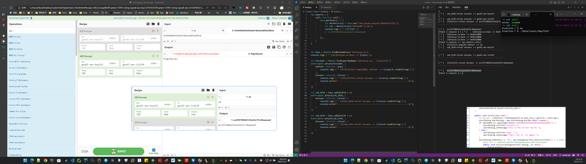
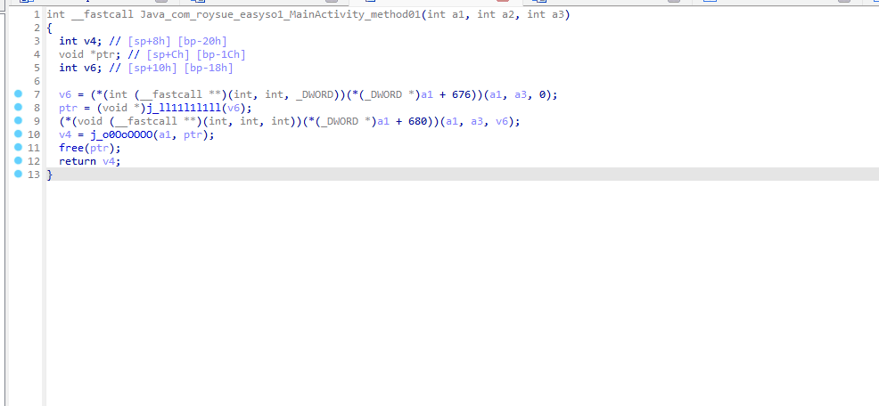

# EasySoCrackMe

一道只有花指令的标准算法还原题。

### 要点 📌

1. 分析就根据已有的知识点大胆猜测，小心验证
2. 这里 `v5` `v6` 没有提示 aes 相关算法字眼的话，也可以利用 Findcrypt 进行辅助分析，
    
    

最终效果：



附件：https://github.com/r0ysue/MobileCTF/tree/main/AndroidAlgorithm/easyso


---

# 解题流程：

- 拿到应用先看是否有加固（因为是 CrackMe 这里就不用验证应用是否能正常使用了）
    
    
    

## 1. install

- 这里直接安装会失败，这里的错误提示 **INSTALL_FAILED_TEST_ONLY** 表示是测试应用，所以这里安装需要指定一些参数才能安装
    
```bash
~\Desktop> adb install app-debug.apk
Performing Streamed Install
adb: failed to install app-debug.apk: Failure [INSTALL_FAILED_TEST_ONLY: installPackageLI]

~\Desktop> adb install -g -t -r -d app-debug.apk
Performing Streamed Install
Success
```
    

## 2. 分析思路

### 2.1 Java 分析

- 应用装上后随便输入点东西进行 Verify，提示如下
    
    
    
- 接下来就是 Jadx 上场 **Jadx app-debug.apk**，因为是 CrackMe，所以这里的类少，直接定位 MainActivity
    
    
    
- 那么现在就是验证是否是执行的 method01 的流程，判断我们找到的位置是否正确
- 📍小技巧：右键方法可直接复制 hook 该方法的 frida 片段，Jadx 需要一定的版本才能支持（我记得是1.4.3+
    
    
    

### 2.2 Java hook

- 使用 `Java.perform` 方法创建一个新的插桩会话，然后启动 frida-serve，触发 Verify，执行流程验证
    
```js
Java.perform(() => {
    let MainActivity = Java.use("com.roysue.easyso1.MainActivity");
    MainActivity["method01"].implementation = function (str) {
        console.log('method01 is called' + ', ' + 'str: ' + str);
        let ret = this.method01(str);
        console.log('method01 ret value is ' + ret);
        return ret;
    };
})
```
    
```bash
# hook 信息
method01 is called, str: aa
method01 ret value is ac33f2780262122a22a1f1c30aaeeae2
```
    
- 有 hook 信息输出，可以确定是执行我们找到的代码流程，那么接下来就是分析 So 层代码
    
```js
public static native String method01(String str);
```
    

### 2.3 So 分析

- 这里只有 **armeabi-v7a** 也就是 32 位的程序，32 位的程序注意点就是 **hook 时地址需要 +1**
    
    
    
- 把 **libroysue.so** 拖进 32 位 IDA 进行分析，期间一切弹出提示都不用管
- 在导出窗口搜索关键词 method01，如果搜索不到，代表该函数并不是静态注册（什么是动静态注册看肉师傅的 NDK 基础去！）
    
    
    

### 2.4 So 函数注册

- 静态注册函数
    - 必须遵循一定的命名规则，一般是 **Java_包名_类名_方法名**
    - 系统会通过 dlopen 加载对应的so，通过 dlsym 来获取指定名字的函数地址，然后调用
    - 静态注册的 JNI 函数，必然在导出表里
    
```c
// Java层加载so库
// native 关键字代表JNI方法
public native void callBackShowToast();

// 掐头去尾,加载支持库 文件名libhello.so
static{
    System.loadLibrary("hello");
}

// C.C++代码
extern "C" JNIEXPORT jstring JNICALL
Java_com_kk_jnidemo_MainActivity_stringFromJNI(JNIEnv *env, jobject /* this */) {}

extern "C"  // 以C的方式编译 不然就是以C++方式编译 自动加上符号修饰(函数名变化)
                        // 实现 C++ 代码调用 C 语言代码，该代码将按照 C 语言的方式进行编译链接。

JNIEXPORT		// 导出函数 JNI导出 IDA里面查看的话就是出现在导出表
jstring			// 返回值类型
JNICALL     // 暂时没用到
Java_com_kk_jnidemo_MainActivity_stringFromJNI	// 固定命名规则 Java_包名_类名_方法名

// 参数
JNIEnv *env  // jni环境
jobject      // 指代调用该函数的Java对象
jclass       // 静态函数 public static native
```
    
- 动态注册函数 JNI_OnLoad
    - 同一个Java函数可注册多个Native函数，以最后注册为准
    
```cpp
// Java层
Log.d("MainActivity", "onCreate: " + stringFromJNI2(1, new byte[]{2}, "3"));
public native String stringFromJNI2(int a, byte[] b, String c);

---------------------------------------------------------------------------------------------------

// 动态注册: so
jstring encodeFromC(JNIEnv *env, jobject obj, jint a, jbyteArray b, jstring c) {
    return env->NewStringUTF("encodeFromC");
}

// JNI_OnLoad
JNIEXPORT jint JNI_OnLoad(JavaVM *vm, void *reserved) {
    JNIEnv *env = nullptr;
        // 从java虚拟机中获取java env
    if (vm->GetEnv((void **) &env, JNI_VERSION_1_6) != JNI_OK) {
        LOGD("GetEnv failed");
        return -1;
    }

        // 注册信息
    JNINativeMethod methods[] = {
            // public native String stringFromJNI2(int a, byte[] b, String c);
            {"stringFromJNI2", "(I[BLjava/lang/String;)Ljava/lang/String;", (void *) encodeFromC},
            {"stringFromJNI2", "(I[BLjava/lang/String;)Ljava/lang/String;", (void *) encodeFromC1},
                        // 可以给同一个Java函数注册多个native函数，以最后一次为准
    };
        // RegisterNatives第二个参数为结构体 结构体参数:Java方法名 方法签名 函数指针
    jclass MainActivityClazz = env->FindClass("com/kk/myapplication/MainActivity");
    env->RegisterNatives(MainActivityClazz, methods, sizeof(methods) / sizeof(JNINativeMethod));  // 通过该函数注册
    return JNI_VERSION_1_6;  // 只能返回JNI版本 不能返回其他jint值
}

// 结构体
//    typedef struct {
//        const char* name;
//        const char* signature;
//        void*       fnPtr;
//    } JNINativeMethod;
```
    

### 2.5 继续 So 分析

- 进入到这个解密按 F5 看伪代码，根据 So 函数注册规则，这里对 `a1` 的参数类型进行修改，`a3` 是我们的入参
    
    
    
    
    
    
- 快捷键 `Y` 修改参数类型，快捷键 `N` 修改命名
    
    
    
- 接下来是不是清晰多了，根据入参进行分析 `a3`
    
```c
int __fastcall Java_com_roysue_easyso1_MainActivity_method01(JNIEnv *env, int a2, int a3)
{
    int v4; // [sp+8h] [bp-20h]
    void *ptr; // [sp+Ch] [bp-1Ch]
    const char *v6; // [sp+10h] [bp-18h]
    // 0. a3 在这里引用
    v6 = (*env)->GetStringUTFChars(env, a3, 0);  // 1.这里的 a3 是 jstring 需要转成 cstring 才能使用
    ptr = (void *)j_ll11l1l1ll(v6);  // 2.传入 v6 也就是我们的字符串
    (*env)->ReleaseStringUTFChars(env, (jstring)a3, v6);  // 3.资源释放
    v4 = j_o0OoOOOO(env, ptr);  // 4.没进函数暂时不知道干嘛的 | 5.⭐根据返回值, 在回过头来分析, 既然返回 v4, ptr 又是通过函数 j_ll11l1l1ll 得到的值, 所以这里可以确定 ptr 通过一些操作赋值给了 v4
    free(ptr);
    return v4;  // 5.返回 v4
}
```
    
- 所以这里我们的目的就是分析 `j_ll11l1l1ll` 函数逻辑

### 2.6 So 分析 - j_ll11l1l1ll

- 这里分析完得到的点就是 `v6` `v5` 以及 `s` 是怎么得到的，

```c
// // 0.根据a1入参引用的地方进行分析
int __fastcall ll11l1l1ll(int a1)
{
  int v2; // [sp+8h] [bp-30h]
  void *v3; // [sp+Ch] [bp-2Ch]
  size_t size; // [sp+10h] [bp-28h]
  void *v5; // [sp+18h] [bp-20h]
  void *v6; // [sp+1Ch] [bp-1Ch]
  char *s; // [sp+2Ch] [bp-Ch]

  v6 = (void *)sub_2658();                      // 7.没有入参 直接返回 那么这里就需要考虑的是这里的返回时是否为随机值
  v5 = (void *)sub_2C44();                      // 8.没有入参 直接返回 那么这里就需要考虑的是这里的返回时是否为随机值
  s = (char *)sub_24A4(a1);                     // 1.传入 a1 得到 s
  size = strlen(s);                             // 2. 判断 s 的长度
  v3 = malloc(size);                            // 3.申请 s 长度大小的内存空间
  j_qpppqp(v3, s, size, v6, v5);                // 4.传入一系列参数, 这里根据返回值进行判断, 可以猜测 v3 基本上可以确实是返回结果, C 里都喜欢这么用, 传入指针, 修改指针地址里面的值当返回值用
  v2 = j_bbddbbdbb(v3, size);                   // 5.通过一系列处理得到 v2
  free(s);
  free(v3);
  free(v6);
  free(v5);
  return v2;                                    // 6.返回v2
}
```

### 2.7 So hook

- 写一个主动调用，方便操作（为什么这里主动调用要 `rpc.exports` 的写法，我也不知道为什么！！反正 frida15 就是这样写才能用❗）
    
```js
rpc.exports = {
    call: function call() {
        Java.perform(() => {
            let MainActivity = Java.use("com.roysue.easyso1.MainActivity");
            let ret = MainActivity["method01"]('aa');
            console.log(`[ * ]\t${ret}`);
            // ac33f2780262122a22a1f1c30aaeeae2

        });
    }
}

let base = Module.findBaseAddress('libroysue.so')
console.log(`[ * ]\tlibroysue.so.base :=> ${base}`);

// 分析入参跟返回值
let funcAddr = Module.findExportByName('libroysue.so', 'll11l1l1ll')
Interceptor.attach(funcAddr, {
    onEnter: function (args) {
        console.log(`[ * ]\tll11l1l1ll.args[${0}] onEnter :=> ${args[0].readCString()}`)
    },
    onLeave: function (retval) {
        console.log(`[ * ]\tll11l1l1ll.retval onLeave :=> ${retval.readCString()}`)
        console.error("------------------------------------------------------------\n");
    }
})

// 分析 v6 返回值
let sub_2658 = base.add(0x2658 + 1)
Interceptor.attach(sub_2658, {
    onLeave: function (retval) {
        console.log(`[ * ]\tsub_2658.retval onLeave :=> ${retval.readCString()}`)
        console.error("------------------------------------------------------------\n");
    }
})

// 分析 v5 返回值
let sub_2C44 = base.add(0x2C44 + 1)
Interceptor.attach(sub_2C44, {
    onLeave: function (retval) {
        console.log(`[ * ]\tsub_2C44.retval onLeave :=> ${retval.readCString()}`)
        console.error("------------------------------------------------------------\n");
    }
})

// 输出信息

[ * ]   libroysue.so.base :=> 0xd67ed000
[Pixel 3::easyso1 ]-> rpc.exports.call()
[ * ]   ll11l1l1ll.args[0] onEnter :=> aa
[ * ]   sub_2658.retval onLeave :=> goodl-aes-key123
------------------------------------------------------------

[ * ]   sub_2C44.retval onLeave :=> goodl-aes-iv1234
------------------------------------------------------------

[ * ]   ll11l1l1ll.retval onLeave :=> ac33f2780262122a22a1f1c30aaeeae2
------------------------------------------------------------

[ * ]   ac33f2780262122a22a1f1c30aaeeae2
```
    

### 2.8 验证输出信息 CyberChef

- 根据这里的输出信息我可以得到大概是 aes 算法，还贴心的标注了 key 与 iv，但是这里也不能完全相信，这里打开逆向挚友 [AES Encrypt - CyberChef](https://gchq.github.io/CyberChef/#recipe=AES_Encrypt(%7B'option':'UTF8','string':'goodl-aes-key123'%7D,%7B'option':'UTF8','string':'goodl-aes-iv1234'%7D,'CBC','Raw','Hex',%7B'option':'Hex','string':''%7D)&input=YWE)，可以发现结果能对上
    
    
    
- 那么代表算法是没有魔改的，如果需要得到 flag，这里拿 Jadx 反编译看见进行对比的 Hex 字符串解密即可 [AES Decrypt, AES Encrypt - CyberChef](https://gchq.github.io/CyberChef/#recipe=AES_Decrypt(%7B'option':'UTF8','string':'goodl-aes-key123'%7D,%7B'option':'UTF8','string':'goodl-aes-iv1234'%7D,'CBC','Hex','Raw',%7B'option':'Hex','string':''%7D,%7B'option':'Hex','string':''%7D)AES_Encrypt(%7B'option':'UTF8','string':'goodl-aes-key123'%7D,%7B'option':'UTF8','string':'goodl-aes-iv1234'%7D,'CBC','Raw','Hex',%7B'option':'Hex','string':''%7D/disabled)&input=ODFkNDRiYjA0MmQ1ZGU5YTdkYjJhNWE4NTZhMjliNWE)
    
    