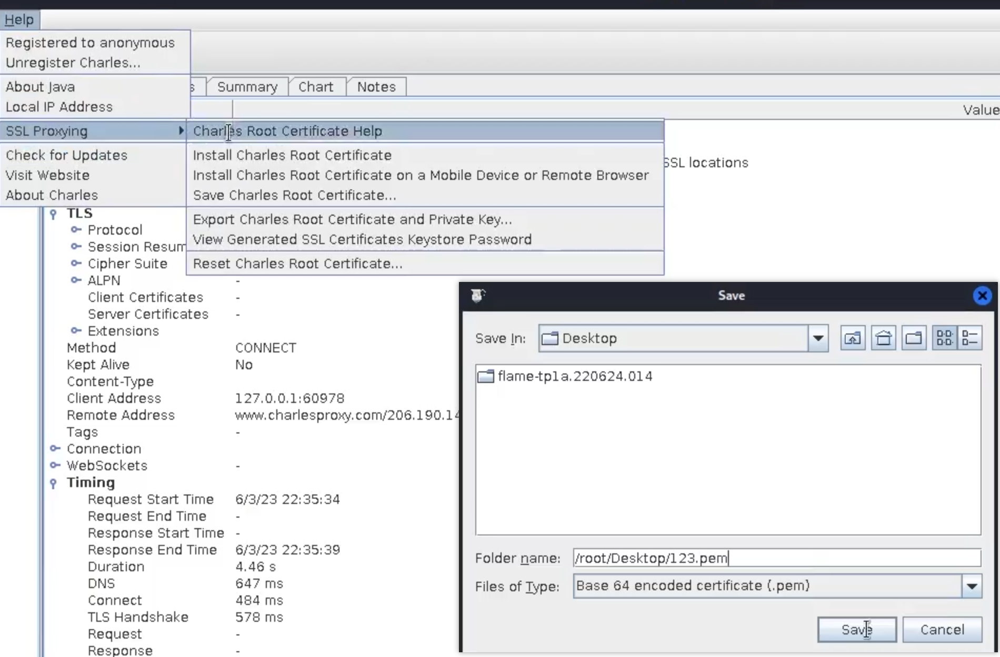

# Pixel4刷入KernelSU后Frida和VPN抓包配置

手把手教你在Pixel4上刷入KernelSU，并且配置好frida和VPN抓包环境。

## KernelSu 环境

- https://github.com/msnx/KernelSU-Pixel4XL 环境
    - 基于 KernelSU from weishu：[https://github.com/tiann/KernelSU](https://github.com/tiann/KernelSU)
    - 设备名称：Pixel 4xl
    - Android版本：13
    - 基带版本：g8150 - 00123 - 220708 b - 8810441
    - 内核版本：4.14.276-g8ae7b4ca8564-ab8715030
    - 构建数字：TP1A.220624.014
- 这里如果使用 r0env 刷机需要添加环境变量，否者无法使用 `adb` `fastboot`
    
    ```yaml
    PATH=$PATH:/root/Android/Sdk/platform-tools;export PATH;
    source ~/.bashrc
    ```
    

### 官方镜像刷机

1. 刷入官方固件包恢复出厂设置
    
    ```bash
    adb reboot bootloader    # **这里需要手机连接到虚拟机, 否者就电源键+音量键进入**
    7z x adb flame-tp1a.220624.014-factory-7b8f6f73.zip
    cd flame-tp1a.220624.014
    ./flash-all.sh           # 等待刷入即可
    ```
    
    
    
    
    
2. 这里刷完再次进入到 bootloader 模式（长按电源键 + 音量键）刷入 Android13 镜像
    
    ```bash
    fastboot flash boot pixel4xl_android13_4.14.276_v057.img
    ```
    
3. 安装 KernelSu
    
    ```bash
    # 进入手机设置 -> 关于手机 -> 连点七下版本号, 启用开发者模式
    # 系统 -> 高级 -> 开发者选项 ->
    # 1.关闭系统自动更新
    # 2.USB调试开关启用, 如果弹出信任弹窗需要信任
    
    # 使用 adb 安装 KernelSU
    adb install KernelSU_v0.5.7_10866-release.apk
    
    # 手机投屏
    scrcpy
    ```
    
    
    

## 抓包环境

### 系统证书安装

1. 保存 Charles 证书，导入到手机进行安装 `adb push 123.pem /sdcard/`
    
    
    
2. 手机安装证书：设置 → 安全 → 更多安全设置 → 加密与凭据 → 安装证书 → CA 证书
    
    
    
3. 安装完成后会出现在用户目录
    
    
    
4. 这里需要将证书移动到根目录才行，将证书模块导入到手机使用 KernelSU 进行安装并重启手机
    
    ```bash
    adb push Move_Certificates-v1.9.zip
    ```
    
5. 手机重启完成后可以在系统处看见 Charles 的证书 **XK72 Ltd**
    
    
    
    
    
    

### Charles

### SSL 代理


### 端口设置


### 访问控制


### 环境验证

- 安装代理工具与酷安应用
    
    ```bash
    adb install Postern_3.1.3_Apkpure.apk
    adb install coolapk.apk
    ```
    
- 手机连接局域网 WI-FI 提示感叹号，执行以下命令去除（其实不去除也行，只是提示而已，网络能正常使用的）
    
    ```bash
    settings put global captive_portal_http_url https://www.google.cn/generate_204
    settings put global captive_portal_https_url https://www.google.cn/generate_204
    settings put global ntp_server 1.hk.pool.ntp.org
    ```
    
    
    
- 代理配置：实际是根据 PC IP 进行填写，这里别照搬
    
    
    
- 启用 VPN，打开酷安进行登陆，如果看到以下信息证明抓包环境是没有问题的
    
    
    

## frida & Objection

- 执行该命令会直接安装最新版 frida、firda-tools、obj
    
    ```bash
    pip install objection -i https://mirrors.aliyun.com/pypi/simple
    
    objection version  # 输出版本号检测是否安装成功
    frida --version
    ```
    
- 从 https://github.com/frida/frida/releases 中获取对应安装版本的 frida-server
    
    ```bash
    # 先查看设备平台，然后在官网下载对应 server 版本
    adb shell getprop ro.product.cpu.abi    # 查看设备CPU
    adb push [电脑端frida-server路径] /data/local/tmp/fs
    adb shell
    su
    cd /data/local/tmp
    chmod 777 fs				# 文件权限修改
    ./fs						    # 启动frida-server
    ./fs -l 0.0.0.0:8888		# 监听端口就这样启动
    ```
    

### 小案例 - 禁止截屏

- 应用下载 [MobileCTF/AndroidNetwork/MZT at main · r0ysue/MobileCTF](https://github.com/r0ysue/MobileCTF/tree/main/AndroidNetwork/MZT)
    
    ```bash
    Android API 禁止截屏
    activity.getWindow().addFlags(WindowManager.LayoutParams.FLAG_SECURE);
    activity.getWindow().clearFlags(WindowManager.LayoutParams.FLAG_SECURE);
    ```
    
- 这里就不在记录怎么详细过检测了，当做作业进行练手操作

## 引用资料和大附件：

- [Pixel4 刷入 KernelSU 后的 VPN 抓包和 frida 配置_哔哩哔哩_bilibili](https://www.bilibili.com/video/BV1M8411Z7rC/?spm_id_from=333.999.0.0&vd_source=bfb9720533da6436a36b48fddb3d128a)
- 官方镜像：[Nexus 和 Pixel 设备的出厂映像 | Google Play services | Google for Developers](https://developers.google.cn/android/images?hl=zh-cn#coral)
- ****Pixel4**** 官方镜像、KernelSU、Postern（手机流量转发工具）、Move_Certificates（自动移动证书到根目录）
    - [https://github.com/r0ysue/MobileCTF/tree/main/AndroidEnvironment/Pixel4KernelSU/attachment](https://github.com/r0ysue/MobileCTF/tree/main/AndroidEnvironment/Pixel4KernelSU/attachment)
